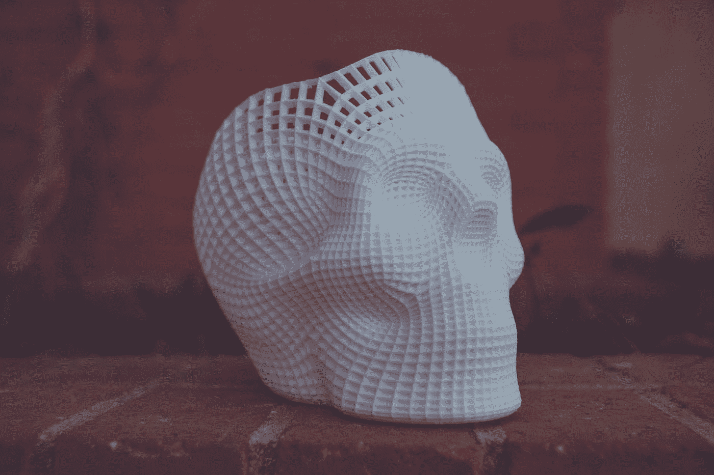

# 更多数据科学神话被专家揭穿

> 原文：<https://medium.com/codex/still-more-data-science-myths-debunked-by-experts-2e4b050e77dc?source=collection_archive---------6----------------------->

## 我们还没有揭穿所有数据科学的神话吗？

在 [Unsplash](https://unsplash.com?utm_source=medium&utm_medium=referral) 上 [NeONBRAND](https://unsplash.com/@neonbrand?utm_source=medium&utm_medium=referral) 拍摄的照片

答案是否定的；流言不断出现。

在 Data Science Mixer 播客上，我总是问我们的客人同一个“替代假设”问题:“关于数据科学或作为数据科学家，人们认为正确的一件事是什么，而你发现它是不正确的？”

我们已经分享了[两个](https://community.alteryx.com/t5/Data-Science/Experts-Debunk-Data-Science-Myths/ba-p/758063) [关于客人最喜欢的神话的综述](https://www.alteryx.com/fr/input/blog/experts-debunk-even-more-data-science-myths)，但是这个问题总是有新的答案！让我们来看看最近的三位嘉宾从他们在数据科学领域广泛多样的经历中选择了哪些重点。

# Alberto Cairo 博士，作者和数据可视化专家；迈阿密大学视觉新闻学 Knight Chair 和迈阿密大学计算科学中心可视化主任

> 人们倾向于认为数据才是最重要的。

我仍然经常遇到这个问题:人们倾向于认为数据才是最重要的。重要的不是数据。就像 TED 会议的创始人理查德·索尔·沃曼喜欢说的那样:“人们非常关心大数据。但我们真正需要的不是大数据，而是大理解。”所以这是不同的。数据有时倾向于自己成为一个目标。在哲学中，人们谈论工具性目标和最终或终极目标。数据和我用来管理、处理、探索、分析和可视化数据的工具——这不是最终目标。那是一个有用的目标。这是一种乐器。是机械。它是我们使用的一种装置，一种工具，我们用它来实现更高层次的东西，清晰的交流或理解。所以数据中重要的不是数据；这是为了找到一种对数据的解释，这种解释是严谨的，符合现实的，同时也是有用的。

# Hector Ferronato，技术总监，揭示全球咨询

> 你只要调用三行代码，结果就是这样。

这是一个概念，即模型只供您即插即用，您只需要调用三行代码，结果如下。这几乎就像一个食谱，实际质量取决于配料。显然，您的食谱很重要，但有一个概念，即数据科学完全是关于模型的，或者至少模型已经很完美，并且已经准备好了。但这真的是关于整个过程。

# Vukosi Marivate，博士，南非比勒陀利亚大学数据科学系主任

> 每个人都知道数据科学这个术语的含义。

每个人都知道数据科学这个术语的含义，并且它实际上与机器学习和人工智能是一样的，这是一个神话。当我与技术官僚和政策制定者交谈时，我总是在开始时有四张幻灯片，解释所有这些事情，所以当我讨论其余的事情时，他们有点明白是什么了。我鼓励人们去问[什么是数据科学]。然后我会给出一个我认为更接近我所做的定义，这样他们就可以在我们的互动中理解它。当我完成我的博士学位时，我和以前的导师交谈过，其中一位是我在牛顿的数据科学经理(在我的实习期间)。我说，“你会给我什么建议？我计划回南非。我想做数据科学。我想建立自己的团队。”他说，“语言。当您与非数据科学家交谈时，定义必须相同。您不能在几个月或几年后做了很多事情，却发现自己实际上没有达成共识，所有这些工作都是浪费。”

*为了篇幅和清晰起见，对这些面试回复进行了小幅编辑。查看所有面试成绩单并在* [*奥特莱斯社区*](https://community.alteryx.com/t5/Data-Science-Mixer/bg-p/mixer) *上做笔记。*