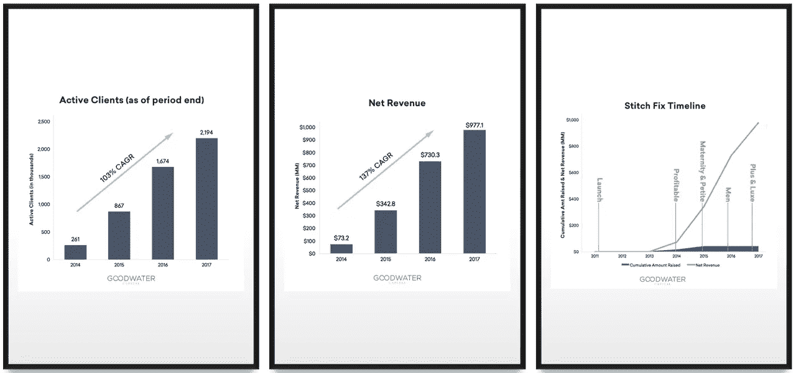
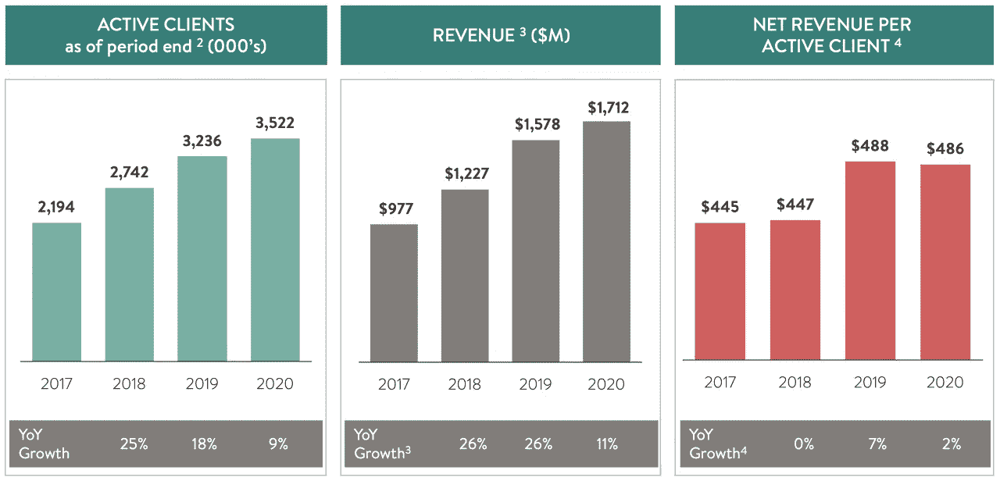
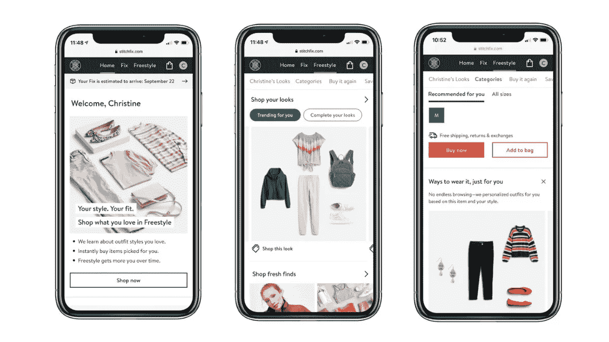

# 缝合修复故事:算法与人类

> 原文：<https://medium.com/codex/stitch-fix-story-algorithm-vs-human-6b27b844239d?source=collection_archive---------1----------------------->

## 你对时尚有多感兴趣？

我们现在使用的“时尚”一词不仅仅指“衣服”，从更广泛的意义上来说，它还指在特定时期流行的风格，包括汽车、建筑和住房。但是，微观上，把时尚理解为‘在特定时间流行的某种形式的服装或发型’就足够了。

时尚一直是人类历史上的一个重要问题，人们的穿着方式在社会意义上也很重要。在埃及壁画中发现的豪华服装和装饰品表明，对外表和服装的兴趣可以追溯到几千年前，时尚不仅是为了自我满足，也是显示许多人同意的社会地位的重要手段。

照片由 Unsplash 上的大英图书馆拍摄

在现代，时尚也作为一种“产业”占据了稳固的地位。根据全球消费者面板营销研究公司 Kantar 的数据，2020 年全球时尚市场的规模超过 3000 亿美元，预计此后每年增长 4%，并在 2025 年扩大到约 3600 亿美元。Fashion United 还分析称，时尚产业的总价值为 2.5 万亿美元，占全球 GDP 的 2%。

虽然时装业的增长无疑是由 SPA 推动的，但大约一半的增长将由全球领先的公司实现，如迅销(优衣库)、Inditex (Zara)、H&M·亨尼斯&莫里茨(H&M)和 TJX 集团。

就时尚分销而言，由于以“MZ 一代——千禧一代和 Z 一代”为代表的新核心消费群体的增长以及科罗纳疫情事件后的快速在线移动，新平台和初创公司正在快速增长，提供独特的产品，实现基于数据和新技术相结合的便利性和定制化。代表性的例子有法国的 [Heuritech](https://www.heuritech.com/) ，通过分析社交媒体图像来预测流行趋势；韩国在线时尚平台 [Musinsa](https://www.musinsa.com/) ，发布超过 3500 个全球和国内品牌以及时尚内容和潮流资讯；美国初创公司 [Entrupy](https://www.entrupy.com) ，利用人工智能在 3 秒内确定奢侈品的‘真伪’；还有我们今天要讲的[缝合修复](https://www.stitchfix.com/)。

# 缝合固定的开始

Stitch Fix 是一项“个性化服装订阅服务”,由当时 28 岁的哈佛大学 MBA 学生卡特里娜·莱克(Katrina Lake)于 2011 年创立。

从斯坦福大学毕业后，Katrina 曾在 Polyvore 和帕台农集团(一家美国战略咨询公司，于 2014 年被安永收购，现名为 EY-帕台农)工作。

Polyvore 是一种“基于社区的社交商务服务”。通过一个名为“虚拟情绪板”的功能，社区成员可以收集服装、杂货、室内产品等。，并在板上创建了一个名为‘Set’的图像拼贴。Polyvore 用户通过分享、评论、比较彼此的拼贴画、竞争等方式进行交流。此外，包括时尚品牌在内的制造商利用 API 连接到该板，提供产品信息和产品销售链接。没有听说过 Polyvore 的人可能听说过 SSENSESSENSE 在 2018 年收购 Polyvore 时结束了 Polyvore 的服务。

Polyvore 的访问者被带到 Ssense 主页的一个版本|来源:Polyvore.com

基于她(时尚)在线商务经验和在一家咨询公司的职业生涯，Katrina 似乎已经开发了 Stitch Fix 模型，该模型“结合了算法和人类造型师，以订阅形式提供用户想要的服装集合”。你还可以看到 Stitch Fix 的术语“Fix”——一个用盒子运送给订户的服装术语——和 Polyvore 的术语“Set”之间的相似之处。

在成立初期，她使用 SurveyMonkey 服务收集可以用来衡量她最初客户风格的数据，选择并交付满足客户欲望的衣服，并直接从客户那里收取每月订阅费——据说她当时没有设置互联网支付功能。2012 年，经过漫长的说服过程，她聘请了网飞大学前数据科学与工程副总裁埃里克·科尔森(Eric Colson)担任 Stitch Fix 的首席算法官，一个成熟的业务系统开始建立和发展。

“修复”服务是如何工作的？

在注册 Stitch Fix 时，客户首先会通过在线调查了解他们的基本体型、职业、偏好的时尚风格和品味、价格区间等。“修复”(一套衣服)建议由算法生成，然后传递给人类造型师，因此他或她可以选择 5 件衣服进行交付。在选择过程中，可以使用其他信息，如客户的社交媒体信息和图片。

客户可以根据自己的意愿设置交付周期:例如，每两周一次、每月一次、每两个月一次。运输和退货是免费的，但每次固定交付要收取 20 美元的设计费。

收到 Fix 后，顾客有 3 天时间决定是原样购买还是部分或全部退货。如果顾客购买了一套服装中的一件，设计费将从服装价格中扣除，如果你购买了所有的服装，总价还会有 25%的折扣。

顾客不仅可以留下关于他们已经收到的修复的笔记，还可以留下他们对未来修复的请求(例如，“我下个月有一个重要的社交活动，请推荐一件衣服”)，造型师会在下一次修复时反映这一请求，并更新顾客的信息。通过这个反馈回路，算法和造型师之间的协作创造了一个良性循环，从而更好地理解客户。

在 Katrina Lake 和 Eric Colson 的有力领导下，Stitch Fix 将创新技术有机地“编织”到其业务的所有领域，同时不断扩展其数据科学、工程和算法实践，这是一项非常重要的任务。Stitch Fix 的子网站'[多线程](https://multithreaded.stitchfix.com/)'详细解释了 Stitch Fix 如何将创新和技术不仅应用于个人造型，还应用于仓库、商品销售和客户体验。特别是，在“多线程”的“培养算法”部分，您可以从较高的层面了解 Stitch Fix 的组织、角色和工作流程的结构如何与典型公司不同，以快速、持续地推动数据驱动的创新。

然而，更重要的是这家初创公司的创始人卡特里娜背后的哲学。她说，“购物从根本上来说是一种非常个人化的人类活动，因此与造型师的适当合作至关重要，造型师有时可以根据自己的判断改变或拒绝算法推荐的结果”。并且在 2018 年接受《哈佛商业评论》杂志采访时，她还说:“很简单:一个好的人加上一个好的算法，远远优于最好的人或最好的算法单独存在。”

# 增长、首次公开募股和疫情危机

基于这种独特的商业模式，Stitch Fix 快速增长——2014 年实现营业利润，2017 年录得约 220 万活跃用户和 10 亿美元销售额，并于 2017 年 11 月在纳斯达克成功上市。

IPO 前的 Stitch Fix 历史|来源:古德沃特资本

然而，Stitch Fix 的经营业绩在 IPO 后并没有表现出同等水平的高增长。Stitch Fix 的 2010 财年投资者演示如下:

缝合修复 IR:2020 财年

活跃客户(一年内至少购买过一次的客户)和销售额正呈现稳定增长，尤其是考虑到在冠状病毒疫情疫情期间，其他大型服装品牌的销售额下降了超过两位数。然而，活跃客户的增长率从 2019 年的 18%下降了一半以上，到 2020 年不足 9%；与前一年相比，总销量和每个活跃客户的销售额都有所下降。

简而言之，投资者面临着不把 Stitch Fix 作为有吸引力的投资目标的局面。(Stitch Fix 也被称为“失败的 IPO ”,因为其股价在 2020 年年中跌至 10 多美元——当然，应该考虑到我们当时正受到冠状病毒疫情的影响)

# 危机的另一面:内在风险

在这次危机背后，我认为有一些内在的风险。

> ***用创新的技术和服务追赶竞争对手***

在创立之初，Stitch Fix 的商业模式可能已经相当差异化和独特。但在疫情颠覆了每个人的生活方式后，传统零售商也迅速扩大了业务能力，扩大了在线服务规模，在某些情况下类似于 Stitch Fix。例子包括梅西百货的服装订阅服务、诺德斯特龙的行李箱俱乐部和亚马逊的 Prime 衣橱。

根据 Recurly Research 的基准数据，“每月一盒”类型的订阅服务的流失率为 10.5%，是包括媒体/娱乐、教育内容和服务、消费品和杂货在内的各类订阅服务平均流失率的两倍。

最终，随着传统零售商推出大量‘类似’服务，获得新客户的成本增加，经营业绩的下行压力自然随之而来。

> ***缝合修复服务模型的可扩展性***

第二个问题在于 Stitch Fix 的服务模型——它结合了算法和人类造型师。当仔细实现时，这种组合乍一看似乎是“理想的”,但是在个性化样式和分发业务的上下文中，它在可伸缩性方面有潜在的问题。

在美国市场，在线商务的回报率约为 25-30%，是线下商务的三倍。F&B(以及任何接近“商品”的商品)税率较低，时装/服装税率较高。我预计订阅服务也会出现类似的模式，甚至会高于时尚/服装行业的典型在线商务。当然，高退货率不一定只是一件坏事，因为零售商可以利用“退货”作为加深与客户关系的战略纽带，但原则上，高退货率会导致“糟糕的库存问题”，特别是考虑到时尚对快速变化的趋势和个人选择的敏感性质。

除了“糟糕的库存问题”之外，设计师参与风格选择(当平均购买价格为 30 至 50 美元时)、客户沟通和算法反馈的所有要素都不可避免地帮助运营在交易规模达到一定水平后达到可扩展性的极限。

> ***【订阅】模式渗透的局限性***

订阅服务在整体服装市场的渗透率仍然很小，仅占美国市场总规模的 1%。Stitch Fix 占据了其中的大约一半(~0.5%)，这使得它成为服装订阅服务市场中无可争议的领导者。但是，你认为大多数人会改变他们的服装购物行为，转向“订阅”服务，而不是自由和灵活地选择自己的时尚风格吗？

# 缝合修复的“自由式”:新的(但不是新的)BM

最终，Stitch Fix 寻求转变其商业模式，以克服危机并扭转市场氛围。

自成立以来，Stitch Fix 在成长过程中不断尝试一点一点地改变其服务模式——扩展到男性/儿童细分市场，渗透到英国市场，推出“造型通行证”(每年仅收取 49 美元的造型费)，推出“额外服务”(允许客户在造型师推荐的修复中添加所需的道具)，等等。

然而，最大的变化是增加了一个商业模式，允许客户从 Stitch Fix 库存中选择衣服。这种新模式最初于 2019 年发布为“直接购买”，允许 Stitch Fix 的现有客户购买基于购买历史和个人风格/偏好推荐的服装。它采取了典型的在线/移动商务的形式，允许你购买——而不需要通过发型师发送的修复。“直接购买”在科罗纳疫情危机中持续稳定增长，并从领导层的角度确立了其作为主要商业战略的地位。

缝合修复:“自由式”屏幕

即使您不是现有 Fix 服务的订户，也可以使用“自由式”服务，当然，没有造型费，没有退货或换货费用，也没有最低订单要求。

“自由式”服务提供了多种功能来购买 Stitch Fix 的产品:

*   *“适合你的潮流”:基于最新潮流的个性化风格推荐*
*   *“完成你的造型”:根据顾客从 Stitch Fix 购买的商品推荐服装*
*   *‘特色品牌’:顾客偏好品牌的集合*
*   *【类别】:根据客户尺寸选择定制产品*
*   *“新鲜发现”:按潮流和季节组织的定制个人商店*
*   *“专家精选”(即将推出):由专家策划的收藏，来自有影响力的人、名人、造型师或其他顾客的独特风格*

在 2020 年至 2021 年采用这种新商业模式期间，Stitch Fix 的创始人兼首席执行官 Katrina Lake 辞去了首席执行官的职务，成为执行主席。咨询公司贝恩(Bain & Co .)的前合伙人伊丽莎白·斯波尔丁(Elizabeth Spaulding)被新任命为首席执行官。

值得注意的是，Stitch Fix 的企业色彩——强调造型师作为个性化风格选择和沟通的核心元素的重要性——正在淡出，而“以算法为中心的运营”在 Elizabeth Spaulding 的领导下越来越受到关注。

# 对峙:算法对人类

算法与人类

在 Stitch Fix 寻找新的增长引擎和改变商业模式的过程中，对‘算法和设计师协作’的关注变得模糊，组织正在转向‘以算法为中心的运营’。于是，Stitch Fix 中的人类造型师就成了重组的对象。

2020 年，加州约有 1，400 名造型师因“节约成本”而被解雇，转而在劳动力成本相对低廉的达拉斯、明尼阿波利斯、奥斯汀和得克萨斯州雇佣工人。2021 年 8 月，在推出“自由式”后，新任首席执行官伊丽莎白·斯波尔丁(Elizabeth Spaulding)传达了一项政策，称“每周不能工作至少 20 小时(当地时间上午 8 点至晚上 8 点)的造型师将不能继续为 Stitch Fix 工作。两周内不能接受这一条款的人可以选择辞职，并获得 1000 美元的自愿离职金。你可以在这里阅读更多细节[。](https://www.modernretail.co/retailers/stitch-fix-to-stylists-accept-scheduling-changes-or-resign/)

这一声明很快成为头条新闻，大约三分之一的造型师辞职。据新闻报道，更多的人正准备这么做。

“成本节约和收入增长以满足市场预期的压力”无疑是这一事件的主要驱动力，但“算法”和“人”之间的对抗是媒介。

从公司的角度来看，必须解决‘结合算法和人类造型师’中的规模问题。“自由式”服务可以被视为一种将“设计师”的角色分配给“客户”和“算法”的方式，从而使进一步实现规模化成为可能。也许 Stitch Fix 可能会认为，随着过去 10 年数据和技术的完善，Fix 和 Freestyle 的“以算法为中心的操作”是可能的。

另一方面，从造型师的角度来看，很明显，该公司更重视‘算法’的作用，并将权力赋予自由式服务。更重要的是，造型师的角色从“给顾客提供造型建议并与顾客建立关系”减少到“训练造型算法”——这似乎取代了他们的工作。

许多前 Stitch Fix 造型师说，“即使对于 Fix 服务，我们也已经得到了指导，主要是为客户写笔记，而不是为算法推荐的风格做出选择”。伊丽莎白还在几次采访中强调了造型师作为“训练机器学习算法”的角色。

# 缝合修复的未来:有意义的实验阶段

无论是伊丽莎白还是 Stitch Fix 的高管都不会认为目前的所有结构都是最终的。除了训练 Fix 和 Freestyle 中使用的算法的角色之外，预计还将进行各种尝试，看看造型师在未来是否有空间执行更高价值的差异化任务。在我看来，Freestyle 即将推出的“专家精选”功能就是其中之一。

鉴于 Fix 服务的当前业务结构，个人设计师执行和管理与客户和算法互动的模式和工具必须改变，以推动更高水平的规模和效率。看看“专家选择”将如何影响造型师的角色，并最终有助于提升业务绩效，这将是一件有趣的事情。

新的转变如果成功，将改变造型师的工作环境、要求和赚钱结构，因此适当的教育和再培训以帮助造型师具备新的思维和能力至关重要。

未来两年将非常重要。“Freestyle”将扩大 Stitch Fix 的潜在市场，超越“Fix”服务，但该市场是另一个(可能)竞争更激烈的市场。如果可能的话，Stitch Fix 如何利用过去 10 年打磨的数据和算法，提供不同于其他更大的时尚商务公司的差异化服务？就个人而言，这不仅是通过收集和验证客户在 Fix 和 Freestyle 中的反应来持续训练算法，还包括如何创建一个良性循环结构，以衡量客户和设计师之间的互动。难道这不是 Stitch Fix 的身份吗，“一种人性化的个性化服务”。

市场似乎对 Stitch Fix 的增长反应不一。尽管 Freestyle 仍处于起步阶段，但 Stitch Fix 在过去 3 个月中仅获得了 58，000 名新的活跃客户，这仍然令人失望。一些分析师评论说，他们预计 2022 财年的剩余时间不会发生巨大变化。

Stitch Fix 预测销售额同比增长超过 15%，虽然这是一个不坏的数字，但与 Stitch Fix 过去实现的 20%的同比销售增长相比，并不令人印象深刻。

期待 Stitch Fix 在 IPO 后表现相对低迷的情况下，能否以 Fix 和 Freestyle 两大支柱，摸索出‘算法-人类协作’的新配方，成功驱动新动力。