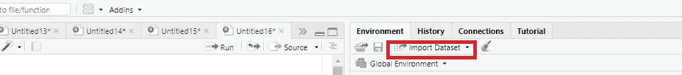
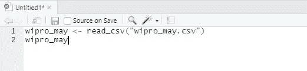
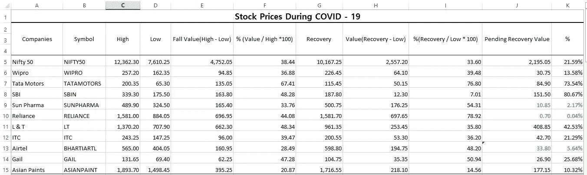
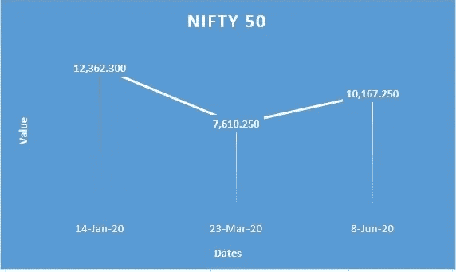
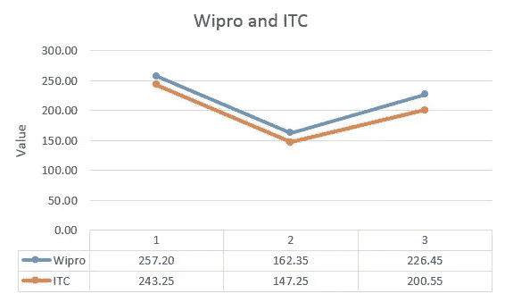
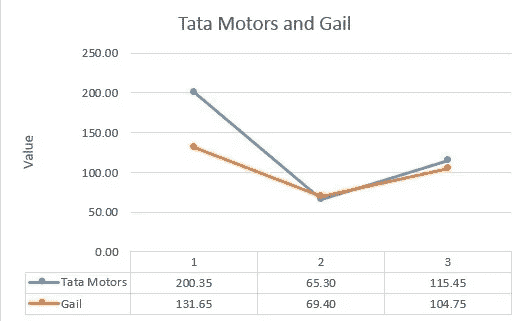
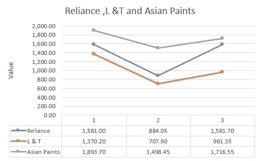

# 用 R 语言进行股票市场分析

> 原文：<https://medium.com/codex/stock-market-analysis-with-r-programming-language-c3ab502eb3e7?source=collection_archive---------1----------------------->

## **分析疫情中印度股票的表现**


[M. B. M.](https://unsplash.com/@m_b_m?utm_source=medium&utm_medium=referral) 在 [Unsplash](https://unsplash.com?utm_source=medium&utm_medium=referral) 上的照片

# **案例:**

准确地说，印度股市在 1 月至 4 月期间下跌了 41.2%。今年年初，大多数公司都处于巅峰状态，并跌至 52 周低点(被认为是今年的最低水平)。现在，股票市场开始复苏，平均涨幅为 43%，但仍有待恢复的价值需要检索。这种分析是按部门进行的，并与 NSE(国家证券交易所)指数运动进行比较。所有这些数据和审查(观察)发生在 2020 年 1 月 1 日至 2020 年 6 月 9 日之间。这种分析还揭示了股票和指数在此期间的表现，以及哪些是恢复最好和最差的公司。

## **R 作为分析工具**

r 编程语言被认为是数据科学中最强大的语言之一，用户也很容易使用它。用于编写 R 代码的软件是 RStudio，也有其他平台可以编写 R 代码，您可以选择。这种语言被统计学家和数据挖掘者广泛用于数据分析和开发统计软件。我们来看看如何用 R 做股票分析:

1.使用**导入数据集**导入数据集:



2.读取您导入的数据集文件:



3.为我们所需的分析编码(我已经从 NSE 网站提取了数据，上面的只是一个例子，现在我用不同的数据集编码)

这是 Wipro 的一个例子:

```
library(dplyr)
#Examining the lowest value of wipro 
> min(wipro_index$Close)
162.35
#Examining the highest value of wipro 
> max(wipro_index$Close)
257.2
#Calculating fall value of wipro
> max(wipro_index$Close) - min(wipro_index$Close)
94.85
#Calculating fall percentage of wipro
> 94.85 / max(wipro_index$Close) * 100
36.88
#Examining the recovery of wipro
> max(wipro_may$'Close Price')
226.45
#Calculating recovery value of wipro
> max(wipro_may$'Close Price') - min(wipro_index$Close)
64.1
#Calculating recovery percentage of wipro
> 64.1 / min(wipro_index$Close) * 100
39.48
#Calculating pending recovery value of wipro
> max(wipro_index$Close) - max(wipro_may$'Close Price')
30.75
#Calculating pending recovery percentage of wipro
> 30.75 / max(wipro_index$Close) * 100 
11.96
#Summarizing our analysis of wipro
> wipro_index  %>% 
    summarize(high = max(wipro_index$Close) ,
    low = min(wipro_index$Close) ,
    fall_value = max(wipro_index$Close) - min(wipro_index$Close) ,            
    fall_percentage = 94.85 / max(wipro_index$Close) * 100 ,
    recovery = max(wipro_may$`Close Price`) ,
    recovery_value  = max(wipro_may$`Close Price`) -        min(wipro_index$Close) , 
    recovery_percentage = 64.10 / min(wipro_index$Close) * 100 ,  
    pending_recovery = max(wipro_index$Close) - max(wipro_may$`Close Price`) ,
    pending_percentage = 30.75 / max(wipro_index$Close) * 100 )
#Output
high    low     fall_value  fall_percentage  recovery  recovery_value
257.2   162.35  94.85       36.88            226.45    64.1 
recovery_percentage  pending_recovery  pending_percentage             39.4826              30.75             11.96
```

通过这种编码，我们可以生成我们想要形成数据集的指定结果。从 R 中获得数据后，我们可以使用 Excel 为我们的分析制作一个简洁的表格。在这个程序中，我使用了包括“最小”、“最大”、“汇总”在内的函数

min—“min”函数返回向量或列的最小值。

max 返回向量或列的最大值或最大值。

汇总-“汇总”功能将数据帧简化为一个向量或值的汇总。

## **我们的数据列表**



## **数值的图形比较**

数据可视化在金融界非常重要，尤其是对于分析而言。不要创建一个列表，一个简单的图表或任何表示方法都很容易理解，并且对比较也很有用。在这篇博客中，为了便于理解，我用折线图比较了公司的价值。

## 1.俏皮 50



从这个图表中，我们可以了解到 Nifty 50 指数在 2020 年 1 月 14 日达到顶峰，在 2020 年 3 月 23 日下跌至 7，610.250。我们还可以观察到，12，362.30 的价格在短短 68 天内跌至 7，610.250，比峰值低 38.44%。接下来我们可以从这个图中观察到的是 Nifty 50 的恢复值。Nifty 50 的股价在短短 78 天内从 7610 点飙升至 10167 点，涨幅高达 33.6 %。关于这个图表的最后一点是，即使价格在 78 天内飙升，它也无法弥补其峰值 12362。因此，我们可以得出结论，Nifty 50 的待定恢复值仍为 2195，需要提高 21.59%的百分比。

## 2.Wipro 和 ITC(印度烟草公司)



这是比较 Wipro 和 ITC 两家公司股价的图表。我们可以观察到，这期间两家公司的动向比较相似。Wipro 一月份的股价是 257.2，跌了 94.85，达到了 162 的股价。下跌值百分比为 36.88%。不久，它在 6 月份恢复，价格飙升至 226 英镑，回收率为 39.4%。当我们比较 Wipro 的峰值价格和恢复价格时，待定恢复值为 30.75，必须上涨 13.58%。来到国贸，其峰值价格为 243.25，在此期间下降至 147.25 的价格。这家公司的下跌值为 96，下跌了 39.47%。股票价格在 3 月至 6 月间上涨至 200.55，回报率为 36.20%。就待收回价值而言，Wipro 的待收回率低于 ITC 的 21.29%。我们可以说 Wipro 在此期间表现良好，因为与 ITC 相比，它的未决回收率较低。

## 3.塔塔汽车和盖尔



这张图表比较了两家公司塔塔汽车公司和盖尔公司的股票价格。我们可以注意到，这两家公司的峰值价格不同，但在价格下降的情况下，它们是相似的。塔塔汽车的最高价格是 200.35 英镑，下降价格是 65.30 英镑。从这些价格中，我们可以观察到塔塔汽车具有惊人的下降价值和速度。塔塔汽车的下降值为 135.05，下降百分比为 64.41%。尽管价格大幅下跌，塔塔汽车公司在很短的时间内恢复了元气。它从下跌后的 65.30 英镑飙升至 115.45 英镑。回收率为 76.80%。但是，待定恢复值仍为 84.90，回收率为 73.54%。对盖尔来说，与塔塔汽车相比，价格变动并不显著。最高价格为 131.65 英镑，下降价格为 69.40 英镑，与塔塔汽车公司的价格更接近。盖尔下降值和下降率分别为 62.25%和 42.28%。恢复价格为 104.75 英镑，与塔塔汽车相比，这可以被认为是一个不错的回归。盖尔的待回收价值为 26.90，百分比为 25.68%。这一图表对比清楚地表明，塔塔汽车公司在此期间的价格波动很大。

## 4.信实、L & T 和亚洲油漆


这张图表包括三家公司的股票价格，即信实、L & T 和亚洲涂料。Reliance 的股票价格是其峰值 1，581 英镑，价格下跌至 884.05 英镑。但是回收率非常高，比最高价还要高。恢复价格为 1，581.70，比其峰值价格增加了 0.7%。很明显，由于价格超过了峰值，因此不存在即将到来的回收率。L & T 的最高股票价格是 1370.20。L & T 的下跌价格和价值分别为 707.90 和 662.30。L & T 的下降率为 48.34%。L & T 的回收价格为 961.35，回收率为 35.80。L & T 的待回收值为 408.85。由此我们可以说，与 L & T 相比，L & T 的表现很差。说到亚洲涂料，考虑到所有的峰值价格，亚洲涂料是其中最高的。亚洲涂料的最高价格为 1，893.70 英镑，下跌价格为 1，498.45 英镑。回收价格为 1，716.55，由此我们可以看出，亚洲油漆的待定价值和比率将低于 L & T。亚洲油漆的待定回收价值和比率分别为 177.15%和 10.32%。像这样，我们可以很容易地预测图表或任何类型的表示中的值，而无需进行任何计算。

## 5.SBI 和太阳制药



该折线图代表了 SBI 和太阳医药的股价。从图表中我们可以看出，在此期间，SBI 的价格波动很大。SBI 的最高价格为 339.3 英镑，价格下跌幅度惊人，为 175.5 英镑。SBI 的下跌百分比为 48.28%。SBI 的回收率仅为 7.01%，被认为是所有公司中最低的。待收回价值为 151.50，待收回率高达 80.67%。下一个公司是太阳制药，与 SBI 相比，它的表现很好。太阳医药的最高价格为 489.9，价格下跌 324.5，下跌值和下跌率分别为 165.40 和 33.76%。Sun Pharma 的回收价格和回收率非常好。太阳医药的恢复价格为 500.75，比其峰值价格 489.9 高出 2.17%。显而易见，太阳医药没有待回收价值。最后一家公司是 Airtel。它被认为是整个数据集中最赚钱的公司。Airtel 的峰值价格为 565 英镑，价格贬值至 404.05 英镑。下跌值和百分比分别为 160.95%和 28.49%。然而，在下跌了 28.49%的情况下，Airtel 惊人地恢复了 598.8 的价格，比峰值还高，增长率为 5.64%。由此，我们可以得出结论，太阳医药和 Airtel 的表现远远好于 SBI。

## **总结最佳和最差表现**

经过所有这些分析，在这个疫情时期，有些公司表现得特别好，有些则不然。所以，我从这个分析中挑选了三个表现最好的公司和三个表现最差的公司。

最佳表现公司:

*   信赖
*   太阳制药
*   机场内的旅馆

挑选这些公司的原因是，他们有惊人的恢复率，没有待定的恢复价值。价格波动也不太大，因此这些公司可能是不错的投资选择。

表现最差的公司:

*   印度国家银行
*   塔塔汽车公司
*   L & T

这些公司在上一年表现良好，但在这次疫情期间，这三家公司的价格波动非常大，而且它们还有惊人的待恢复价值和速率。因此，在疫情时期投资这些公司是不明智的。

数据科学不仅属于计算机科学，也属于金融分析。数据科学在商业、经济等领域非常重要。在经济学中，使用数据科学，我们可以进行自己的需求分析系列，这在经济规划中发挥着关键作用，可以预测未来的需求、销售、价格、成本分配等。说到业务，随着业务复杂性的增加，数据科学对 it 有着巨大的影响。数据科学在商业中的一个重要应用是决策。不仅在经济和商业领域，数据科学在许多领域都有应用，它也被认为是探索的趋势主题之一。

以下链接是哈佛大学提供的一门有趣的在线基础数据科学课程:

[](https://www.edx.org/course/data-science-r-basics) [## 数据科学:R 基础

### 在我们的数据科学专业证书课程的第一个，这门课程将向您介绍 R…

www.edx.org](https://www.edx.org/course/data-science-r-basics)