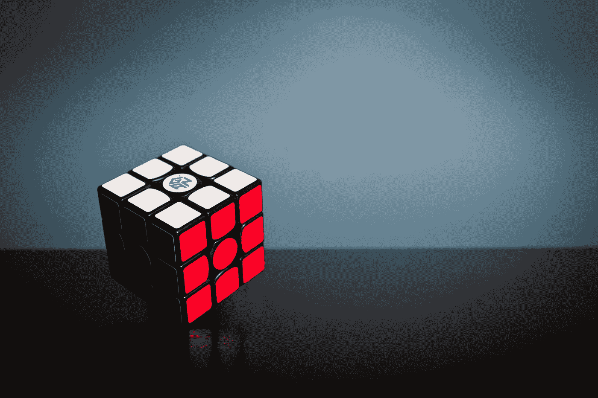

# 股票市场是人工智能预测的最神秘的系统

> 原文：<https://medium.com/codex/stock-market-is-the-most-enigmatic-system-to-be-predicted-by-ai-f8cca09e05c6?source=collection_archive---------4----------------------->

## 以及为什么几乎不可能这样做

奥拉夫·阿伦斯·罗特内在 [Unsplash](https://unsplash.com?utm_source=medium&utm_medium=referral) 上的照片

## 介绍

人工智能被引入现实世界已经几十年了，更不用说，它已经进化了很多。人工智能现在几乎在每一个领域都扮演着重要的角色，而且在未来还会继续发挥作用。它帮助科学家或生物学家在药物和医药领域取得突破，帮助环境学家维护和研究可持续的环境。最近，GPT 3 号和无刀 2.0 号的发明抢走了聚光灯，吸引了全世界数百万人的注意。这些是开源人工智能技术，可以做一些疯狂的事情，比如从文本中生成图像，等等超出人们想象的事情。

尽管当前人类设法发现并增强了能够在几个领域取得重大进展的强大人工智能技术，但它仍然难以预测股票市场的走势。我遇到了很多声称用人工神经网络预测市场的故事，如 RNN 和 LSTM，并成功达到 99%的准确率。这是愚蠢的，在这篇文章中，我们会发现为什么会这样。考虑到你的好奇心被激起，让我们深入这篇文章吧！

## 股票市场:最复杂的适应性系统

我们先来讨论一下什么是复杂适应系统(CAS)。CAS 是一个集成的生态系统，能够适应给定的环境。理解 CAS 的最好例子是我们的免疫系统。每当一种新病毒进入人体，免疫系统就会相应地发生变化，以便能够对这种病毒做出反应。同样，股票市场也随着买卖双方的行为而变化。

现在，股票市场作为一个 CAS 遵循两个重要特征:第一个是，市场是由一个代理人网络驱动的，这些代理人不是别的，就是人。这些代理共同形成了一个系统，在这个系统中，它们相互作用，并跟随其他代理的行为，这个循环走向永恒。其次，市场的控制权高度分散。这个世界上没有一个权威机构能够掌控整个股市。也许存在某些团体来调节市场，但没有人被授权去控制。所以，整个市场只依赖于数百万投资者或交易者的行为。

复杂适应系统的这两个特征最终可能会给人工智能预测股票价格带来麻烦，因为这些特征中的一般因素是人类行为，而这显然是不一致的。首先，人工智能无法考虑人类行为来建立模型，其次，即使它设法做到了，人类行为也是如此不一致，以至于人工智能模型几乎不可能预测运动。

## 人工智能模型可以被复制

即使当你设法建立一个更好的人工智能模型，实际上以更高的准确度预测市场，它也可以很容易地被其他人模仿，并最终改变你试图预测的市场的未来运动。我来详细解释一下这个。想象一下，你已经建立了一个人工智能模型来预测苹果的股票价格，你会非常兴奋地马上从中赚到一百万美元。现在，其他人也可以很容易地访问你的模型来做同样的任务，这就成了连锁反应。使用该模型的人数和交易量不断增加，在某一点上，整个市场运动受到影响，使得该模型无法预测，因此变得过时。

## 预测市场是浪费时间吗？或许

根据有史以来最伟大的投资者和价值投资之父沃伦·巴菲特的说法，一个声称有能力预测市场未来走势的人与算命先生没有什么不同，与股票投资无关。我们都知道，我们在股票上的投资在未来会有回报，这是可以预测的，但具体什么时候会发生是不可预测的，即使有人工智能和其他我们可以支配的技术。相反，我们可以做的是花时间寻找最好的股票来投资，按照沃伦·巴菲特的说法，没有什么比这更能保证我们的投资了。

## 预测市场是不可能的吗？

据我所知，99%的人在试图预测市场时失败了，但是有一些公司属于剩下的 1%的类别。除了人类行为和市场的随机运动等因素，导致人工智能模型预测市场准确性下降的另一个重要方面是质量差的数据。因此，像高盛和摩根大通这样的金融巨头正在投入数百万美元，主要用于购买高质量的准确股票数据，其次用于人工智能领域的研究，以大幅优化他们的投资。

从企业界听到的最好的成功故事肯定是文艺复兴技术公司。这家公司创造了定量金融这个术语，并一直致力于金融、技术和数学的结合。他们的方法很简单。他们以数百万美元的价格直接从交易所或其他高质量数据提供商那里购买数据，将数据输入他们的数学模型，将训练好的模型部署到现实世界中，以预测和计时市场。这听起来可能很简单，但很多复杂的工作都在幕后进行，这种方法确实有回报。截至目前，复兴科技是应用量化金融领域的先驱，也是收入最高的公司之一。

这篇文章的寓意是，如果你有一亿美元可以支配，那就去预测市场，否则，不要给自己太大压力，拿一桶爆米花，和网飞一起放松。