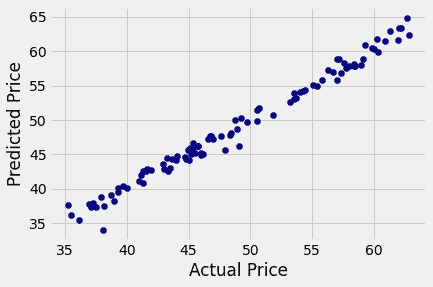

# Python 中回归算法的股票预测

> 原文：<https://medium.com/codex/stock-predication-using-regression-algorithm-in-python-fb8b426453b9?source=collection_archive---------0----------------------->


[M. B. M.](https://unsplash.com/@m_b_m?utm_source=medium&utm_medium=referral) 在 [Unsplash](https://unsplash.com?utm_source=medium&utm_medium=referral) 上拍摄的照片

## 使用 ML 算法预测股票价格的端到端解释

在这个练习中，我将使用 Yfinance 库来删除雅虎财经网站上的信息，雅虎财经是一个很好的网站，可以快速浏览你正在寻找的公司的上市股票、基金和投资数据。此外，我将通过对数据进行回归模型分析来测试和预测某些参数和股票价格。

# 导入所有必需的库

首先，我们将成功执行这个练习所需的库。这里要调用和关注的主要库是 yfinance。这个库将使我们能够从雅虎网站提取和调用不同的数据

在[1]中:

```
!pip install yfinanceCollecting yfinance
  Downloading yfinance-0.1.59.tar.gz (25 kB)
Requirement already satisfied: pandas>=0.24 in /opt/conda/lib/python3.7/site-packages (from yfinance) (1.2.2)
Requirement already satisfied: numpy>=1.15 in /opt/conda/lib/python3.7/site-packages (from yfinance) (1.19.5)
Requirement already satisfied: requests>=2.20 in /opt/conda/lib/python3.7/site-packages (from yfinance) (2.25.1)
Collecting multitasking>=0.0.7
  Downloading multitasking-0.0.9.tar.gz (8.1 kB)
Requirement already satisfied: lxml>=4.5.1 in /opt/conda/lib/python3.7/site-packages (from yfinance) (4.6.3)
Requirement already satisfied: python-dateutil>=2.7.3 in /opt/conda/lib/python3.7/site-packages (from pandas>=0.24->yfinance) (2.8.1)
Requirement already satisfied: pytz>=2017.3 in /opt/conda/lib/python3.7/site-packages (from pandas>=0.24->yfinance) (2021.1)
Requirement already satisfied: six>=1.5 in /opt/conda/lib/python3.7/site-packages (from python-dateutil>=2.7.3->pandas>=0.24->yfinance) (1.15.0)
Requirement already satisfied: urllib3<1.27,>=1.21.1 in /opt/conda/lib/python3.7/site-packages (from requests>=2.20->yfinance) (1.26.3)
Requirement already satisfied: idna<3,>=2.5 in /opt/conda/lib/python3.7/site-packages (from requests>=2.20->yfinance) (2.10)
Requirement already satisfied: certifi>=2017.4.17 in /opt/conda/lib/python3.7/site-packages (from requests>=2.20->yfinance) (2020.12.5)
Requirement already satisfied: chardet<5,>=3.0.2 in /opt/conda/lib/python3.7/site-packages (from requests>=2.20->yfinance) (3.0.4)
Building wheels for collected packages: yfinance, multitasking
  Building wheel for yfinance (setup.py) ... - \ done
  Created wheel for yfinance: filename=yfinance-0.1.59-py2.py3-none-any.whl size=23442 sha256=33c81ce98e6e86be0df9c086ce8b9f54138a14a1079c79d74003a7cfc00b8974
  Stored in directory: /root/.cache/pip/wheels/26/af/8b/fac1b47dffef567f945641cdc9b67bb25fae5725d462a8cf81
  Building wheel for multitasking (setup.py) ... - done
  Created wheel for multitasking: filename=multitasking-0.0.9-py3-none-any.whl size=8368 sha256=c14a0494e534aacbc1170fdaed133fb002cae59c00456e90086fe6970f5dd186
  Stored in directory: /root/.cache/pip/wheels/ae/25/47/4d68431a7ec1b6c4b5233365934b74c1d4e665bf5f968d363a
Successfully built yfinance multitasking
Installing collected packages: multitasking, yfinance
Successfully installed multitasking-0.0.9 yfinance-0.1.59
```

在[2]中:

```
*# Let's start with calling all dependencies that we will use for this exercise* 
import pandas as pd
import numpy as np
import math 
import seaborn as sns 
import matplotlib.pyplot as plt
from sklearn import metrics
from sklearn.model_selection import train_test_split
import yfinance as yf  *# We will use this library to upload latest data from Yahoo API*
%matplotlib inline
plt.style.use('fivethirtyeight')
```

# 数据收集和探索

在本节中，我们将使用某些方法调用与公司描述、股票价格、收盘价、交易量以及与股票相关的公司行为相关的数据。

在[3]中:

```
*# define the ticker you will use*
nio = yf.Ticker('NIO')
*#Display stock information, it will give you a summary description of the ticker*
nio.info
```

Out[3]:

```
{'zip': '201804',
 'sector': 'Consumer Cyclical',
 'fullTimeEmployees': 7763,
 'longBusinessSummary': 'NIO Inc. designs, develops, manufactures, and sells smart electric vehicles in Mainland China, Hong Kong, the United States, the United Kingdom, and Germany. The company offers five, six, and seven-seater electric SUVs, as well as smart electric sedans. It is also involved in the provision of energy and service packages to its users; marketing, design, and technology development activities; manufacture of e-powertrains, battery packs, and components; and sales and after sales management activities. In addition, the company offers power solutions, including Power Home, a home charging solution; Power Swap, a battery swapping service; Public Charger, a public fast charging solution; Power Mobile, a mobile charging service through charging vans; Power Map, an application that provides access to a network of public chargers and their real-time information; and One Click for Power valet service, where it offers vehicle pick up, charging, and return services. Further, it provides repair, maintenance, and bodywork services through its NIO service centers and authorized third-party service centers; statutory and third-party liability insurance, and vehicle damage insurance through third-party insurers; courtesy car services; and roadside assistance, as well as data packages; and auto financing services. Additionally, the company offers NIO Certified, an used vehicle inspection, evaluation, acquisition, and sales service. NIO Inc. has a strategic collaboration with Mobileye N.V. for the development of automated and autonomous vehicles for consumer markets. The company was formerly known as NextEV Inc. and changed its name to NIO Inc. in July 2017\. NIO Inc. was founded in 2014 and is headquartered in Shanghai, China.',
 'city': 'Shanghai',
 'phone': '86 21 6908 2018',
 'country': 'China',
 'companyOfficers': [],
 'website': 'http://www.nio.com',
 'maxAge': 1,
 'address1': 'Building 20',
 'industry': 'Auto Manufacturers',
 'address2': 'No. 56 AnTuo Road Anting Town Jiading District',
 'previousClose': 38.12,
 'regularMarketOpen': 37.96,
 'twoHundredDayAverage': 43.683704,
 'trailingAnnualDividendYield': None,
 'payoutRatio': 0,
 'volume24Hr': None,
 'regularMarketDayHigh': 38,
 'navPrice': None,
 'averageDailyVolume10Day': 70446940,
 'totalAssets': None,
 'regularMarketPreviousClose': 38.12,
 'fiftyDayAverage': 41.888824,
 'trailingAnnualDividendRate': None,
 'open': 37.96,
 'toCurrency': None,
 'averageVolume10days': 70446940,
 'expireDate': None,
 'yield': None,
 'algorithm': None,
 'dividendRate': None,
 'exDividendDate': None,
 'beta': 2.613181,
 'circulatingSupply': None,
 'startDate': None,
 'regularMarketDayLow': 36.76,
 'priceHint': 2,
 'currency': 'USD',
 'regularMarketVolume': 52839807,
 'lastMarket': None,
 'maxSupply': None,
 'openInterest': None,
 'marketCap': 60854632448,
 'volumeAllCurrencies': None,
 'strikePrice': None,
 'averageVolume': 97445091,
 'priceToSalesTrailing12Months': 3.743073,
 'dayLow': 36.76,
 'ask': 37.43,
 'ytdReturn': None,
 'askSize': 3000,
 'volume': 52839807,
 'fiftyTwoWeekHigh': 66.99,
 'forwardPE': -371.4,
 'fromCurrency': None,
 'fiveYearAvgDividendYield': None,
 'fiftyTwoWeekLow': 2.88,
 'bid': 37.21,
 'tradeable': False,
 'dividendYield': None,
 'bidSize': 1400,
 'dayHigh': 38,
 'exchange': 'NYQ',
 'shortName': 'NIO Inc.',
 'longName': 'NIO Inc.',
 'exchangeTimezoneName': 'America/New_York',
 'exchangeTimezoneShortName': 'EDT',
 'isEsgPopulated': False,
 'gmtOffSetMilliseconds': '-14400000',
 'quoteType': 'EQUITY',
 'symbol': 'NIO',
 'messageBoardId': 'finmb_311626862',
 'market': 'us_market',
 'annualHoldingsTurnover': None,
 'enterpriseToRevenue': 2.107,
 'beta3Year': None,
 'profitMargins': -0.34511003,
 'enterpriseToEbitda': -9.618,
 '52WeekChange': 11.664452,
 'morningStarRiskRating': None,
 'forwardEps': -0.1,
 'revenueQuarterlyGrowth': None,
 'sharesOutstanding': 1638520064,
 'fundInceptionDate': None,
 'annualReportExpenseRatio': None,
 'bookValue': 17.315,
 'sharesShort': 65406021,
 'sharesPercentSharesOut': 0.0399,
 'fundFamily': None,
 'lastFiscalYearEnd': 1609372800,
 'heldPercentInstitutions': 0.36421,
 'netIncomeToCommon': -5610789888,
 'trailingEps': -0.724,
 'lastDividendValue': None,
 'SandP52WeekChange': 0.45070732,
 'priceToBook': 2.1449609,
 'heldPercentInsiders': 0.00533,
 'nextFiscalYearEnd': 1672444800,
 'mostRecentQuarter': 1609372800,
 'shortRatio': 0.53,
 'sharesShortPreviousMonthDate': 1614297600,
 'floatShares': 1327183283,
 'enterpriseValue': 34251128832,
 'threeYearAverageReturn': None,
 'lastSplitDate': None,
 'lastSplitFactor': None,
 'legalType': None,
 'lastDividendDate': None,
 'morningStarOverallRating': None,
 'earningsQuarterlyGrowth': None,
 'dateShortInterest': 1617148800,
 'pegRatio': 4298.73,
 'lastCapGain': None,
 'shortPercentOfFloat': None,
 'sharesShortPriorMonth': 48084071,
 'impliedSharesOutstanding': None,
 'category': None,
 'fiveYearAverageReturn': None,
 'regularMarketPrice': 37.14,
 'logo_url': 'https://logo.clearbit.com/nio.com'}
```

# 回归分析的数据准备和清理

来自 Yahoo Finance 的数据简单明了，反映了股票市场的实时数据，因此清理和处理导出的数据并不是一项困难的任务。

在[4]中:

```
history = nio.history(period="Max")
df = pd.DataFrame(history)
df.head(10)
```

Out[4]:


在[5]中:

```
*# defining x and y* 
x = df.index
y = df['Close']
y
```

Out[5]:

```
Date
2018-09-12     6.600000
2018-09-13    11.600000
2018-09-14     9.900000
2018-09-17     8.500000
2018-09-18     7.680000
                ...    
2021-04-06    40.000000
2021-04-07    37.270000
2021-04-08    38.700001
2021-04-09    38.119999
2021-04-12    37.139999
Name: Close, Length: 649, dtype: float64
```

在[6]中:

```
*# Data Exploration*
*# i like to set up a plot function so i can reuse it at later stages of this analysis* 
def df_plot(data, x, y, title="", xlabel='Date', ylabel='Value', dpi=100):
    plt.figure(figsize=(16,5), dpi=dpi)
    plt.plot(x, y, color='tab:red')
    plt.gca().set(title=title, xlabel=xlabel, ylabel=ylabel)
    plt.show()
```

在[7]中:

```
stock_name= "NIO"
title = (stock_name,"History stock performance till date")
df_plot(df , x , y , title=title,xlabel='Date', ylabel='Value',dpi=100)
```


在[8]中:

```
*# Data Processing and scaling*
df.reset_index(inplace=True) *# to reset index and convert it to column*
```

在[9]中:

```
df.head(2)
```

Out[9]:


在[10]中:

```
df.columns ['date','open','high','low','close','vol','divs','split']
```

在[11]中:

```
df.drop(columns=['divs','split']).head(2) *# We are dropping un necessary columns from the set*
```

Out[11]:


在[12]中:

```
df['date'] = pd.to_datetime(df.date)
```

在[13]中:

```
df.describe()
```

Out[13]:


在[14]中:

```
print(len(df))649
```

在[15]中:

```
x = df[['open', 'high','low', 'vol']]
y = df['close']
```

# 数据分割

对于这些数据，我将数据分为训练数据集和测试数据集，测试规模占总数据集的 15%。之后，我们可以使用 shape()方法简单地检查数据是否被成功分割。

在[16]中:

```
*# Linear regression Model for stock prediction* 
train_x, test_x, train_y, test_y = train_test_split(x, y, test_size=0.15 , shuffle=False,random_state = 0)
```

在[17]中:

```
*# let's check if total observation makes sense*
print(train_x.shape )
print(test_x.shape)
print(train_y.shape)
print(test_y.shape)(551, 4)
(98, 4)
(551,)
(98,)
```

# 回归算法模型实现

在我们开始对数据集实现回归模型的技术部分之前，让我们谈一谈回归算法。基本上，回归是一套估计关系的技术。例如，在现实生活中，我们可以将拉伸弹簧的力与弹簧拉伸的距离联系起来(类似于胡克定律)，或者解释随着时间的推移，半导体行业可以在电路中装入多少晶体管(摩尔定律)。

# **回归算法的类型**

显然机器学习中有很多回归算法，比如线性回归、逻辑回归和 Lasso 回归算法:

# **线性回归**

线性回归是一种监督学习算法，它根据给定的自变量预测因变量或目标，所以基本上你找到了因变量和自变量之间的关系。

# **逻辑回归**

逻辑回归算法是另一种监督算法，用于描述数据并解释一个因变量和一个或多个自变量之间的关系。使用该算法的输出不是 0 就是 1。

在我们的例子中，我们将使用线性回归算法来预测这些股票价格

线性回归的方程式可以写成如下:

在[18]中:

```
import os
from IPython.display import Image
print("**Linear Regression Formula**")
Image(filename="../input/stock-prediction-using-regression-algorithm/1.JPG", width= 250, height=100)**Linear Regression Formula**
```

Out[18]:


也

在[19]中:

```
print("**Regression Formula**")
Image(filename="../input/stock-prediction-using-regression-algorithm/2.JPG", width= 280, height=110)**Regression Formula**
```

Out[19]:


其中，x1，x2，…xn 代表自变量，而系数θ1、θ2、θn 代表权重。

在[20]中:

```
from sklearn.linear_model import LinearRegression
from sklearn.metrics import confusion_matrix, accuracy_score
regression = LinearRegression()
regression.fit(train_x, train_y)
print("regression coefficient",regression.coef_)
print("regression intercept",regression.intercept_)regression coefficient [-6.51840470e-01  8.48419125e-01  8.12048390e-01 -3.50557805e-10]
regression intercept -0.0315814559475216
```

# 预测和估计

# 决定系数 R

在这里，我们将计算由 R 表示的决定系数，其取值在 0 和 1 之间，R 值越高，线性回归在解释 Y 值的变化方面越成功，在我们的情况下，Y 值代表受调查公司的收盘价。下面是决定系数 R 背后的数学公式

在[21]中:

```
print("**List of equations**")
Image(filename="../input/stock-prediction-using-regression-algorithm/3.JPG", width= 400, height=250)**List of equations**
```

Out[21]:


在[22]中:

```
*# the coefficient of determination R²* 
regression_confidence = regression.score(test_x, test_y)
print("linear regression confidence: ", regression_confidence)linear regression confidence:  0.9836914831421212
```

我们数据的决定系数 R 为 0.98，即 98%，这意味着我们的模型是一个线性模型，可以解释所有 Y 值的变化。

# 预言；预测；预告

正如我们在下面看到的，来自开盘、盘高、盘低和成交量的预测数据点列表并没有根据时间或日期进行排序，此时对这些数据点进行排序并不重要，因为我们将使用散点图()方法根据它们的相关日期进行绘图。

在[23]中:

```
predicted=regression.predict(test_x)
print(test_x.head())open       high        low        vol
551  45.750000  46.720001  42.500000  271678300
552  45.360001  48.919998  44.680000  233779100
553  48.270000  50.590000  47.880001  209106300
554  50.860001  55.700001  50.480000  270203000
555  56.990002  57.200001  51.500000  243669700
```

在[24]中:

```
predicted.shape
```

Out[24]:

```
(98,)
```

# 实际价格与预测值的预测表

在[25]中:

```
dfr=pd.DataFrame({'Actual_Price':test_y, 'Predicted_Price':predicted})
dfr.head(10)
```

Out[25]:


下表显示了数据集的实际值与预测值的汇总统计值

在[26]中:

```
dfr.describe()
```

Out[26]:


# 模型评估

MAE 和 RMSE 是最常见的统计指标，用于测量连续变量，或者在我们的情况下，我们的回归模型的准确性。

这两个模型背后的数学可能会令人困惑或有点难以理解其含义，但请以这种简单的方式思考一下，我们有实际的股票收盘价和预测的股票价格，它们是根据我们讨论过的相同的实际股票价格计算的，现在我们需要计算它们之间的误差或差异，以查看这些预测与手头的实际值相比有多准确。

# 平均绝对误差(MAE):

MAE 测量一组预测中误差的平均大小，不考虑它们的方向。

在[27]中:

```
print("**Mean Absolute Error (MAE)**")
Image(filename="../input/stock-prediction-using-regression-algorithm/4.JPG", width= 400, height=250)**Mean Absolute Error (MAE)**
```

Out[27]:


# 均方根误差(RMSE):

RMSE 是一个二次评分规则，也衡量误差的平均幅度。

在[28]中:

```
print("**Root mean squared error (RMSE)**")
Image(filename="../input/stock-prediction-using-regression-algorithm/5.JPG", width= 400, height=250)**Root mean squared error (RMSE)**
```

Out[28]:


# 均方差(MSE):

在[29]中:

```
print("** Mean squared error (MSE)**")
Image(filename="../input/stock-prediction-using-regression-algorithm/6.JPG", width= 400, height=250)** Mean squared error (MSE)**
```

Out[29]:


MSE 均方误差(MSE)衡量误差平方的平均值，即估计值和实际值之间的平均平方差。MSE 是一个风险函数，对应于平方误差损失的期望值。

上面提到的所有指标的范围可以从 0 到∞并且与误差的方向无关。它们是负向的分数，这意味着它们呈现的值越低越好。请记住，RMSE 的值总是比 MSE 大，而且它可以惩罚更多与错误相关的数据，因此 RMSE 可能是比 MSE 更好的衡量标准。

在我们的案例中，我们的评估结果如下:

在[30]中:

```
print('Mean Absolute Error (MAE):', metrics.mean_absolute_error(test_y, predicted))
print('Mean Squared Error (MSE) :', metrics.mean_squared_error(test_y, predicted))
print('Root Mean Squared Error (RMSE):', np.sqrt(metrics.mean_squared_error(test_y, predicted)))Mean Absolute Error (MAE): 0.7581175544856527
Mean Squared Error (MSE) : 1.001586723642404
Root Mean Squared Error (RMSE): 1.000793047359145
```

我们所有的度量结果都显示小于 1 的值，从解释的角度来看，我认为对于线性问题，MAE 是比 RMSE 更好的度量，因为 RMSE 不仅仅描述平均误差，还有其他更难梳理和理解的含义。此外，RMSE 更加重视大的误差，所以模型会尽可能地减少这些误差。

在[31]中:

```
dfr.describe()
```

Out[31]:


# 模型精度

在[32]中:

```
x2 = dfr.Actual_Price.mean()
y2 = dfr.Predicted_Price.mean()
Accuracy1 = x2/y2*100
print("The accuracy of the model is " , Accuracy1)The accuracy of the model is  99.68318915929602
```

在[33]中:

```
plt.scatter(dfr.Actual_Price, dfr.Predicted_Price,  color='Darkblue')
plt.xlabel("Actual Price")
plt.ylabel("Predicted Price")plt.show()
```



在[34]中:

```
plt.plot(dfr.Actual_Price, color='black')
plt.plot(dfr.Predicted_Price, color='lightblue')
plt.title("Nio prediction chart")
plt.legend();
```


# 结论

当谈到时间序列预测或试图感受市场整体走向时，股票市场一直是最热门的话题。不可能找到“去”公式来预测股票市场的方向，因为市场的不断波动，移动变量的不确定性可能会影响股票市场的波动，从相关风险到政治不稳定和宏观经济因素，等等。

为了更好地了解市场的走向，依赖回归模型并根据过去的表现预测某些值是不够的。以下几点应该是对成熟的回归模型报告的补充。

# 1-基本面分析

基本面分析是一种基于历史和当前业绩数据来分析和预测公司内在价值的方法，这些数据以财务报表和资产负债表信息的形式出现。因此，可以分析信息来计算公司当前的倍数，如市盈率、市净率、流动性比率、负债率、回报率、利润率等。这些信息可以让你对公司的发展方向有一个坚定的信念，并帮助你做出是否考虑投资该公司的关键决定。

# 2-技术分析

技术分析是基于历史数据(例如，交易股票的每日总量或价值)使用统计方法和趋势，并评估历史模式以预测未来股价运动的方法。

# 3-情感分析

基本上，情感分析是使用高端自然语言处理来确定给定的文本数据是正面的、负面的还是中性的。你可以通过段落、大量文字资料、客户评论、研究论文、科学论文等进行分析。在我们的例子中，您可能会使用这种方法来分析主题公司的 Twitter 帐户，或者从其脸书帐户进行评论等等。

关于作者:**阿卜杜拉·马赫古布**

数据科学家|投资运营分析师|数据科学爱好者| ML |大数据| Python | SQL | FinTech |战略规划者|业务开发人员|演讲者|作家|全栈开发人员和 UX 设计师