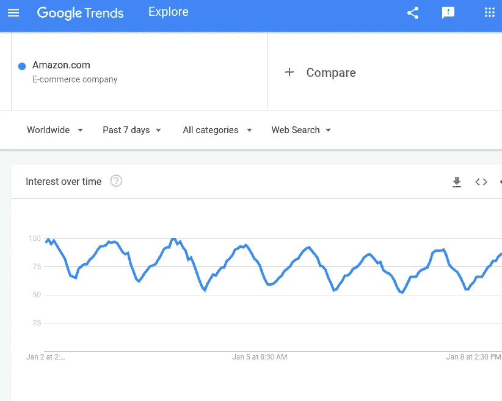

# 股票价格预测:一种改进的方法

> 原文：<https://medium.com/codex/stock-price-prediction-a-modified-approach-8d63ea6726a7?source=collection_archive---------0----------------------->


在 [Unsplash](https://unsplash.com/s/photos/stock-market?utm_source=unsplash&utm_medium=referral&utm_content=creditCopyText) 上由 [Austin Distel](https://unsplash.com/@austindistel?utm_source=unsplash&utm_medium=referral&utm_content=creditCopyText) 拍摄的照片

## 我们能使用机器学习来预测股票的价值吗？

股票价值预测是当前机器学习领域的一个主要任务。已经提出了几种方法来解决这个问题。它们中的大多数是基于对股票价值的时间序列分析，其他的是基于用来预测特定股票价值的新闻情绪。股票预测问题特别有趣，因为这个问题有几个方面。价格价值取决于人、情绪、公司业绩、新闻、监管机构和银行等做市金融机构。由于提到的每一个因素几乎都在同一时间起作用，而且每一个因素都会影响价格的变动，所以很难用一个特定的因素来解释价格的变化。我自己曾经尝试过[这篇文章](https://towardsdatascience.com/stock-price-prediction-based-on-deep-learning-3842ef697da0)中提出的一种方法。在我目前的工作中，我将提出一个更加健壮的方法。一些想法是从我以前的作品中继承而来的，为了克服我以前作品中的缺陷，做了一些修改。为了更好地理解，你可以看看我以前的作品。

**这是一种完全基于研究目的的方法。请不要基于这种算法进行投资。**

# 当前的想法

## **市场指标**

在我目前的想法中，我试图设计一种算法，将实际市场指标的工作方式考虑在内。我们大多数人都有一个共同的看法，即股票市场是非常不确定的，它肯定是，但不知何故，人们研究市场，发现策略。所以，问题来了，真正的交易者是如何研究市场的？多亏了 Investopedia 和 Zerodha 这样的网站，我发现了一些市场指标，如支持、阻力和波动指数。现在，要知道的一件事是，指标是根据交易者的感觉工作的。

让我们来看看一些定义:

**支撑位:**支撑位可以定义为一个价格水平，它通过阻止价格进一步下跌来充当底部。基本上，在这个水平上，有买家买入并推回市场。

**阻力:**与支撑类似，阻力是一个价格水平，作为阻止价格进一步上涨的天花板。在这个水平，基本上，卖盘会介入并推低股价。

如果支撑被打破，它就会变成阻力，反之亦然。

**波动指数/标准差:**我们都知道，这里的一切都和钱有关，所以风险自然有限。但是要冒一次险，就要有一些期待。波动指数反映了预期。两个波动性指数定义了一个范围或一个带，基于当前时间范围的行为，在该范围或带之间，下一个时间范围的可能股票价值可能下跌。通常，波动指数是相对于移动平均线来定义的。根据标准实践，上限指数是移动平均线的 2 %+当前移动平均线，下限指数是当前移动平均线-移动平均线的 2%。这就定义了一个波段。如果该波段被打破，则认为有大量交易，大多正在发生。

支撑和阻力有两种:多头和空头。这个基本上要看学习的时间限制。

现在，我们已经讨论了几个实时市场指标。需要记住的一点是，所有这些指标都是根据我们从过去 t 个单位获得的数据，对 t+1 个单位的未来价格进行假设而计算出来的。理解这一点对于理解所使用的建模概念非常重要。

因此，这个想法是，如果真正的大脑使用这些指标进行预测，为什么不在建模中使用它们。

## 经济指标

如果整个市场受到影响，股票价格也会受到影响。现在，为了记录这种变化，我们可以考虑经济指标，如道琼斯指数和 SnP 500 指数。它们是整个市场经济实际运行情况的标准指标。这些指标可以从[这里](https://www.macrotrends.net/)下载。


道琼斯图表

## 趋势

股票市场依赖于公众情绪。现在，假设一家公司达成了一笔交易或推出了一款新产品，那么，这可能会推高该公司股票的价格。这仅仅是因为人们现在更关注这家公司了。如果我们能了解公司的发展趋势，这一点很容易被注意到。谷歌提供了这些趋势，可以作为价格的指标。如果人们谈论更多的东西，那不是很好就是很坏。在这两种情况下，价格值都会发生变化。变化的方向与新闻情绪密切相关。



## **新闻舆情**

再一次，正如我之前提到的，新闻在股票价格变化中起着巨大的作用。因为它创造了情绪。如果有关于一家公司的正面消息，它的价格会因为显而易见的原因而上涨。在 Finviz 和《金融时报》等网站上可以获得股票的金融新闻。如果我们能获得新闻情感，我们就能很容易地使用它们。


AMZN ticker 的 FINVIZ 新闻数据

## 相关股票

如果我们试图预测一个特定的股票价值，有几个其他股票与考虑的股票价值高度相关。如果我们能找到相关性最高的前 10 或 5 只股票，它们可能是很好的指标。

现在，我们已经讨论了一些要点，让我们进入一些更详细的内容:

## 作为时间序列数据的股票预测

股票市场由交易者以不同的方式操作。有些按小时计算，有些按 5 分钟计算，有些按天计算。在这项工作中，我每天都在工作。因此，我们必须预测当天的收盘价，即第 t+1 天的**调整收盘价。现在，我们有股票在第**个**天的开盘价、收盘价、调整后收盘价、成交量、最高价和最低价。所以，如果我们有第 t 个单元的值，我们想预测第 t+1 个单元，我们使用时间序列分析。我们使用**递归神经网络**进行时间序列分析。**

## 整合功能

我们上面谈到的所有特征，如指标、趋势和情绪，除了相关的股票价格，都已经为第 t+1 天做好了准备。趋势、经济指标和新闻甚至可以在 t+1 日开市前搜集和准备好。对于相互关联的股票，我们可以分别对它们进行时间序列分析，并生成第 t+1 天的价格。

所有这些特性都为 t+1 日价值做好了准备。这些特征作为外部特征影响作为时间序列输出的预测值。因此，它们可以简单地与相关股票的时间序列分析的输出合并到一个回归模型中。

以这种方式，我们的神经网络将能够结合风险管理、买方和卖方的存在、新闻情绪的存在以及主题价格预测期间的经济条件。

让我们来看看这种方法的工作原理。

## 工作

最初的工作在我之前的工作中解释过。你可以参考一下，以便更清楚地了解。我曾试图预测亚马逊股票的价值，并使用了 SnP 500 公司的前 300 名股票。


上面的图表给出了前 300 个报价机之间的相互关系。我考虑了与我们的目标股票亚马逊(Amazon)相关性最高的前 10 家股票交易所。


上图显示了分笔成交点及其相互关系。

现在，我们已经采用了调整后的收盘价，并创建了单独的 RNN 模型，以获得它们在第 t+1 天的价值。

为了训练 RNN，我们采用了 20 天的连续数据，并训练模型来预测第 21 天的数据。


上述模型已被用于训练给定数据的单个 RNN 模型。

现在，让我们来谈谈我们的目标股票亚马逊(Amazon)。首先，让我们检查市场指标的声明。

**移动平均线**:最近 20 天调整收盘值的平均值。

**波动指数上限**:第 t 日移动平均线+第 t 日移动平均线的 2%

**下波动指数**:第 t 日移动平均线-第 t 日移动平均线的 2%

**短阻**:最近 10 天的最大高值。

**空头支撑:**最近 10 天的最低低值。

**多头支持:**最近 50 天的最小低值。

**长阻力**:最近 50 天的最大高值。

> 定义不标准。对于本项目而言，它们纯属假设。请不要做这些定义。它们纯粹是为了研究目的和想法投射。


上图显示了调整后的收盘价、波动指数以及空头支撑位和阻力位。


这张图显示了移动平均线，波动指数，长期支撑和阻力。

这些趋势可以从谷歌趋势网站以 csv 格式下载。同样的，经济指标，道琼斯可以从[这里](https://www.macrotrends.net/1358/dow-jones-industrial-average-last-10-years)下载为 csv，S & P 500 可以从[这里](https://www.macrotrends.net/2488/sp500-10-year-daily-chart)下载。


上图显示了移动平均线随指标的变化。

对于新闻观点，我从[这里](https://seekingalpha.com/symbol/AMZN/analysis)搜集了过去两年亚马逊股票的新闻。目前，我们可以抓取像 FINVIZ 和金融时报这样的网站。

```
from nltk.sentiment.vader import SentimentIntensityAnalyzer
analyzer = SentimentIntensityAnalyzer()
scores=df_news['News'].apply(analyzer.polarity_scores).tolist()
scores_df=pd.DataFrame(scores)
df_news_final=pd.concat([df_news,scores_df],axis=1)
```

上面的代码片段用于获取新闻情感值。我们使用的是 nltk . petition . Vader 库中的 SentimentIntensityAnalyzer()。


分析器基本上给出了新闻的极性。如果消息是好的或积极的，则正极性高，以此类推。这些列是:阳性、阴性和中性。

因此，我们结合所有的特征来创建我们的训练数据集。

```
RNN_data_cols=['High','Low','Open','Close','Volume','Adj Close','Moving_av']
```

正如我们之前所讨论的，根据时间序列分析，上述 7 个特征是直接相关的因素，我们需要将它们通过 RNN 以获得第 t+1 个值。

```
Regression_data_cols=['Upper_volatility','Lower_volatility','Short_resistance','Short_support','Long_resistance','Long_support','trend_hit','Dow_jones','snp500','compound','neg','neu','pos','BF-B','CTAS','CPRT','AJG','HUM','MKTX','INFO','CHD','A','APD']
```

以上 23 列是影响 RNN 获取 t+1 时间序列数据值的外部特征。它们包括不同的特征，如新闻情绪、相关股票价格等。

为了再次训练 RNN，我们创建了 20 天的连续数据，并尝试预测第 21 天的调整后收盘。


上述模型已用于预测最终股票价值。正如我们所看到的，首先 RNN 使用时间序列分析预测价值，然后将影响特征传递到回归模型中，以预测考虑外部因素影响的价值，这些外部因素存在于原始市场条件中。

我们需要使用 10 个相关报价机的单个 RNN 模型，从时间序列分析中得出它们在第 t+1 天的概率值，这些值将作为外部特征传递。对他们来说，我们只需要跟踪趋势或运动，以获得我们的目标股票的相关运动，所以，时间序列分析对这些股票就足够了。

## 结果


上图中的红线显示实际值，蓝线显示预测值。我们可以看到我们的模型非常接近股票的实际价值。

# 结论

在这篇文章中，我们看到了一种预测股票价格的方法，它考虑到了实际交易者的观点，并试图从那里进行分析。支撑线和阻力线的存在有助于模型模拟真实的市场场景，包括真实的卖家和买家。新闻和趋势显示了人们的情绪对真实市场的影响。

这个项目完全是从研究的角度来展示背后的想法。这些定义和假设是为实施项目而制定的，并且仅针对特定项目。

代码可用:[此处](https://github.com/abr-98/Stock_prediction_approach_modified)。

我希望这有所帮助。