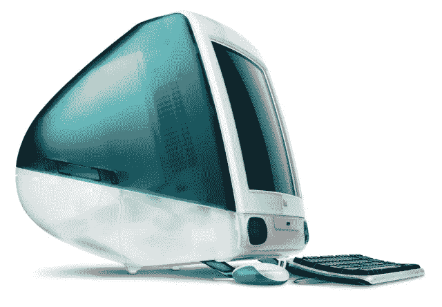

# 被盗的史蒂夫·乔布斯第一台苹果电脑样机在拍卖会上被发现，你可以得到！！！

> 原文：<https://medium.com/codex/stolen-steve-jobs-1st-apple-computer-prototype-found-at-auction-for-you-to-get-72b4cf3ea216?source=collection_archive---------22----------------------->

**苹果公司的第一台电脑**，更正式的名称是*“苹果电脑 A”，*现在正在波斯顿拍卖，就在我们说让你买的时候，但是你知道它可能已经被偷了吗？！

来源——苹果

**Apple-1** 是**苹果的第一个有形产品**,只是一块暴露在外的电路板，上面粘着一捆思想和…