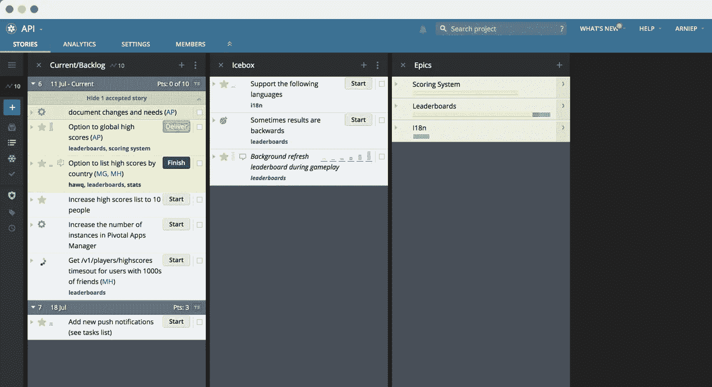

# 停止创造科技故事

> 原文：<https://medium.com/codex/stop-creating-technical-stories-f5e7bc424ff8?source=collection_archive---------0----------------------->

## 您的待办事项中是否包含诸如迁移、升级、重构和其他杂务之类的技术故事？你写的是任务而不是真实的用户故事吗？让我们看看为什么这是一个反模式。

[枢轴跟踪器](https://www.pivotaltracker.com/)中的一块板

我是通过[不断重构](https://ronjeffries.com/xprog/articles/refactoring-not-on-the-backlog/)不断改进代码库的粉丝。我喜欢编码，我关心…