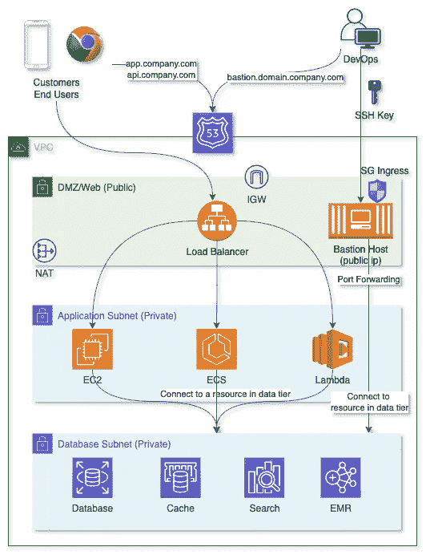
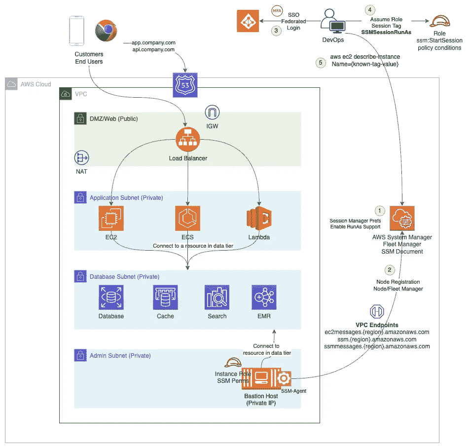

# 停止在互联网上暴露堡垒主机

> 原文：<https://medium.com/codex/stop-exposing-bastion-host-over-the-internet-c1d535192562?source=collection_archive---------3----------------------->

云中(甚至是数据中心中)网络架构的最佳实践是将您的基础架构资源隔离在适当的子网中。需要暴露给公共子网中的公共资源和私有子网中的其余资源的资源，进一步将私有子网划分成一个以上的私有子网，以将应用程序、数据库和管理基础设施资源隔离到它们自己的私有子网中。

对于具有三层架构的典型 web 应用程序或微服务，您可以使用公共子网中的负载平衡器(通过友好域名解析，例如*{ API | { app-name } } . your company . com*)将应用程序或 API 的某些部分公开。然后，负载平衡器将流量路由到您的应用服务器(微服务实例/容器)，应用服务器将从数据库中读取/写入数据。

我不会在这篇文章中详细讨论正确的子网和 IP 分配策略(可能会在以后的文章中讨论)，这篇文章的前提是同意将基础架构资源放置在适当的子网中，主要是公开或私有(仅供内部使用)。随着基础设施被放入私有子网，出现了以下问题

> 我们如何访问在专用子网中创建的资源(如关系数据库、开放式搜索服务器、缓存服务器等)以进行开发、故障排除、维护和其他管理活动？

在没有 VPN 设置/连接的情况下(如果您是一家利用云原生和 SaaS 解决方案进行企业运营和开发的初创公司或小公司，就会出现这种情况)，您将需要在您的公共子网中托管一台单独的服务器，通过互联网公开和访问，并允许从(DevOps 团队的)已知 IP 地址列表中使用 SSH(端口 22 打开)。这台服务器就是你的**堡垒主机**。在这个设置中，您的 bastion 主机是公开可访问的，SSH(端口 22)是开放的，这是一个安全风险。

具有堡垒主机(无 VPN)的典型设置，允许使用 SSH 端口转发/隧道访问专用子网中的资源，用于应用程序开发、故障排除、维护/管理任务。

## 停下来。！你不需要在互联网上暴露你的堡垒主机。

照片由[纳丁·沙巴纳](https://unsplash.com/@nadineshaabana?utm_source=medium&utm_medium=referral)在 [Unsplash](https://unsplash.com?utm_source=medium&utm_medium=referral) 上拍摄

# AWS 系统管理员—会话管理员

AWS [会话管理器](https://docs.aws.amazon.com/systems-manager/latest/userguide/session-manager.html)，帮助您解决上述风险并改善您的安全状况。会话管理器的优点是:

*   使用 [IAM 访问策略](https://docs.aws.amazon.com/systems-manager/latest/userguide/getting-started-restrict-access-quickstart.html#restrict-access-quickstart-end-user)集中访问 Bastion 主机(或其他 EC2 实例)
*   没有用于入站访问的开放端口，也不需要维护 SSH 密钥
*   从 AWS 控制台/UI 轻松访问受管节点
*   支持端口转发
*   支持 Linux、Windows 和 macOS
*   [审计](https://docs.aws.amazon.com/systems-manager/latest/userguide/session-manager-auditing.html) (AWS CloudTrail)和[日志](https://docs.aws.amazon.com/systems-manager/latest/userguide/session-manager-logging.html) (CloudWatch 和 S3，对日志进行 KMS 加密)
*   使用 [AWS KMS](https://docs.aws.amazon.com/systems-manager/latest/userguide/session-preferences-enable-encryption.html) 进行加密

我们尽可能利用无服务器，除了数据库、搜索和缓存。我们必须管理的唯一服务器是一个 Bastion 主机，它有一个逻辑(userdata + cron)将开发人员的 ssh 公钥同步到主机，只要主机是可访问的(公共的)并且允许端口访问(使用安全组入口规则)，就授予它们访问权限。一旦开发人员访问了 bastion 主机，他们就使用 [SSH 端口转发/隧道](https://www.ssh.com/academy/ssh/tunneling/example)与私有子网内的其他服务器进行通信。

通过 AWS 会话管理器 SSM 代理，Bastion 主机可以在专用子网内移动，并通过适当的出口设置向 AWS 系统管理器服务注册。

使用 AWS 会话管理器有助于通过消除 Bastion 主机的公开暴露来减少攻击面，它不再需要维护 SSH 的允许 IP 地址的入口规则，并且启用了 [SSMSessionRunAs](https://docs.aws.amazon.com/systems-manager/latest/userguide/session-preferences-run-as.html) 支持，您也不需要维护 SSH 密钥，因此减少了维护开销。对您的帐户具有访问权限(最好启用 SSO 并使用 IAM 角色和 STS)的用户，以及具有`[ssm:StartSession](https://docs.aws.amazon.com/systems-manager/latest/userguide/session-manager-getting-started-restrict-access.html)` [权限](https://docs.aws.amazon.com/systems-manager/latest/userguide/session-manager-getting-started-restrict-access.html)(和适当的 IAM 策略[条件](https://docs.aws.amazon.com/systems-manager/latest/userguide/getting-started-restrict-access-examples.html#restrict-access-example-instance-tags))的用户，这种设置增加了一层安全性，并消除了在用户离开公司时定制开发人员离开流程以删除用户访问权限的需要，因为他们将不再能够获得 STS 令牌来与 AWS 会话管理器交互。

[会话管理器插件](https://docs.aws.amazon.com/systems-manager/latest/userguide/session-manager-working-with-install-plugin.html)允许您使用 SSH 进入 bastion 主机，即使在私有子网中运行的 bastion 主机上没有任何进入规则，通过使用`~/.ssh/config`中的`ProxyCommand`配置，利用`aws ssm start-session`命令启动 SSH 连接。

# 审计和日志记录

SSM 启动/终止会话 API 调用作为标准[管理 API 审计跟踪](https://docs.aws.amazon.com/systems-manager/latest/userguide/session-manager-auditing.html)的一部分被跟踪，这将有助于记录查看哪个用户使用会话管理器与实例交互，以及使用了什么 [SSM 文档](https://docs.aws.amazon.com/systems-manager/latest/userguide/sysman-ssm-docs.html)进行交互。

在会话管理器的管理事件审计跟踪之上，您可以配置会话管理器来[记录会话活动](https://docs.aws.amazon.com/systems-manager/latest/userguide/session-manager-logging.html)到 Cloudwatch 日志和 S3，两者都支持基于 KMS 密钥的加密，以保持静态日志加密。请注意，对于使用 SSH ProxyCommand 建立的会话，不会记录会话活动。

O 总的来说，我对会话管理器的特性很满意，并且已经将它集成到我们的环境中，这是通过使 bastion 主机私有来改善我们的安全状况的一个必要步骤，并且有一个集中的机制来授权用户建立 SSH 连接，通过隧道连接到私有子网中的其他服务器。我强烈推荐使用 [AWS 会话管理器](https://docs.aws.amazon.com/systems-manager/latest/userguide/session-manager.html)来停止公开暴露 bastion 主机并提高安全性。

如果你喜欢这个故事，请随意关注，这样你就能在我以后的文章中得到通知。以下是我的一些其他故事，你可能会喜欢:

 [## 我需要多少个 AWS 账户？

### 具有多帐户设置的 AWS 基础设施被认为是最佳实践。您在决定 AWS 时应该考虑的方面…

medium.com](/geekculture/how-many-aws-accounts-do-i-need-d54261a0ab04)  [## 我需要多少个 AWS 账户？—第二部分

### AWS 组织的演变，随着您的业务和需求从概念验证发展到…

medium.com](/geekculture/how-many-aws-accounts-do-i-need-part-2-a45de4d89efc)  [## 使用 Terragrunt 和 Terraform 的 IaC 设置

### Terragrunt 可以让你的 Terraform 代码保持干燥。当我尝试它时，我想知道如何在类似的…

medium.com](/codex/devops-iac-setup-using-terragrunt-and-terraform-5d8a54c97724)