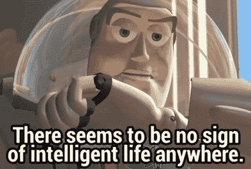

# 停止用这些愚蠢的“框架”来对抗 CSS 存在的理由

> 原文：<https://medium.com/codex/stop-fighting-the-reason-css-exists-with-these-dumbass-frameworks-91732f5993c7?source=collection_archive---------0----------------------->

*警告，这篇文章既是为了教育，也是为了发泄。它可能会重复我在以前的文章中说过的话，我会一直重复给你们听，明白吗？你对重复或“刺耳的语言”有问题，请现在就 GTFO。你遥不可及，* ***如果你认为这些“框架”有任何价值，我也不会浪费我的时间来“文明地”谈论你是多么的愚蠢！***

查看 HTML / CSS 框架如何“工作”