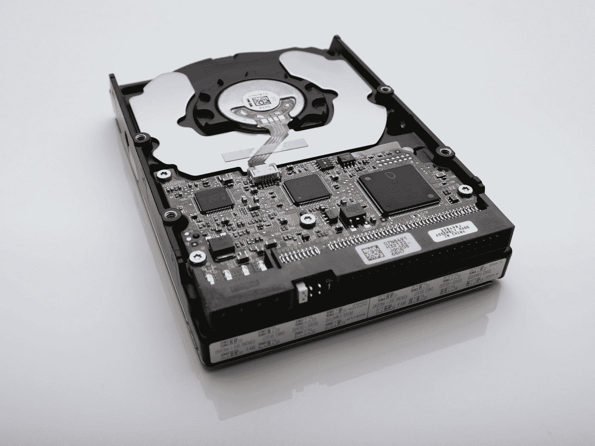

# 停止使用外置硬盘

> 原文：<https://medium.com/codex/stop-using-external-hard-drives-389f401f2f29?source=collection_archive---------6----------------------->

外置硬盘不再是存储宝贵数据的最佳方式。如果你真的关心你的记忆、照片和视频、工作相关的信息、图书馆等等，我建议忘记那块古老的金属。

文森特·博塔在 [Unsplash](https://unsplash.com?utm_source=medium&utm_medium=referral) 上拍摄的照片

# 本地硬存储的持久性较低

跳过硬盘的主要原因是可靠性。10 年前，我拥有一个 0.5TB 的 Transcend 硬盘，一直担心它的安全性。它需要远离坠落和磁铁之类的东西。我在上面保存了照片、视频、音乐和书籍。最终，我只是把它束之高阁。

每次我搬到一个新的公寓，每隔 2-3 年就会发生一次，我必须把它带在身边。最近，我发现它不再起作用了。我的旧数据现在保存在破磁带上。10 年间我丢失了 0.5TB 的数据。

现在让我们看看云存储提供了什么。AWS S3 或谷歌云提供声称 99.999999999%耐久性或 11 个 9 的存储计划。简而言之，对于 10，000 个对象(文件)，它可能每 1000 万年丢失一个。这就是我所说的耐久性。这意味着我在照片中捕捉到的最尴尬的时刻将会保留几代人。

有一些不太耐用的选项(根据服务水平协议)价格更低，但它们仍然非常耐用。他们通过*数据冗余*来实现。数据在几个可用性区域、数据中心之间复制。如果其中一个变得不可用或被小行星摧毁，数据仍然存储在其他的。

这就像在 3 个不同的设施中有 3 个外部硬盘驱动器，它们在地理上是分开的，受到保护，安全并且总是在线。还有备用电源。但更可靠，因为服务是由在云业务领域领先多年的行业巨头提供的。

# 硬盘有兼容性问题

甚至不要让我开始将硬盘连接到不同的计算机和操作系统。

我在华硕笔记本电脑上从 Windows 开始，然后切换到 Linux，最后登陆 MacBook。如果该驱动器在 Windows 上运行良好，那么由于文件系统不兼容，在另一个系统上使用就很麻烦了。我要么需要把它格式化成 NTFS 或者 EFS4，然后只在一个操作系统上使用。

我灵魂中没有足够的 UNIX 邪恶来使它工作。我只是想要数据可用。为什么我需要这个讨厌鬼？

# 硬盘不灵活

当我旅行时，我想要尽可能少的电缆和设备。我是否需要为我的硬盘预订行李，并生活在不断担心我的数据被破坏的恐惧中？不，先生！它们将被回收，除了在我的国家没有公司会回收这些垃圾。那些垃圾的创造者也不会在意。

乔纳森·博尔巴在 [Unsplash](https://unsplash.com?utm_source=medium&utm_medium=referral) 上的照片

# 硬盘存储被高估了

如今，硬盘是计算资源中最便宜(尽管最慢)的部分。然而，像苹果或三星这样的大公司需要钱(谁不需要)并压榨任何额外的潜在利润。例如，他们对每 64GB 的额外存储收取初始设备价格的 X%。它们迫使我们担心如何适应我们生产和消费的所有媒体。我们为 1–2TB 固态硬盘支付了过高的价格。同样的设备。1TB。两倍的价格。

曾经生产软盘驱动器和光盘的公司现在生产闪存盘和外置硬盘。如果我们仔细观察并比较硬存储和云存储的价格，您可能会感到惊讶。

苹果 16 的 MacBook 和 1TB 的差价是 400 美元。MacBook Air 256GB 和 512GB 的差价是 250 美元。苹果认为 256GB 要 250 美元。好的。

微软 Surface Go 和 256GB 版本的差价为 50 美元。微软 128GB 收费 50 美元——比苹果便宜 150%。

在亚马逊上，100 美元左右就可以买到 1TB 容量的外置硬盘。它比内置内存的顶级笔记本电脑便宜得多。

使用 AWS S3，我们可以存储 1TB 的数据，每月花费约 1 美元、约 4 美元、约 13 美元或约 22 美元，具体取决于访问频率。谷歌云存储服务提供 1TB 的存储空间，价格约为 4 美元、7 美元、10 美元或 26 美元。Azure 存储也有类似的价格。甲骨文提供 32GB 永久免费！你下结论。

如果设置正确，存储在云上的数据将具有很高的持久性。它将是安全的，从地球上任何一个有互联网的地方都可以访问。并且没有围绕硬盘、系统驱动程序、USB 连接器和电缆的仪式性舞蹈。

云经济规则。

但是你仍然需要高速互联网来访问它。

数据在分析或消费时是有价值的。储存时没有。如果你能把数据扔进云端，为什么要限制自己去承受易碎的金属和塑料碎片的负担呢？