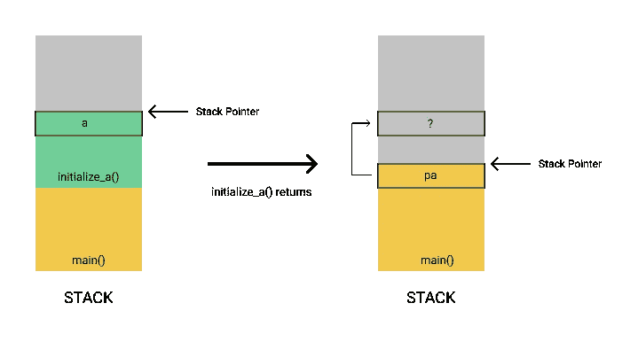

# 停止使用 malloc！关于内存分配，每个优秀的开发人员都需要知道什么

> 原文：<https://medium.com/codex/stop-using-malloc-what-every-good-developer-needs-to-know-about-memory-allocation-cae2aa39b6d9?source=collection_archive---------13----------------------->

对于我们当中的新程序员来说，`malloc`函数可能有点令人生畏。让我们试着分解它。一个正在运行的程序需要空间来保存和读取变量，所以你的计算机提供了两种不同类型的位置来放置它们:堆栈和堆。堆栈用于一般目的，由程序自动处理，而堆由程序员管理。让我们看一个简单的例子:

在这个基本函数中，变量`a`的定义是在堆栈上进行的。值 3 只是放在它上面，当需要访问它时，C++编译器会记住它的地址。一旦我们的`print_example`函数返回，变量就会超出作用域，在里面声明的所有内容都会被丢弃，并且不能再被访问。现在，范围是一个基本概念，每个人都应该已经很熟悉了。

让我们试着挑战编译器。假设我们需要一个函数来初始化一个变量并返回一个对它的引用，这在没有类和构造函数的 C 语言中是很常见的。

你能猜出控制台上会打印什么吗？编译器似乎不喜欢它:

程序编译了，但是抛出了一个分段错误，这意味着我们试图访问一个我们不应该访问的位置。这是行不通的，因为正如我们所说的，变量`a`在函数返回后被丢弃，所以我们在主函数中得到的指向`a`的指针是悬空的。顺便说一下，有趣的是注意到编译器只抛出一个警告，让我们运行程序。是的，警告是相关的，不应该被忽视。

函数返回前后的调用堆栈

那么如果我们之前的不工作，我们如何在我们的主范围之外初始化一个变量呢？为了正确地做到这一点，我们实际上需要使用`malloc`在堆上为变量分配空间。下面是修正后的函数:

如果你从未见过对`malloc`的调用，这一行应该看起来相当吓人，但实际上不是。`malloc`返回堆上空闲位置的地址，大小为请求的大小(以字节为单位)。对于我们的例子，我们需要一个`int`，所以我们要求一个`int`大小的内存。`malloc`是一个通用的内存分配(不仅仅是整数)，所以它返回一个`void*`类型的通用指针。我们需要将这个指针指向我们需要的东西，这里是一个`int*`。

现在，当函数返回时，变量不会被丢弃，因为它不是函数上下文的一部分，而是程序本身。因此，该变量可以在任何地方访问，即使它不是一个全局变量！我们现在得到了想要的输出:`a=3`。

当一个变量在堆上被分配时，一旦我们不再需要它，用`free(pa)`释放那个内存是很重要的，否则我们可能会以内存泄漏而告终。对于大型应用程序来说，这个非常恼人的问题很难完全消除，因为它需要一丝不苟。如果您忘记了它并运行您的代码，不要担心，内存不会永远消失，因为一旦程序终止，为程序堆分配的内存就会被丢弃。这就是为什么当一个程序长时间运行时，比如视频游戏，内存泄漏会更加令人讨厌。

对于那些想知道更多关于栈和堆的区别的人(你真的应该知道)，我推荐看一看[这篇文章](https://www.guru99.com/stack-hvs-heap.html)。您还将了解何时使用堆而不是堆栈。如果你想知道什么时候使用其中一个，你应该记住两件事:

*   避免在堆栈上创建巨大的对象(因为它的大小是有限的，可能会导致堆栈溢出)
*   小心变量的范围，问问你自己你返回的指针是不是悬空的

这就是堆内存分配的基本用法。理解起来其实并不复杂，我们请求一个给定大小的内存，向它写入数据，当我们不再需要它的时候释放空间。困难的部分是监视这些内存泄漏，这可能是一个很难处理的问题，因为程序可能会采取意想不到的路径。例如，如果一个函数抛出一个异常并提前返回，那么 free 指令可能永远也不会到达，与之相关的内存也变得无用。由于处理原始 malloc 和 free 的困难，应该避免使用它，除非我们真的知道我们在做什么，或者我们的应用程序足够简单(即使这样，我们也总是会感到惊讶)。

那么解决这个问题的方法有哪些呢？一种可能性是使用 RAII 编程技术，它代表资源采集是初始化。它是由 C++编程语言的创造者比雅尼·斯特劳斯特鲁普首先介绍的！基本上，我们在获取物体的同时启动了记忆。这样，分配的内存被绑定到对象的生存期，这意味着如果它超出范围并被丢弃，对象的析构函数将为我们清理堆分配的内存。现在可能还不太清楚，所以让我们看看内存分配器类是什么样子的。

当构造分配器时，它分配内存并存储它的地址。当它被析构时，内存被自动释放。因此，当`MemoryAllocator`实例运行超出范围并被丢弃时，它的析构函数被调用，分配的内存将被释放，而无需我们自己担心释放内存的问题。使用起来非常简单:我们实例化对象并请求它被给定的位置。下面是如何在堆上初始化数组:

现在，如果每个堆分配都是通过 RAII 进行的，我们就不用再担心内存泄漏了。即使当一个函数抛出异常时，它的局部变量也会被丢弃，`MemoryAllocator`实例也是如此。

RAII 现在已经真正成为规范，现代编程语言(如 Rust)通过将对象的范围与其存在关联起来，迫使程序员使用它。这被称为对象的生存期。如果你想学习更多关于安全编程技术的知识，我推荐你试试 Rust，你可能会从另一个角度发现编程。

感谢您阅读我的第一篇文章，在这篇文章中，我试图分解编程中的中间概念！如果你喜欢它，并希望我处理其他概念，让我知道并喜欢这篇文章，它对一个作家来说意味着整个世界。