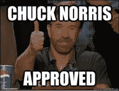
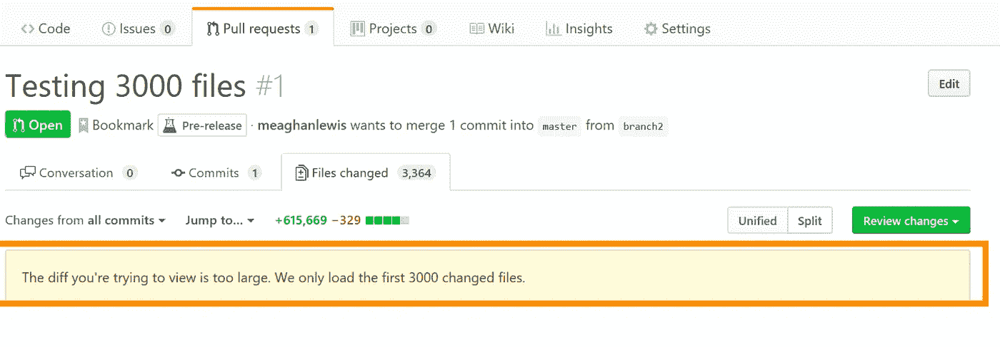
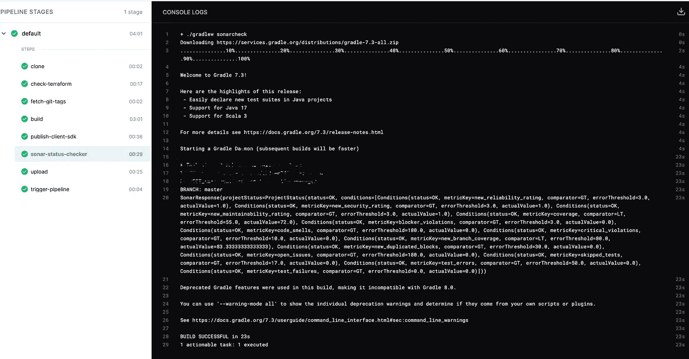
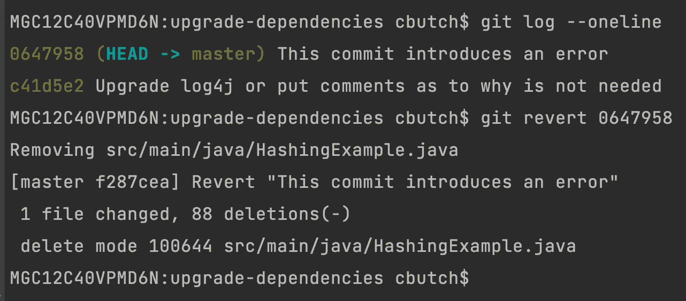
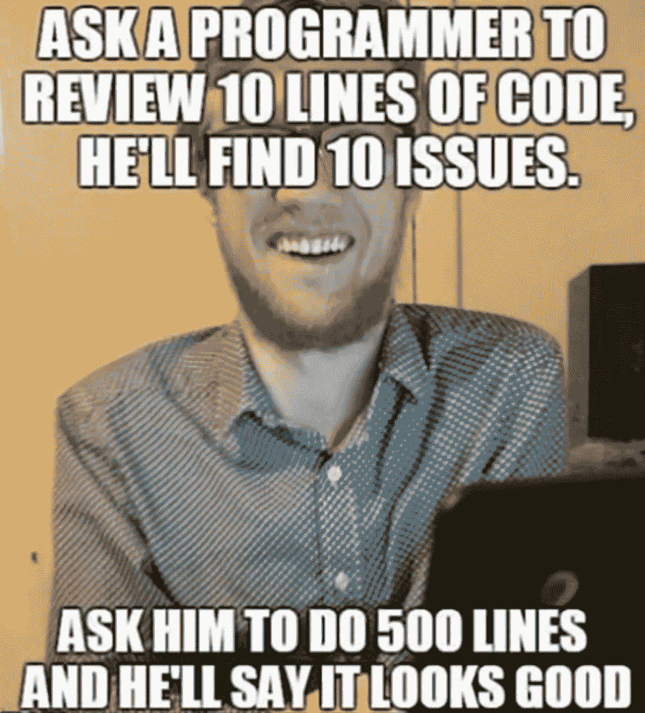
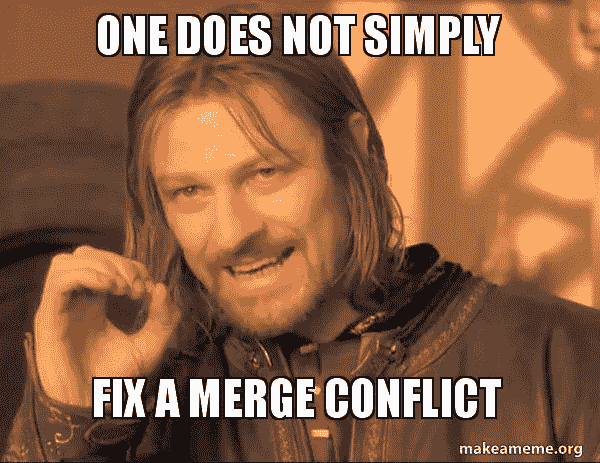

# 停下来。你一直在错误地使用拉取请求

> 原文：<https://medium.com/codex/stop-youve-been-using-pull-requests-all-wrong-79d5b5a5843c?source=collection_archive---------1----------------------->

让拉取请求 1000%更有用的实用技巧



[src](https://i.pinimg.com/236x/1f/ff/f6/1ffff6d108ebf73c5d130ca7f4ead52c--meme.jpg)

大多数成功的流程使用同行评审来确保质量。软件开发也不例外。通常，在将代码变更合并到主线分支之前，必须在拉请求中对其进行审查。

这些年来，我提交了一些拉取请求，并审查了大量请求。在这段时间里，我发现了一些工具和流程，对于提交请求和审阅请求的人来说，这些工具和流程使拉式请求更加有效。

# 停止争论偏好

*   将一个 [linter](https://www.perforce.com/blog/qac/what-lint-code-and-why-linting-important#:~:text=Linting%20is%20the%20automated%20checking,a%20basic%20static%20code%20analyzer.&text=There%20are%20many%20code%20linters%20available%20for%20various%20programming%20languages%20today.) 添加到你的代码中，并将其挂钩到进程中(无论是在构建进程中还是在 [git 挂钩](https://git-scm.com/book/en/v2/Customizing-Git-Git-Hooks))

这确保了文件的格式是相同的，所以 pull 请求将只包含源代码更改(而不是显示大的更改集，因为我的 ide 将 linux 行尾更改为 windows 行尾)。这也将节省时间，因为审阅者不会争论无关紧要的变化，例如括号是否与 if 语句或 next 语句在同一行。



避免类似这样的拉取请求

# 自动拒绝不符合标准的 PRs

*   向您的 CI 流程添加一个[静态代码分析工具](https://www.sonarqube.org/)。如果违反了规则，就让它在构建中失败

静态代码分析提供了一种一致的、自动化的方法来确保代码符合某些标准(并且您可以在团队的基础上调整这些标准)。例如，这可以确保没有超过 50 行的方法，或者强制 80%的单元测试覆盖率。如果拉请求不符合标准，则构建失败。这些检查甚至可以在请求其他人审阅之前进行。



自动化静态代码分析，并将其添加到您的管道中

# 在代码纠正之前关注可恢复性/缓解

审查代码是一个容易出错的过程。即使是最好的评论家也会犯错。考虑到错误的不可避免性(尤其是未知错误)，在审查 pr 时，我们应该将大部分注意力集中在用于最小化这些错误对客户影响的流程上。在实践中，这通常意味着执行以下操作

*   确保[代码可以安全回滚](https://aws.amazon.com/builders-library/ensuring-rollback-safety-during-deployments/)
*   确保使用[金丝雀或线性部署](https://docs.aws.amazon.com/serverless-application-model/latest/developerguide/automating-updates-to-serverless-apps.html)(而不是一次全部使用)
*   尽可能确保[处理是异步的](/@connorbutch/stop-making-synchronous-calls-f101af15cd46)
*   确保失败事件保存在[死信队列](https://docs.aws.amazon.com/AWSSimpleQueueService/latest/SQSDeveloperGuide/sqs-dead-letter-queues.html)中
*   确保代码发出正确的[自定义 cloudwatch 指标](https://docs.aws.amazon.com/AmazonCloudWatch/latest/monitoring/publishingMetrics.html)(可能使用 [EMF](https://docs.aws.amazon.com/AmazonCloudWatch/latest/monitoring/CloudWatch_Embedded_Metric_Format_Specification.html) )
*   确保 [cloudwatch 对错误和延迟发出警报](https://docs.aws.amazon.com/AmazonCloudWatch/latest/monitoring/AlarmThatSendsEmail.html)
*   确保[自动回滚](https://docs.aws.amazon.com/serverless-application-model/latest/developerguide/automating-updates-to-serverless-apps.html)相关报警
*   确保重新处理不合格项目的操作程序([操作手册](https://wa.aws.amazon.com/wellarchitected/2020-07-02T19-33-23/wat.concept.runbook.en.html))

# 缩小 PRs

*   变更集(pr)应该很小(可能只有 20 行)
*   尝试每天至少两次重定基准/合并

通过[进行频繁的、小的、可逆的改变](https://docs.aws.amazon.com/wellarchitected/latest/operational-excellence-pillar/design-principles.html)，我们可以准确地确定什么改变导致错误/延迟增加。我们已经使用了上面定义的技术来确保最小的客户影响，所以现在我们需要担心的是将主线分支恢复到工作状态。这可以通过一个命令来完成

```
git revert <commitHashHere>
```



推动更小的变更集也使得审查拉请求变得更容易，开发人员将更有可能彻底审查它们。



真的有人审核大拉请求吗？

较小的拉取请求也最小化了引入错误的风险([更多的代码=更多的错误](https://www.openrefactory.com/intelligent-code-repair-icr/)

这也避免了[合并地狱](https://dev.to/pencillr/merge-conflict-hell-46on)，因为一次改变的文件数量会少得多。



[src](https://media.makeameme.org/created/one-does-not-5bfeec.jpg)

# 基于主干的开发有人吗？

随着我开始越来越频繁地创建更小的拉请求，到了拉请求本质上是一次提交的程度，我发现自己在问，“这些拉请求的目的是什么？”。我在几个团队中尝试过真正的基于主干的开发，并且发现适当的自动化是有效的。

# 结论

这下你明白了。我对如何通过改进围绕拉动式请求的工具、流程和技术来产生更高质量的解决方案的建议。如果你有任何我没有在这里描述的技巧，请在评论中告诉我！