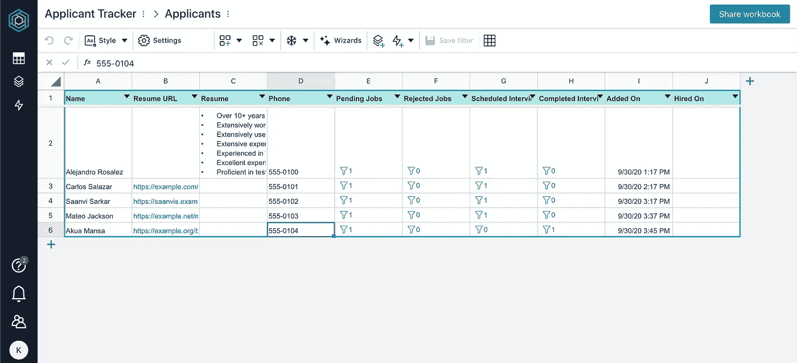
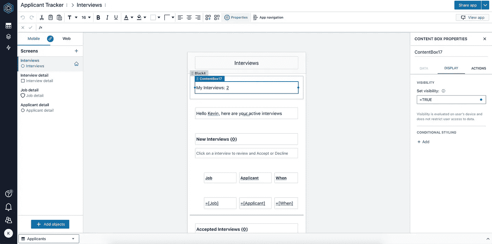

# 用蜜码扼杀 excel 表格

> 原文：<https://medium.com/codex/strangle-excel-sheets-with-honeycode-34a109c293cf?source=collection_archive---------10----------------------->

## 电子表格是每个小型企业到大型企业的核心。你可以走进任何一个办公室，询问人们在哪里保存“ *x 的*”记录，你可能会听到，“我们有一个 Excel 表格”。这篇文章展示了如何使用 [AWS Honeycode](https://www.honeycode.aws/) 来处理它们的方法！

使用套装软件或定制软件实现过程的数字化或自动化非常昂贵。更糟糕的是，我们有时没有做对，有时甚至是第二次尝试。这就是为什么我们的行业有敏捷的方法来改进这个过程。我们需要尽可能早地减少失败的机会或采用新的方法。

在我作为一名在这些企业中执行数字化的工程师的职业生涯中，我目睹了电子表格几乎是组织中每个级别的首选工具。在许多情况下，我们的数字革命归结为用自动化取代这些结构化电子表格，使数据更容易共享或协作，同时在完整性、安全性、合规性和治理方面保持数据安全。

## AWS 蜜码

在这篇博客中，我想分享我在 AWS Honeycode 上的发现。这是 AWS 的一个低代码解决方案，一年前发布，目前仍在 bèta。它的特点是:“无需编程即可构建定制应用”。这个想法是，如果你有电子表格数据(或 CSV ),你想自动编辑和查看这些数据，Honeycode 会给你一个无代码的界面。

UI 从一个电子表格视图开始。您可以创建表，定义列的数据类型，甚至定义 v-lookup 之类的有趣的东西。之后，您可以进入应用程序设计模式。您可以为您的数据结构创建一个或多个视图。它们可用于桌面和移动视图。最后，你可以添加“自动化”功能，比如发送定制邮件或调用 webhook。

## **带着 Honeycode 兜风的亲身经历**

我最近带着 AWS Honeycode 兜了一圈。我试着自动化公司的里程登记——当然是在使用电子表格记录一段时间之后。；)

我已经为我的整个成年生活支付了写代码的费用。我已经不止一次地开始编写小的实用宠物项目，过一段时间后就放弃它们。跟踪公用设施的使用情况，我自己的 domotics 实现，我的个人财务管理都受制于业余爱好项目。在大多数情况下，尝试新技术。这一次，我想采取一种不同于编码的方法，尝试这种低代码方法。不到一个小时，我就把我的谷歌文档表转换成了一个有四个表格和三个视图的应用程序。设置它是一种有趣的体验，最终的应用程序感觉用户友好。

应用程序建模有时感觉有点不稳定，但我用一个小时摆弄得到的结果真的很棒。如果我将它比作创建一个定制的无服务器的 SPA，这是我任何速度都无法比拟的。但坦率地说，Honeycode 是一个低代码工具，无法与 big Mendix 和 Outsystems 相比。

因此，让我们看看如何在实践中将这个工具应用到一些用例中。

## 数字化改造项目中的 *Excel 扼杀者模式*

到目前为止，许多组织都有一些数字化战略。许多公司甚至计划成为数据驱动型公司。尤其是对于大型组织而言，向数字化的过渡意味着将业务中发生的大部分事情捕获到系统中。虽然电子表格可供所有者使用，但自动化通常是让您的公司实现数字化优化的第一步。但是，使用定制软件或这样做速度慢、成本高，而且您只能实现自动化，而不能以这种方式进行转换。然而，真正的转型需要最少的数字化支持。

当微服务接管单片应用程序时，我们经常谈论扼杀者模式。总的想法是通过在新创建的微服务中封装域的片段来迁移到微服务架构。我觉得当公司需要更多结构化数据时，我们可以使用同样的方法。这就是像 Honeycode 这样的工具的用武之地。

我建议采取以下方法:

*   首先用 Honeycode 自动化现有的数据收集(电子表格),以达到最低程度的数字化。您将享受共享网络产品的好处。此外，您将能够在过程的早期尝试创建不同的视图。
*   通过彻底重新设计业务流程的转型计划来增强数字化。基于现有的数据结构，我们可以更容易地集成我们的新解决方案。

这种方法有几个优点:

*   在早期阶段加快上市时间，在执行转型时也是如此。这意味着在过程的早期进行反馈。
*   你将有一个快速实验的环境。
*   你将更容易将新的数字产品连接到数据源

## **低成本管理参考数据/主数据**

在每个定制软件开发项目中，都有这些参考数据集合，如国家列表、需要管理的类型的枚举列表(例如，车辆类型)。这通常是只有少数人需要管理的事情。因此，像 Ruby on Rails 这样的平台试图使用脚手架来简化这一过程，然而，在 React with Serverless backends 这样的真正常见的现代堆栈上，没有太多成熟的选项可以做到这一点。AWS Honeycomb 将使创建一些管理后端来安全地管理数据变得容易。

# 结论

在我的博客结尾呈现的两个用例当然可以被其他低代码解决方案所取代。虽然这种说法是正确的，但仍然有一些理由选择 Honeycode。

**利用 AWS 许可**
如果你已经是 AWS 的付费用户，使用这款产品很容易。你的用户**不**需要控制台访问。Honeycode 有自己的用户管理，甚至可以集成单点登录。

**AWS 集成** 诚然，我对你可以在 Honeycode 的自动化部分使用的选项有点失望。Honeycode 的基本集成是电子邮件和 webhooks。最近增加了 AWS AppFlow，使您能够连接到 SalesForce、Snowflake、Zendesk 和 [more](https://aws.amazon.com/appflow/integrations/) 。在许多情况下，webhooks 可以作为我们应用程序环境中入口点的触发器。

然而，使用 [SDK](https://docs.aws.amazon.com/honeycode/latest/UserGuide/getting-started.html) 与数据交互的方式感觉最成熟。Honeycode SDK 允许你读取、更新、删除你的工作簿。这使您能够将工作簿中的数据传播到您的环境中，并将其与现有系统挂钩。