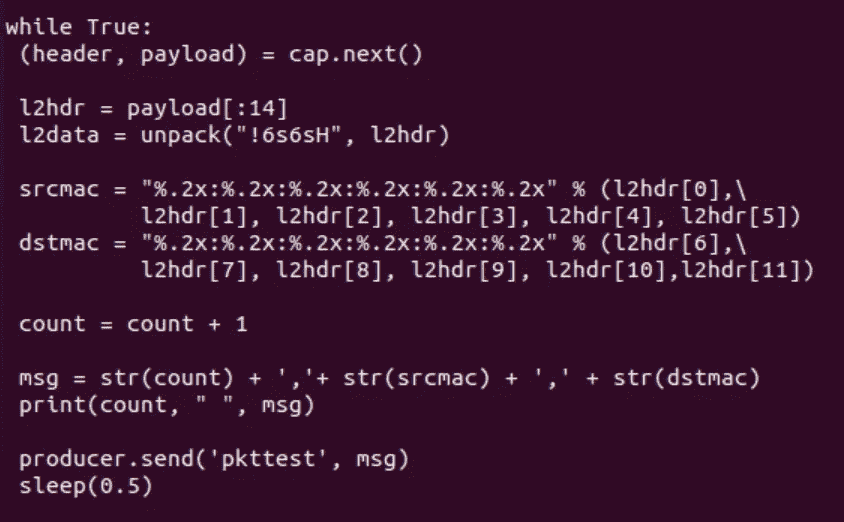
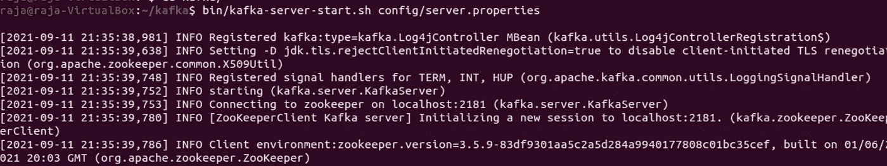
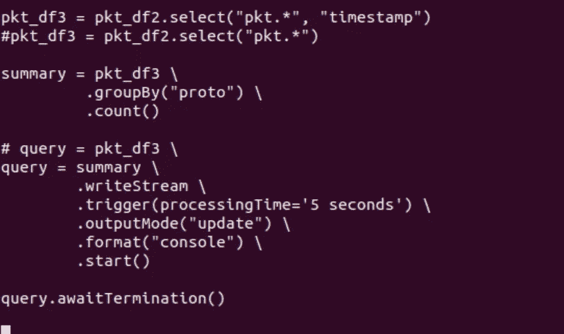

# 使用 Kafka 将实时网络数据包流传输到 Spark 流

> 原文：<https://medium.com/codex/streaming-live-network-packets-data-in-to-spark-streaming-using-kafka-25c8b5f58181?source=collection_archive---------2----------------------->

Python 中的循序渐进的初学者指南，使用网络流量数据作为用例，使用 Spark 结构化流来尝试 Kafka。

在这篇博客中，我们将使用 Apache Kafka 数据馈送平台构建一个基本原型，展示如何将实时网络流量传输到 Apache Spark。

# 介绍

在当今的大数据世界中，所有的一切都是为了实时处理连续和庞大的信息集，并即时做出决策/获取洞察力。两者——数据来源，如 IOT 设备、遥测设备等。以及数据库、分析/可视化引擎等数据接收器。，需要高效、快速、健壮的容错数据管道和处理平台。像 Apache Kafka 这样的流媒体平台和 Spark 这样的大数据处理平台符合这些目标。

我试图了解这些如何适用于网络领域。如何将连续产生的网络数据从其源传输到可以分析数据的地方？在我有限的研究和学习中，我从网上和 YouTube 上的一些资源中学到了一些概念，并可以尝试一些基本的实践，我正试图在这个博客中分享。

那么，在这个练习中我们要做什么呢？我们将从 pcap 文件或 network interface live 中获取一些网络流量数据，提取一些重要的头字段，并通过 Kafka 服务器将它们传输到 Spark 应用程序。我已经提供了所有必要的步骤并分享了代码，这样你也可以在你的笔记本电脑上动手尝试。

请注意，这将是所有的 Python 语言。

在我们开始一步一步的练习之前，我将在这里简要介绍一些关于卡夫卡，火花等的基础知识。只是介绍一下背景。

## 阿帕奇卡夫卡

根据[官方定义](https://kafka.apache.org/)，Apache Kafka 是一个开源的分布式事件流平台，被数千家公司用于高性能数据管道、流分析、数据集成和关键任务应用。

*简单来说，Kafka 是一个开源平台，可帮助将连续数据从一个或多个生产者传输到一个或多个消费者，以进行实时和批量数据处理。这里* *可以看到卡夫卡* [*的各种用例。*](https://kafka.apache.org/uses)

卡夫卡概述

生产者将连续的数据流推送到 Kafka 集群。Kafka 集群由许多服务器或代理组成，这些服务器或代理接收来自生产者的数据消息，并将其附加到称为主题的东西上(生产者提到它希望特定消息进入哪个主题，因此主题基本上是消息的上下文)。Kafka 代理将消息保存在本地存储器中，以备消费者将来检索之需。消费者应用程序从他们感兴趣(订阅)的主题中提取数据消息作为流。Kafka 集群可以包含许多代理，以便在 Kafka 集群中的一个或多个代理出现故障时提供数据负载共享和容错。

## 阿帕奇动物园管理员

ZooKeeper 是一个为分布式应用程序提供的分布式开源协调服务。它公开了一组简单的原语，分布式应用程序可以在这些原语的基础上实现同步、配置维护、分组和命名等高级服务。
在 Kafka 的上下文中，**我们需要运行 Zookeeper** 以便使用 Kafka 服务器，因为 Zookeeper 对于协调和管理 Kafka 代理集群是必不可少的。

## 阿帕奇火花

[Apache Spark](https://spark.apache.org/) 是用于大规模数据处理的统一分析引擎。
它是一个用于大数据工作负载的开源分布式处理系统。它利用内存缓存和优化的查询执行，针对任何大小的数据进行快速分析查询。它提供 Java、Scala、Python 和 R 的开发 API，并支持跨多种工作负载的代码重用——批处理、交互式查询、实时分析、机器学习和图形处理。

Spark 支持一系列库，包括 [SQL 和 DataFrames](https://spark.apache.org/sql/) 、用于机器学习的 [MLlib](https://spark.apache.org/mllib/) 、GraphX 和 [Spark Streaming](https://spark.apache.org/streaming/) 。

[**Spark Streaming**](https://spark.apache.org/streaming/)轻松构建可扩展的容错流式应用。它允许您像编写批处理作业一样编写流式作业。它支持 Java、Scala 和 Python。

在本博客的示例中，我们将使用 Spark 流应用程序作为消费者，即它将订阅 Kafka 主题并接收来自 Kafka 服务器的消息。

一旦我们从 Kafka 接收到 Spark 的数据流，我们就可以使用 Spark SQL 服务对数据进行任何分布式分析，或者将数据存储到数据库等。

# 先决条件

您需要在系统中安装 Apache Zookeeper、Apache Kafka 和 Apache Spark。我使用了 Ubuntu Linux(作为虚拟机器中的一个虚拟机),并将所有这些安装在 Ubuntu 虚拟机中。

1.  为了安装虚拟盒子，Ubuntu，卡夫卡和 Zookeeper，你可以观看波格丹一世的这个精彩的[视频](https://www.youtube.com/watch?v=CU44hKLMg7k&t=5612s)。
2.  通过运行 **pip install pyspark** 安装 pyspark (Python 库 for Spark)
3.  通过运行 **pip install kafka-python** 为 Kafka 安装 Python 库
4.  安装 pcapy 和 scapy 工具。这些用于从网络接口捕获实时数据包，并从数据包中提取报头字段。

*   **pip 安装 scapy**
*   **sudo 更新
    sudo 安装 python3-pcapy**

**我用的版本如下。**

Kafka-2 . 8 . 0(Scala 2.12—[Kafka _ 2.12–2 . 8 . 0 . tgz](https://www.apache.org/dyn/closer.cgi?path=/kafka/2.8.0/kafka_2.12-2.8.0.tgz)([ASC](https://downloads.apache.org/kafka/2.8.0/kafka_2.12-2.8.0.tgz.asc)， [sha512](https://downloads.apache.org/kafka/2.8.0/kafka_2.12-2.8.0.tgz.sha512) ))

火花- pyspark 3.1.2

# 练习的主要步骤

1.  编写一个 Kafka 生成器，从网络数据包中提取包头字段，并将其提供给 Kafka 主题。
2.  使用 pyspark 编写一个基于 Spark 结构化流的程序，订阅 Kafka 主题，从 Kafka 接收数据流并消费它(使用它进行进一步分析)。
3.  启动 Zookeeper 和 Kafka 服务。
4.  通过同时运行它们来测试我们的生产者和 Spark 消费者。

现在，我们将一个接一个地完成以上所有步骤。

**你可以从我的 github 库** [**这里**](https://github.com/raja-surya/Network-Traffic-Kafka-Spark) **下载这个练习的代码。**

# 应用程序编码

## **1。生产商代码**

我写了两种类型的生产者代码和相应的消费者-

*   第一个示例通过读取 pcap 文件获取数据包数据，并将其传输到 Kafka。
*   第二个例子通过嗅探虚拟机的网络接口(pcapy 工具在这方面有所帮助)来获取资源，并将其传输到 Kafka。

请记住运行正确的生产者和消费者程序对。文件名分别以“-pcap”和“-live”结尾。

让我们分部分检查生产者代码(pkt-producer-pcap.py)的第一个例子。

在上面的代码中，我们从 Kafka 导入了 KafkaProducer 类。我们还导入了一个支持代码(来自 MyScapyExtract.py ),以便从 pcap 文件中读取和提取包头字段(使用 scapy 工具)。然后，我们创建一个 producer 对象，指定我们想要连接的 kafka 服务器- localhost 和端口 9092(Kafka 的默认端口)。

现在我们将进入下一组代码..

在上面的代码中，我们获取了一个 pcap 文件，并提取了 pcap 文件中每个数据包的包头字段。我使用了一个小的 pcap 文件(可以在我的 github 中找到),其中包含我在笔记本电脑中使用 wireshark 捕获的数据包。Scapy 是我用来从包中提取字段的 python 工具。您可以在 google 上搜索 scapy，也可以查看 MyScapyExtract.py 文件中的代码来了解这一部分。返回的“datalst”将只是下面粘贴的字典元素列表。每个字典将对应于 pcap 文件中的一个数据包。您可以看到各个数据包的各种包头字段。

[{'id': '0 '，' len': '215 '，'时间戳':' 2021–09–12 10:06:37.000000 '，' esrc': '94:08:53:64:e0:05 '，' edst': '01:00:5e:7f:ff:fa '，' etype': '2048 '，' isrc': '192.168.1.11 '，' idst ':' 239 . 255 . 255 . 255

{'id': '1 '，' len': '332 '，' timestamp ':' 2021–09–12 10:06:37.000000 '，' esrc': '30:a9:de:a5:93:50 '，' edst': '94:08:53:64:e0:05 '，' etype': '2048 '，' isrc': '192.168.1.7 '，' idst': '192.168.1.11

现在让我们转到 pkt-producer-pcap.py 中的下一部分代码

上面部分代码只是遍历每个包，只取 IP 包(以太类型十进制 2048 对应 0x0800)并提取 5 元组(源 IP 地址，目的 IP 地址，UDP 的话协议- 17，TCP 的话协议-6，源端口，目的端口)。然后，它将这个 5 元组数据与数据包的计数一起打包到一个消息中，并使用 KafkaProducer 的 send()方法将其发送给 Kafka。**请注意，第一个参数‘PKT test _ pcap’是生产者选择在 Kafka 中附加消息的主题。**

我们现在将看到生产者的第二个例子(pkt-producer-live.py ),其中我们将从网络接口捕获实时数据包并将其发送到 Kafka。

我们使用 pcapy 工具从 Ubuntu VM 的网络接口“enp0s3”中嗅探数据包。

cap.next()将返回下一个探测到的数据包。我们在一个无限循环中嗅探数据包，从 L2 报头中提取源 mac 和目的 mac，并将其发送给 Kafka 到一个名为“pkttest”的主题。就这么简单！

## 2.Spark 结构化流消费者代码

***结构化流*** *是一款基于 Spark SQL 引擎构建的可扩展、容错的流处理引擎。您可以像表达静态数据上的批处理计算一样表达您的流计算。Spark SQL 引擎将负责增量地、持续地运行它，并随着流数据不断到达而更新最终结果。(摘自* [*结构化流媒体编程指南*](https://spark.apache.org/docs/latest/structured-streaming-programming-guide.html#overview) *)*

从我有限的研究中了解到，“结构化流”是 Spark 的一个新功能，在其中，您可以对流数据执行分析计算，就像它是一个数据帧一样。使用*微批处理*引擎处理结构化流查询，该引擎将数据流作为一系列小批量作业进行处理。

数据流被视为一个无限制的数据帧，新的行被连续地附加到该数据帧中(当新的流数据到达时)。

结构化流

所以如上所述，*Spark SQL 引擎将负责增量地、持续地运行它，并随着流数据不断到达而更新最终结果。*

现在，我们将进入我们的消费者代码(spark-consumer-pcap.py ),它用 python 实现了 spark 结构化流，并与 Kafka 集成(您可以参考[结构化流+ Kafka 集成指南](https://spark.apache.org/docs/latest/structured-streaming-kafka-integration.html))

在上面的代码部分中，我们从 pyspark SQL 导入 SparkSession 和函数。我们设置 Kafka 主题的名称，消费者需要从这个主题接收消息——这个主题就是生产者向其提供消息的主题。我们还设置了 kafka 服务器和端口，并启动了 Spark 会话。

然后我们使用 spark 会话，并通过 SparkSession.readStream()返回的 DataStreamReader 接口获得一个流数据帧。我们通过 Kafka 服务器，主题细节在这里。可以使用不同的源，如文件、kafka、socket 等。这里我们读卡夫卡；所以我们提格式(“卡夫卡”)。
我们得到的数据帧就像 Pandas 数据帧一样，有行(流数据记录)和列。这里，我们感兴趣的是提取“值”列和“时间戳”。“值”包含由生产者发送的消息。当它以字节格式(序列化)到达时，我们将它类型转换为字符串。

然后，我们定义一个模式字符串来分割和解释流记录的“值”部分，我们在前面的步骤中将其转换为字符串。记住从生产者发送的消息(来自 pcap 源的第一个流示例)在格式计数和包含源 IP 地址、目的 IP 地址等的 5 元组中。因此，在上面的代码中，我们定义了相同的模式，并将“值”列拆分为这些单独的列。pyspark 中的这些操作语法与我们处理 Pandas 数据帧的方式不同。

在上述代码之后，pkt_df3 包含一个列的数据帧-count、src_ip、dst_ip、proto、sport、dport 和“timestamp”。

现在，我们将进入消费者守则的最后一部分。

一旦我们从数据流中获得数据帧，我们就可以做进一步的分析或将数据帧写入内存或控制台等。为此，我们必须使用通过 Dataset.writeStream()返回的 DataStreamWriter。我们开始流式计算。我们将查询触发间隔设为 5 秒，这是检查新数据可用性的时间间隔。有不同的输出模式，如“附加”，“更新”等。我们在这里使用“update”(只有结果表中自上一次触发后更新的行才会输出到接收器)。这里我们提到的接收器是“控制台”，意思是我们希望数据帧输出到控制台。这些的各种选项可以在 [*结构化流编程指南*](https://spark.apache.org/docs/latest/structured-streaming-programming-guide.html#overview) *中找到。*

如果您看到上面代码中被注释掉的部分，我们也可以选择做一些分析，比如聚合。在那里，我按“proto”字段分组，并对属于特定协议的数据包进行计数(有多少 TCP 数据包和 UDP 数据包)。

执行此代码后，流计算将在后台开始。查询对象是活动流式查询的句柄。我们使用 awaitTermination()等待查询终止，以防止流程在查询活动时退出。

现在，我们完成了生产者和消费者的编码。是时候看看如何测试我们的数据包流了。

# 测试我们的应用

**请注意，我们需要四台 Ubuntu 终端来做这个练习。** 一个对应这些中的每一个——启动 Zookeeper 服务器，启动 Kafka 服务器，运行生产者代码，运行消费者代码。

## 3.启动 Zookeeper 和 Kafka 服务器

正如我之前在先决条件部分提到的，你可以观看波格丹一世的视频[来学习如何在 Ubuntu 中安装 Apache Kafka，启动 Zookeeper 和 Kafka 服务器。](https://www.youtube.com/watch?v=CU44hKLMg7k&t=5612s)

首先，我们必须启动 Zookeeper，这是启动和运行 Kafka 所必需的。

启动动物园管理员

让 Zookeeper 保持运行，打开另一个终端标签并运行 Kafka 服务器，如下所示。

启动 Kafka-服务器

启动 Kafka 服务器后，不要干扰窗口，打开新的终端标签来测试我们的应用程序。

## 4.测试我们的生产者和火花消费者

**首先，我们将运行 Spark 消费者程序**来启动它，并让它等待来自生产者的新消息。

在新窗口中，转到存放消费者代码文件的文件夹。

我们必须调用一个名为**的 spark 脚本 spark-submit 并向其传递整合卡夫卡和 Spark 所需的包路径。**

~/.local/bin/spark-submit-packages org . Apache . spark:spark-SQL-Kafka-0–10 _ 2.12:3 . 1 . 2 spark-consumer-pcap . py

在上面的 CLI 中，2.12 是 Kafka 包的 Scala 版本，3.1.2 是我们使用的 Spark 版本(参考[结构化流+ Kafka 集成指南](https://spark.apache.org/docs/latest/structured-streaming-kafka-integration.html)的“部署”部分)。

可以添加 **PATH=$PATH:~/。local/bin/** 在你的~/里。巴沙尔调用火花-提交从任何地方。

启动 Spark 消费者代码

现在，不要干扰消费者程序窗口，打开一个新的选项卡来运行生产者代码。

**sudo-E python 3 PKT-producer-pcap . py**

我使用 sudo 是因为如果您想运行第二个示例(从网络接口捕获实时数据包)，管理员权限是必不可少的。这里我们运行第一个例子(从 pcap 文件获取数据包数据)。

生产者将数据包 5 元组流式传输到 Kafka

我们可以在上面看到，生产者将包数据(5 元组)一个接一个地流式传输到 Kafka。在我的例子中，总共有 27 个包。

生产者将数据包 5 元组流式传输到 Kafka

因此，生产者完成了从 pcap 文件中提取包数据并将其流式传输到 Kafka 服务器。

我们可以通过运行带有- list 选项的 kafka-topics.sh 来检查主题是否在 Kafka 中成功创建。

我们在列表中看到我们的主题“pkttest_pcap”。

现在我们将切换到消费者窗口，检查消费者是否能够接收到来自 Kafka 的消息流。

太棒了！我们看到 Spark 消费者代码能够接收不同批次的传入流，并在控制台中显示所有 27 个数据包的数据帧。

我们可以通过消费者代码中的 groupBy on 协议字段在 pyspark 中尝试对数据帧进行聚合操作，如下所示。

聚合操作示例

输出如下所示。

我们可以看到，当新数据到达时，它会不断更新两个协议 TCP (6)和 UDP (17)的计数。最后，我们看到 5 个 TCP 数据包和 22 个 UDP 数据包，总共 27 个数据包。

如果您想将接收到的数据帧批量保存在文件中，您可以尝试以下代码。

我们可以开始学习更多关于 pyspark SQL 和 DataFrame 操作的知识，并做更多的分析，因为我们现在知道如何在 spark 中从源接收流数据。

类似地，您可以尝试第二个示例，即从网络接口实时嗅探数据包并进行流式传输(pkt-producer-live.py 和 spark-consumer-live.py)。**请注意，生产者从接口开始捕获数据包可能需要一点时间，所以你必须耐心尝试。**

下面给出了实时捕获示例的输出。

实时嗅探和流式传输的生产者输出

Spark 消费者收到活嗅包

# 结论

到目前为止，我们已经用

*   如何使用 Kafka 流式传输网络流量数据？
*   如何写一个卡夫卡式的制片人？
*   如何写一个 Spark 结构化的流消费者？

毫无疑问，还有很多东西需要深入研究和探索，当然，在接收到的数据的 Spark 处理/分析方面也有更多的工作要做。

尽管如此，我希望这个博客能够帮助初学者(尤其是网络领域的爱好者)开始他们在 Kafka 和 Spark streaming 的学习之路。感谢您读到这里！如果你喜欢这个博客，请鼓掌，因为它会鼓励我写更多类似的学习！也请[订阅](https://rajarams.medium.com/subscribe)来接收我发来的更多此类博客的通知！

## 参考材料:

*   [主数据块和阿帕奇火花](https://www.youtube.com/playlist?list=PL7_h0bRfL52qWoCcS18nXcT1s-5rSa1yp)
*   [适合初学者的阿帕奇卡夫卡](https://www.youtube.com/watch?v=CU44hKLMg7k&t=5612s)
*   [IT 网络数据分析](https://www.ciscopress.com/store/data-analytics-for-it-networks-developing-innovative-9780135183465) -作者 John Garret
*   [使用 Apache Spark 进行网络流量分类](https://upcommons.upc.edu/bitstream/handle/2117/110827/125003.pdf?sequence=1&isAllowed=y)
*   [PCAP 流处理](https://github.com/oberljn/pcap_streaming#pcap-stream-processing)
*   [使用 Spark 流的在线互联网流量监控系统](https://ieeexplore.ieee.org/stamp/stamp.jsp?arnumber=8268735)
*   [结构化流媒体节目指南](https://spark.apache.org/docs/latest/structured-streaming-programming-guide.html)
*   [结构化流媒体+ Kafka 集成指南](https://spark.apache.org/docs/latest/structured-streaming-kafka-integration.html)