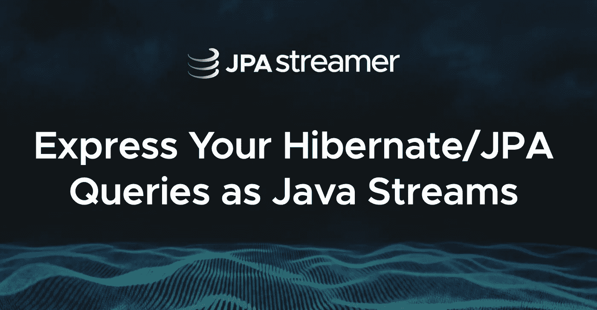
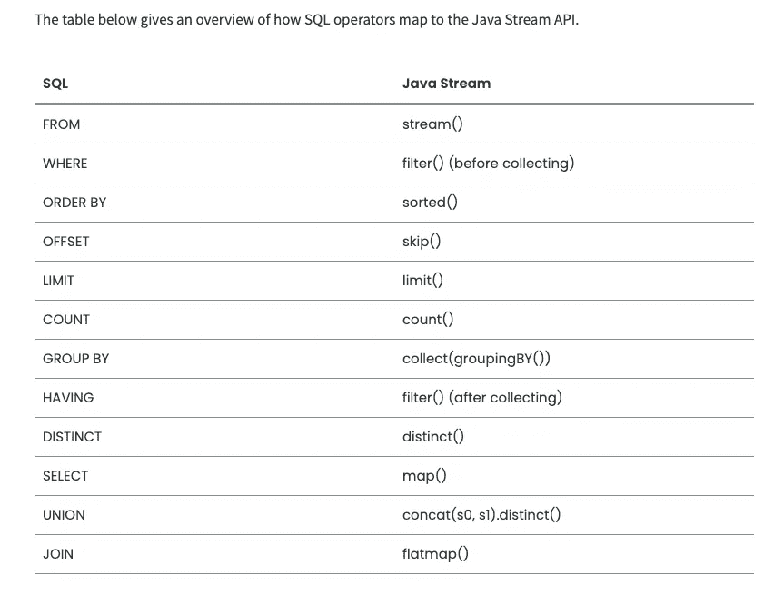

# 使用 JPAstreamer 进行流式处理

> 原文：<https://medium.com/codex/streaming-with-jpastreamer-b7116609138?source=collection_archive---------3----------------------->

## *一个开源的轻量级库，以 Java 流的形式即时处理数据*



JPA 流光

## 概观

[**JPA**](https://en.wikibooks.org/wiki/Java_Persistence/What_is_JPA%3F)(Java Persistence API)规范让您定义哪些对象应该被持久化，以及这些对象应该如何在您的 Java 应用程序中持久化。JPA 被认为是 Java 行业中对象到关系映射(ORM)的标准行业方法。

我们经常会遇到这样的情况，我们确实喜欢坚持使用一种语言。需要从 Java 转换到 Hibernate 查询语言(HQL)或 Java 持久性查询语言(JPQL)，这是一个繁琐的过程，因为每种语言的语法都不同，而且有些不直观。在这种情况下，我更喜欢 Hibernate Java Persistence API(JPA ),它为我消除了其他不便。

*如果你想了解 Java 流，你可以访问我以前的博客* [***这里***](https://praveeng-nair.medium.com/java-with-streams-c58994a400e4) *。*
现在已经可以在 JPA 的更高版本中获得流，我们可以在其上进行聚合操作，这是完全正确的，但是这些流不能使用流来表达实际的数据库查询，并且性能可能很差。

JPAstreamer 库提供了另一个开源解决方案，它是一个轻量级的库，可以用 Java 流表达 JPA 查询。在这篇博客中，我们将介绍如何将这个库与 **Spring Boot** 和 **Spring Data JPA** 集成在一起。这个想法听起来很棒，同时也让我很兴奋，因为 library 会基于您的 Java 流创建一个 SQL 查询。

下图显示了 Java 流的 SQL 等价运算符，它以非常简单的方式解释了这个概念。你可以在这里阅读更多操作符[。](https://speedment.github.io/jpa-streamer/jpa-streamer/1.0.1/fetching-data/sql-equivalents.html)



Java 流的 SQL 等价物

## 创建 Spring Boot 应用程序

我创建了一个简单的 Spring Boot 应用程序，它运行嵌入式 H2 数据库，并通过 REST API 公开端点。它还使用 Spring Data JPA 与数据库进行交互。因此，一旦应用程序从[https://start . spring . io](https://start.sping.io)引导，我们需要在 pom 文件中包含以下两个依赖项。第一个添加了`JPAstreamer`，而第二个将它与 Spring Boot 整合。

```
<dependency>   
<groupId>com.speedment.jpastreamer</groupId>   <artifactId>jpastreamer-core</artifactId>   
<version>1.0.2</version> 
</dependency> <dependency>   <groupId>com.speedment.jpastreamer.integration.spring</groupId>   <artifactId>spring-boot-jpastreamer-autoconfigure</artifactId>   <version>1.0.2</version> 
</dependency>
```

## JPA 的实体模型

让我们看一下我们的示例实体。下面是`Author`类。每个作者可以有一本或多本相关的书。

```
@Data
@Entity(name = "author")
@JsonInclude(JsonInclude.Include.*NON_NULL*)
public class Author {

    @Id
    @GeneratedValue
    private Long id;

    private String firstName;

    @Column(unique = true)
    private String lastName;

    @OneToMany
    private List<Book> books;

}
```

下面是`Book`实体。

```
@Data
@NoArgsConstructor
@Entity(name = "book")
@JsonInclude(JsonInclude.Include.*NON_NULL*)
public class Book {
    @Id
    @GeneratedValue
    private Long id;

    @Column(unique = true)
    private String title;

    @ManyToOne(fetch = FetchType.*EAGER*)
    @JoinColumn(name = "author_id")
    private Author author;

    public Book(Long id, String title) {
        this.id = id;
        this.title = title;
    }
}
```

## JPAstreamer 依赖注入

现在我们可以将 JPAstreamer 注入到我们的控制器中，并做一个简单的操作。

```
private final JPAStreamer jpaStreamer;

public BookController(JPAStreamer jpaStreamer) {
    this.jpaStreamer = jpaStreamer;
}
```

让我们对`Book`实体执行一个 *findAll* 操作，根据`id`字段对其进行降序排序，然后将所有流收集到列表中。简而言之，看起来几乎与标准 Java 流相似，不是吗？

```
@GetMapping("/books")
public ResponseEntity<?> findAllBooks() {
    return ResponseEntity.*ok*(
            jpaStreamer.stream(Book.class)
            .sorted(Book$.*id*.reversed())
            .collect(Collectors.*toList*()));
}
```

现在，我们可以在启动应用程序后调用端点。

```
$ curl [http://localhost:8080/api/books](http://localhost:8080/api/books)[{"id":**5**,"title":"Harry Potter and the half blood Prince","author":{"id":1,"firstName":"Joanne","lastName":"Rowling","books":[]}},{"id":**4**,"title":"Harry Potter and Sorcerers stone","author":{"id":1,"firstName":"Joanne","lastName":"Rowling","books":[]}},{"id":**3**,"title":"Harry Potter and Chamber of Secrets","author":{"id":1,"firstName":"Joanne","lastName":"Rowling","books":[]}},{"id":**2**,"title":"The Cuckcoos Calling","author":{"id":1,"firstName":"Joanne","lastName":"Rowling","books":[]}},{"id":**1**,"title":"The Casual Vacancy","author":{"id":1,"firstName":"Joanne","lastName":"Rowling","books":[]}}]
```

如果您看到应用程序日志，这些 API 操作会执行 SQL 查询。

```
Hibernate: 
    select
        book0_.id as id1_2_,
        book0_.author_id as author_i3_2_,
        book0_.title as title2_2_ 
    from
        book book0_ 
    order by
        book0_.id desc
Hibernate: 
    select
        author0_.id as id1_0_0_,
        author0_.first_name as first_na2_0_0_,
        author0_.last_name as last_nam3_0_0_ 
    from
        author author0_ 
    where
        author0_.id=?
Hibernate: 
    select
        books0_.author_id as author_i1_1_0_,
        books0_.books_id as books_id2_1_0_,
        book1_.id as id1_2_1_,
        book1_.author_id as author_i3_2_1_,
        book1_.title as title2_2_1_,
        author2_.id as id1_0_2_,
        author2_.first_name as first_na2_0_2_,
        author2_.last_name as last_nam3_0_2_ 
    from
        author_books books0_ 
    inner join
        book book1_ 
            on books0_.books_id=book1_.id 
    left outer join
        author author2_ 
            on book1_.author_id=author2_.id 
    where
        books0_.author_id=?
```

## 流配置

大多数情况下，您只需要选定的字段，而不是全部，这也有助于提高查询的性能，因为我们只对某些字段感兴趣。我们可以通过在`JPAstreamer.`
上使用`StreamConfiguration`来实现这一点。让我们借助另一个例子来看看这一点。

```
@GetMapping("/books/sc/{title}")
public ResponseEntity<?> findBookByTitleUsingStreamConfig(@PathVariable String title) { StreamConfiguration<Book> sc = StreamConfiguration
            .*of*(Book.class)
            .selecting(Projection.*select*(Book$.*id*, Book$.*title*));
    return ResponseEntity.*ok*(
            jpaStreamer.stream(sc)
            .filter(Book$.*title*.contains(title))
            .collect(Collectors.*toList*()));
}
```

上面的投影只选择了 id 和 title。如果我们到达 API 端点，我们只能看到响应中返回的特定字段。StreamConfiguration 还有助于解决其他性能问题，如 [N+1 问题](https://vladmihalcea.com/n-plus-1-query-problem/)。

```
$ curl [http://localhost:8080/api/books/sc/Potter](http://localhost:8080/api/books/sc/Potter)
[{"id":3,"title":"Harry Potter and Chamber of Secrets"},{"id":4,"title":"Harry Potter and Sorcerers stone"},{"id":5,"title":"Harry Potter and the half blood Prince"}]
```

## 摘要

`Stream`是一个接口，`JPAstreamer`可以根据所使用的管道和其他因素从`Stream`的各种不同实现中进行选择。上述流通过 JPA 呈现给数据库查询。

因此，我们已经看到，使用开源库`JPAstreamer`和 Hibernate(或任何 JPA 提供者)在 JPA 上进行流式处理，将类型安全的、有表现力的数据库查询组合成标准的 Java 流是多么容易和出色。这样做，您将能够继续使用 JPA，同时保持代码库的整洁和可维护性。

我看到的唯一问题是，它会进行一些分析，并将某些数据发送回 [Speedment 的](https://speedment.com/)服务器。如果您希望禁用此[功能](https://github.com/speedment/jpa-streamer/blob/master/DISCLAIMER.md)，您需要联系他们的团队。我对此有点担心，但话说回来，这个想法真的很好。

你可以在这里找到源代码[](https://github.com/PraveenGNair/spring-data-jpastreamer)**。快乐学习！！**

## **参考**

**[](https://github.com/speedment/jpa-streamer) [## GitHub-speedment/jpa-streamer:JPAstreamer 是一个轻量级库，用于将 JPA 查询表示为…

### 选择 film0_。film_id 为 film_id1_1_，film0_。描述如描述 2 _ 1 _ film 0 _ 所述。languag11_1_…

github.com](https://github.com/speedment/jpa-streamer) [](https://blogs.oracle.com/javamagazine/jpastreamer-expressing-hibernatejpa-queries-with-java-streams) [## JPAstreamer:用 Java 流表达 Hibernate/JPA 查询

### 2021 年 1 月 29 日下载这篇文章的 PDF 如果你能保持 Hibernate/JPA，同时坚持使用 Java 会怎么样…

blogs.oracle.com](https://blogs.oracle.com/javamagazine/jpastreamer-expressing-hibernatejpa-queries-with-java-streams)**