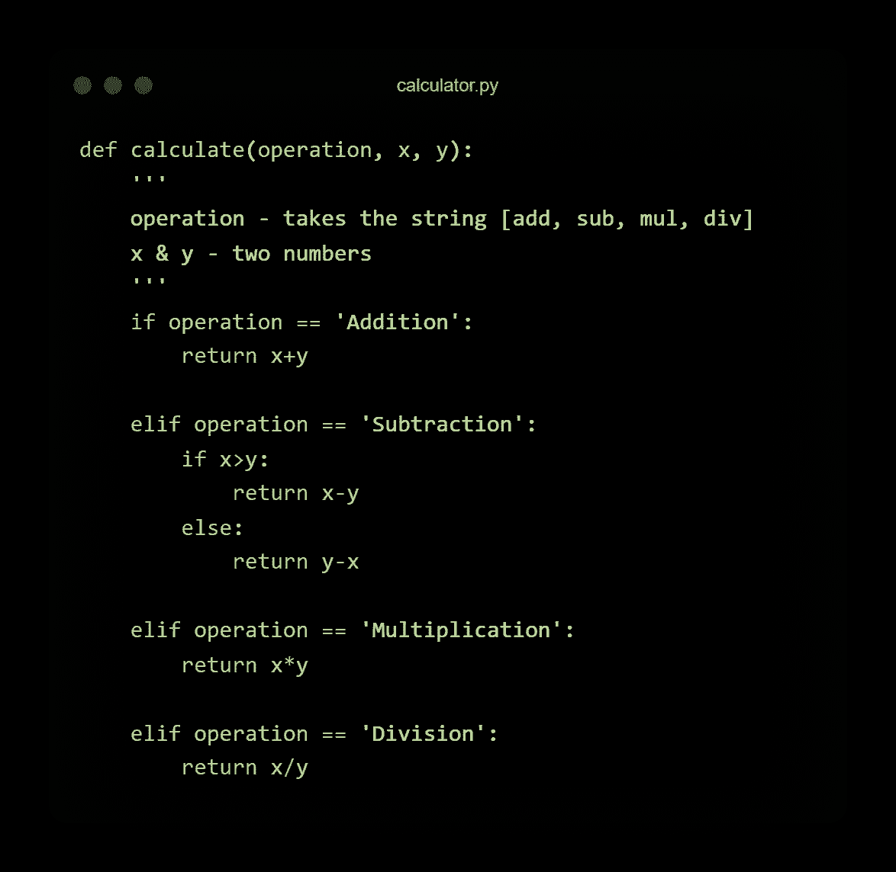
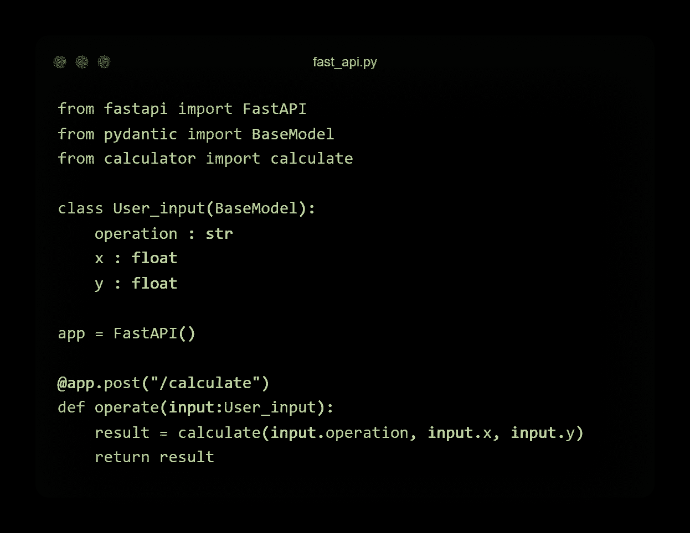
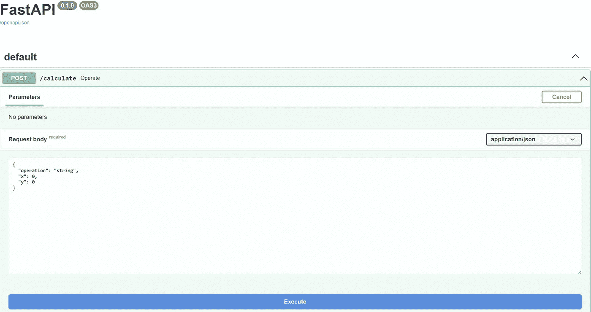
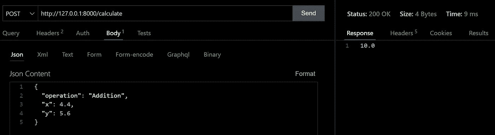
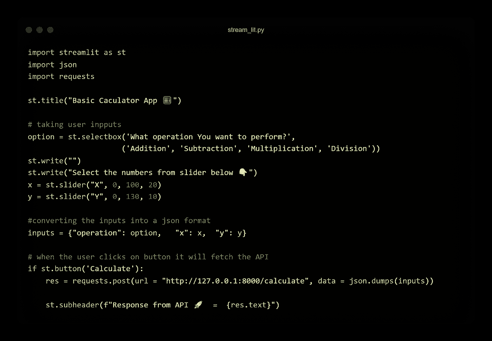
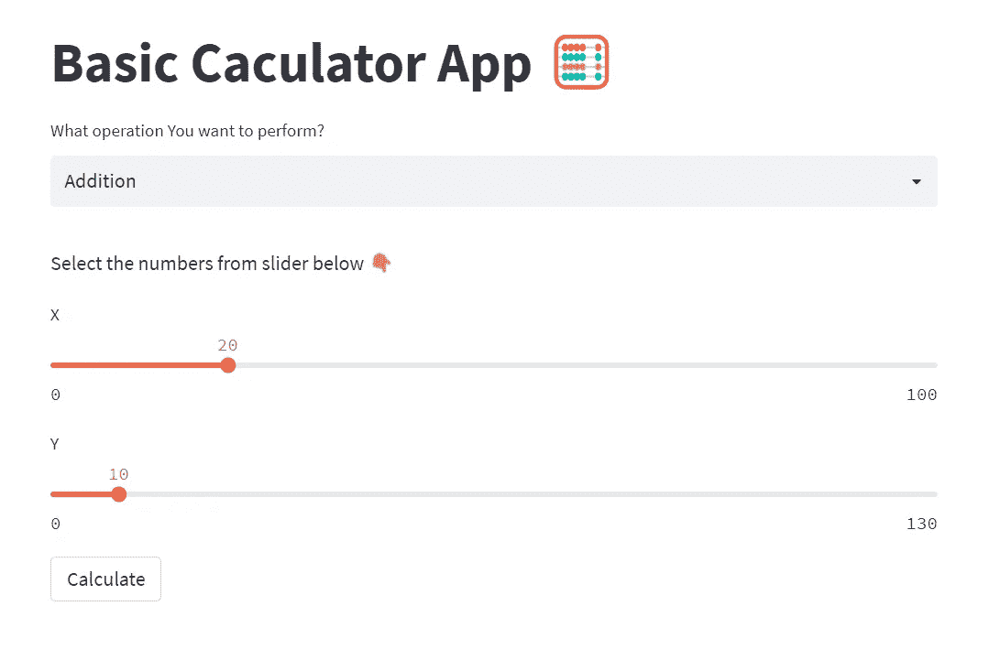
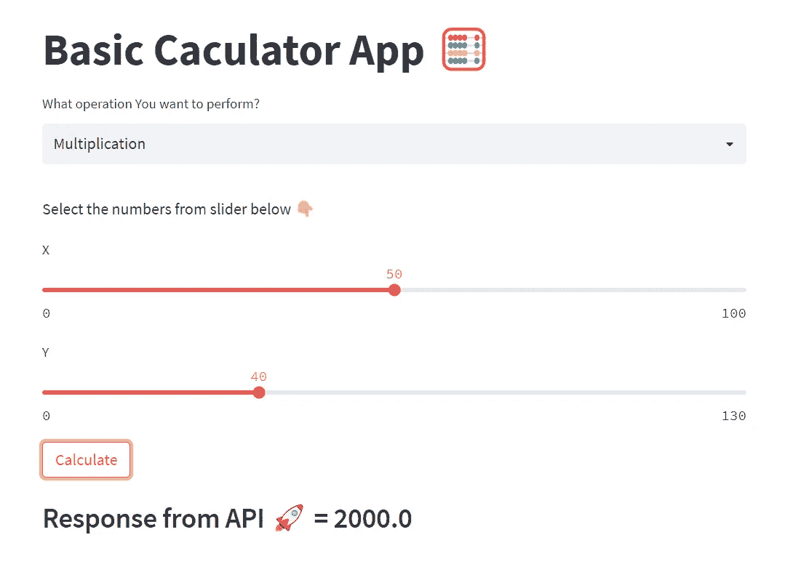

# 细流🔥+ FastAPI⚡️-你下一个数据科学配方所需的成分

> 原文：<https://medium.com/codex/streamlit-fastapi-%EF%B8%8F-the-ingredients-you-need-for-your-next-data-science-recipe-ffbeb5f76a92?source=collection_archive---------0----------------------->


**作者图片**

[**Streamlit**](https://streamlit.io/) 是一个**开源、免费、全 python 框架，为数据科学/机器学习项目快速构建和共享交互式仪表盘和 web 应用** **。**

Streamlit 的口号是 ***“构建和分享数据 app 的最快方式”*** *，*哪个是真的*。*这个框架使得数据科学家和机器学习工程师可以轻松地创建强大的用户界面，并且**将 jupyter notebook/ python 脚本转换为交互式应用**和**无需担心**视图、模板和 JS。要使其具有交互性，您只需编写一个 python 脚本，它就会从**顶部运行到底部**。

虽然 Streamlit 可以用于生产，但它最适合快速原型制作。通过使用 [**FastAPI**](https://fastapi.tiangolo.com/) 提供机器学习/数据科学模型，在原型获得批准后，您可以使用 Dash 或 React 快速转移到生产就绪的 UI。

在这篇简短的博文中，我将介绍以下步骤:

1.  创建一个基本的 Python 计算器模块。
2.  **使用 FastAPI 从模块中提供函数。**
3.  **使用 Streamlit 创建一个非常基本的用户界面。**
4.  **整合细流& FastAPI。**

我在这里不打算使用任何花哨的机器学习模型，一旦我们掌握了 FastAPI + Streamlit pipeline 的知识，我们就可以**将其扩展到任何数据科学/机器学习模型。**

# 步骤 1:创建计算器模块

一个 [**模块**](https://docs.python.org/3/tutorial/modules.html) 就是一个 python 脚本，包含了一组你想要包含在你的应用中的函数。在这里，我们正在构建一个计算器应用程序，所以我们需要的输入是数字和我们想要执行的操作。

让我们创建一个函数 ***计算*** 用于同样的目的，分别用参数 ***运算，x***&***y***并将其保存为***calculator . py***模块。

这是一个非常基本的函数，它简单地对使用`***if-elif***`块传递的操作名执行操作，并返回结果。



**带计算功能的计算器模块:作者图片**

# 步骤 2:使用 FastAPI ⚡创建 API

想温习一下 **FastAPI 基础知识吗？阅读本**👉[📖](https://afaqueumer.medium.com/fastapi-fundamentals-getting-faster-with-fastapi-866545b841ca)

这里我们将创建一个基本的请求体。我们将创建一个 User_input 类，使用 [**pydantic 的 BaseModel**](https://pydantic-docs.helpmanual.io/usage/models/) 进行类型验证，并将参数发送到 ***计算器函数*** ，我们将简单地从上面创建的 ***计算器模块*** 中导入该函数。



**FastAPI 脚本:作者图片**

为了运行 FastAPI 服务器，我们需要运行以下命令:

```
**uvicorn fast_api:app --reload**
```

我们现在可以在这里打开 Swagger UI👉`[**http://127.0.0.1:8000/docs**](http://127.0.0.1:8000/docs)`



**Swagger UI:作者图片**

让我们在[迅雷客户端](https://www.thunderclient.com/)中测试一下我们的路径操作。



**请求&响应:作者图片**

这就完成了我们的后端流程。我们已经创建了一个模块和一个 API，通过导入模块来调用函数。

REST APIs 的主要好处之一是 **REST 协议将数据存储(后端)和 UI(前端)与服务器**分离，从而允许客户端和服务器独立。

# **第三步。使用 Streamlit** 创建网络应用🔥

为了创建 UI，我们将使用 Streamlit，这是一个应用程序框架，使数据科学家和机器学习工程师可以在几分钟内轻松地将数据脚本创建到可共享的 web 应用程序中。全是纯 Python。不需要前端经验，✨.

您可以通过 pip 安装 streamlit:

```
**pip install streamlit**
```

您可以从这里了解更多关于 Streamlit 的信息👉`[**https://streamlit.io/**](https://streamlit.io/)`



**Streamlit 应用程序脚本:作者图片**

在上述应用程序中，我使用了以下组件:

```
**st.title:** Display text in title formatting.
```

```
**st.write:** Write arguments to the app.
```

```
**st.selectbox:** Display a select widget.
```

```
**st.slider:** Display a slider widget.
```

```
**st.button:** Display a button widget.
```

为了运行 streamlit 服务器，我们需要运行以下命令:

```
**streamlit run stream_lit.py**
```

它将在浏览器中启动应用程序，您可以转到`[**http://localhost:8501**](http://localhost:8501/)`web 应用程序将如下所示👇



**Streamlit 应用:作者图片**

因此，我们的 UI 只用几行代码就创建好了。这将允许用户从选择框中选择一个操作，使用滑块选择 x 和 y 的值(默认情况下，值分别定义为 20 和 10)。它应该显示一些结果后，按下计算按钮。

# 步骤 4:用后端组装前端

为了避免错误和运行良好的应用程序，我们需要确保我们的前端和后端服务器启动和运行。

```
# For running streamlit app
**streamlit run stream_lit.py**
```

```
# For running backend with FastAPI
**uvicorn fast_api:app --reload**
```

`**st.button**` 是一个布尔组件，如果按钮在应用程序的最后一次运行中被点击，它返回一个**真**，否则返回**假**。我们将在 **if-else** 块&中利用这一点。只有当按钮被点击时，我们才会发送请求。这将避免更大的应用程序中不必要的操作，并可以节省机器学习应用程序中的大量计算损失。

我们将使用 [**Python 的请求**](https://pypi.org/project/requests/) 库来集成 streamlit 脚本中的后端。在 streamlit 应用程序中，我们将输入存储到一个字典变量`**inputs = {"operation": option, "x": x, "y": y}**`

JSON 是一种存储和交换数据的语法。如果您有一个 Python 对象，您可以使用`**json.dumps()**`方法将其转换成 JSON。

我们将把我们的 python 对象 ***输入*** 转换成 JSON 格式，同时向我们的 API 发送请求。

```
**requests.post(*url* = “http://127.0.0.1:8000/calculate", 
              *data* = json.dumps(inputs))**
```

我们已经在步骤 2 中测试了对我们请求的响应。因此，我们将简单地在应用程序中编写响应作为操作的结果。



恭喜你！！！现在我们知道如何创建一个全功能的 web 应用程序。

我将尝试提出更多机器学习/数据科学概念，并将尝试将听起来很花哨的术语和概念分解成更简单的术语和概念。

我希望你喜欢这篇文章！你可以**关注我** [Afaque Umer](https://medium.com/u/430bc504f9d9?source=post_page-----ffbeb5f76a92--------------------------------) 获取**更多**这样的文章。

## 感谢阅读🙏

## 继续学习🧠继续分享🤝保持敬畏🤘