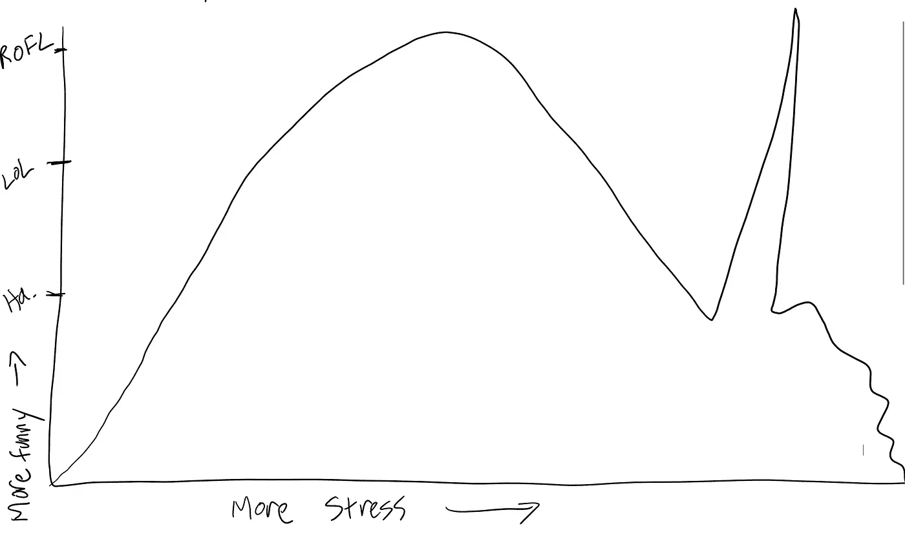

# 编程的压力喜剧曲线

> 原文：<https://medium.com/codex/stress-comedy-curve-of-programming-8d8c4cf02d63?source=collection_archive---------8----------------------->

*免责声明:所有观点都是我自己的*

照片功劳(或责备)是我的

在作为一名软件工程师工作了十几年后，我开始相信在你当前工作的压力和你发现新的压力事件有多有趣之间有着直接的关系。

我把这称为“压力喜剧曲线”。总的前提是这样的，“你的工作压力越大，你就会越有趣…