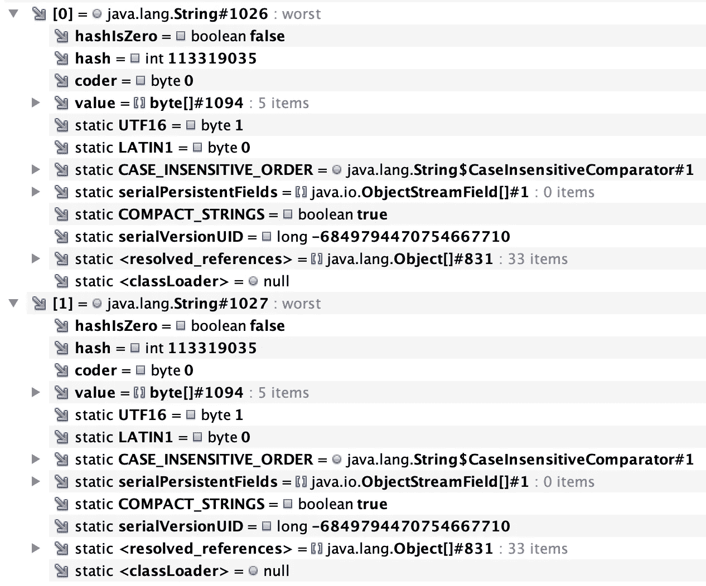

# Java 中的字符串重复数据删除

> 原文：<https://medium.com/codex/string-deduplication-in-java-2dc1e1893a74?source=collection_archive---------4----------------------->

本文旨在解释和演示什么是 Java 中的字符串重复数据删除。

**TL；DR** 字符串重复数据删除允许多个字符串共享同一个底层字符数组。您可以按如下方式激活它。

```
-XX:+UseG1GC -XX:+UseStringDeduplication
```

我使用的是 OpenJDK 13，只要您使用的是 java 版本 9 或更高版本，您就可以继续使用并重现这里显示的结果。

首先，让我们解释一下字符串类型的基础知识。该字符串包含一个名为 value 的字段，该字段保存实际内容(字符)。

您可能知道，创建新的字符串对象而不是使用所谓的“字符串文字”可能是不好的做法。

上面的代码有什么问题？我们来分析一下。我将使用 [VisualVM](https://visualvm.github.io/) ，但也有其他可用的选项。运行以下命令(为了清楚起见，我使用“-”号来禁用字符串重复数据删除，但它在默认情况下是禁用的)。

```
> javac StringDeduplication.java
> java -XX:+UseG1GC -XX:-UseStringDeduplication StringDeduplication
```

然后打开另一个控制台窗口来提取堆转储(用您的 PID 替换{PID})。

```
> jcmd {PID} GC.heap_dump -all ~/Desktop/stringdeduplication-1.hprof
```

在 VisualVM 中打开这个转储，选择“Objects ”,然后选择“GC Roots ”,导航到数组列表，你会发现数组列表包含如下 4 个元素。


VisualVM 中 StringDeduplication.java 的数组列表“字符串”。

请注意，前 4 个字符串是不同的引用，而后两个是相同的。进一步扩展元素，您可以注意到前两个字符串也将指向两个不同的字节数组(String 中的**值**字段)。


扩展了“最坏”的字符串。

“错误”字符串将包含相同的**值**字段的原因是由于字符串构造函数中使用了字符串文字，该字符串构造函数从字符串池中获取它。在这种情况下，没有必要使用字符串构造函数，在一些特殊情况下它会很有用，这里不讨论。

怎么办？这就是字符串重复数据删除的用武之地。(请注意，字符串重复数据删除仅适用于 G1 垃圾收集器。)运行以下命令启动应用程序。

```
> javac StringDeduplication.java
> java -XX:+UseG1GC -XX:+UseStringDeduplication -Xlog:gc*=info StringDeduplication
```

然后打开另一个控制台窗口强制执行 GC，然后提取堆转储(用您的 PID 替换{PID})。

```
> jcmd {PID} GC.run
> jcmd {PID} GC.heap_dump -all ~/Desktop/stringdeduplication-2.hprof
```

我们首先执行 GC 的原因是因为这是字符串重复数据删除发生的时间，这会导致暂停时间稍长。但希望这能让其他阶段更有效率，因为需要移动的对象更少了。

现在打开 VisualVM，注意前两个字符串的底层**值**字段的不同。



通过字符串重复数据删除扩展了“最差”的字符串。

瞧，它们现在共享相同的底层**值**字段。

**参考文献**

[1]visual VM
[https://visualvm.github.io/](https://visualvm.github.io/)

[2] Java 开发工具包第 13 版工具规范
[https://docs . Oracle . com/en/Java/javase/13/docs/specs/man/index . html](https://docs.oracle.com/en/java/javase/13/docs/specs/man/index.html)

[3]Java 命令
[https://docs . Oracle . com/en/Java/javase/13/docs/specs/man/Java . html](https://docs.oracle.com/en/java/javase/13/docs/specs/man/java.html)

[4] Java HotSpot VM 选项
[https://www . Oracle . com/Java/technologies/javase/VM Options-JSP . html](https://www.oracle.com/java/technologies/javase/vmoptions-jsp.html)

jcmd 命令
[https://docs . Oracle . com/en/Java/Java se/13/docs/specs/man/jcmd . html](https://docs.oracle.com/en/java/javase/13/docs/specs/man/jcmd.html)