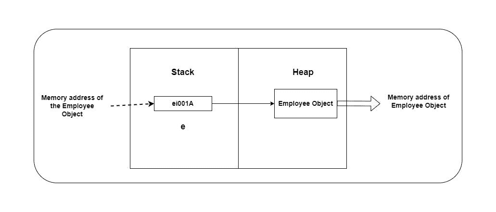
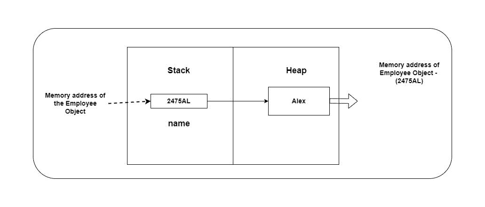
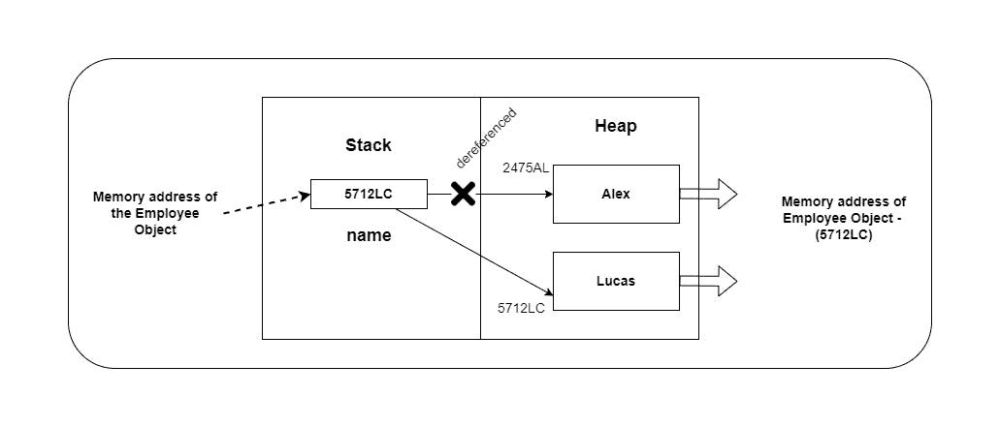

# “Java 中的字符串是不可变的”对吗？

> 原文：<https://medium.com/codex/string-in-java-is-immutable-is-it-right-e21d8e424497?source=collection_archive---------14----------------------->

好吧，我相信你们大多数人已经知道了！！！我对此也很熟悉！！！但是我们是否准确地得到了“不可变”这个关键词，我们知道为什么 Java 中的字符串是不可变的吗？

让我们开始吧！！！

# 什么是不变的？

对象创建后就不能编辑或修改了。在 Java 中，值和对象是两个不同的概念。瞬时变量或参考变量保持值。例如，一个即时变量存储一个程序员提供的真实值(取决于类型)。

```
int x = 53;
double s = 43.725;
String name = “Kasun”;
```

您可能知道，Java 中的对象存储在 JVM 内存的堆区域中。因此，引用变量的值就是它所指向的对象的内存地址。参考变量“S”如下图所示。



另一方面，一个对象是一个类的子类，有几个实例变量，称为“属性”

String 类表示 Java 中的字符串。因此，任何用“String”类型声明的变量都成为指向 String 类实例(例如:String 对象)的引用变量。值“Alex”被分配给变量“name ”,如下所示。我们稍后将变量的值更改为“Lucas ”,在这种情况下，只有引用变量“name”的值被更改。字符串对象根本没有被修改。“John”对象是我们引用的字符串对象。

```
String name = “Alex”;
name = “Lucas”;
```

好吧，我明白了。你很困惑。让我们看看上面的代码在堆栈和堆内存位置发生了什么！！！

如前所述，任何 Java 对象都存储在堆中。当“name”变量设置为“Alex”时，JVM 在堆中生成一个对象，并将其值设置为“Alex”(因为分配了一个字符串值，String 是 Java 中的一个类，所以创建了一个字符串对象)。该对象由“name”变量引用。如下图所示。



当“名字”后来分配给“卢卡斯”的时候。这会生成一个新的字符串对象，其值为“Lucas”那么,“name”变量现在指向哪里呢？当然，从这里可以看出,“name”变量从“Alex”对象解引用并指向“Lucas”对象。



那么，我们能改变或转化这个物体吗？没有，但是只生成了一个新的 String 对象(Lucas 对象)，并且“name”变量现在指向该对象。这说明了为什么您可以影响“name”变量的值。这意味着 Java 字符串是不可变的！

只是提醒一下，堆中的对象有独立的内存地址。

让我们看看为什么 Java 字符串对于我的其他内容是不可变的。