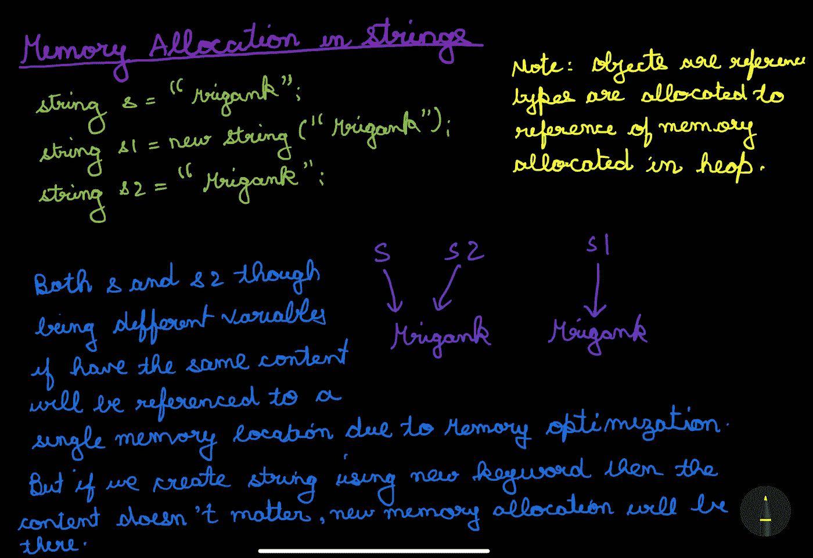
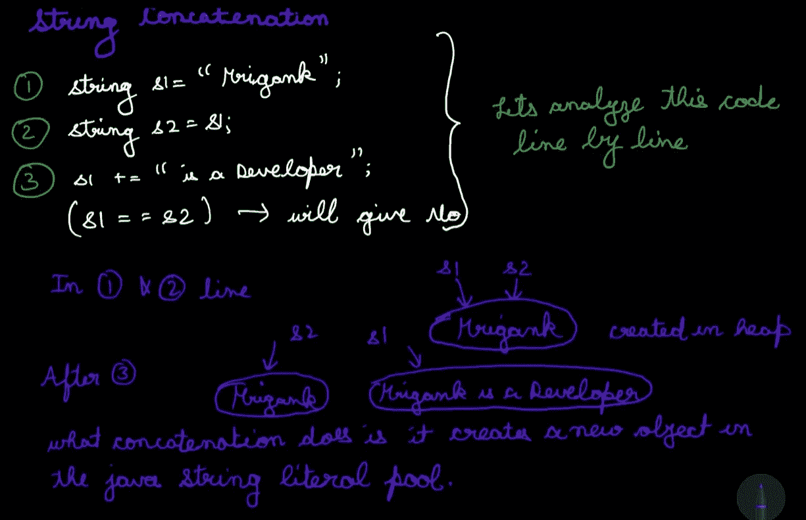
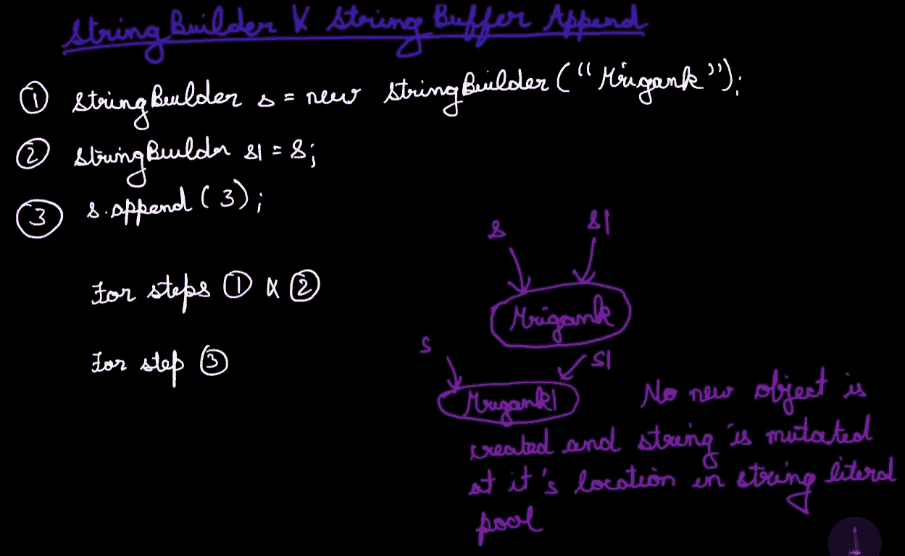

# JAVA 中的字符串

> 原文：<https://medium.com/codex/strings-in-java-e562c599b7d1?source=collection_archive---------13----------------------->

# 创建字符串

JAVA 中的每个字符都是以 UTF-16 格式存储的，所以 String 中的每个字符都使用 16 位或 2 字节的内存。在 Java 中有四种创建字符串的方法:

*   字符的数组或数组列表
*   字符串类。
*   StringBuffer 类
*   StringBuilder 类

String 类创建不可变的字符串，而 StringBuffer 和 StringBuilder 类使用可变的字符串。StringBuffer 和 StringBuilder 的区别在于，StringBuffer 是一个线程安全的类，也就是说，我们可以在多线程应用程序中使用 StringBuffer。同时，StringBuilder 不是一个线程安全的类。StringBuilder 类的好处是它比 StringBuffer 类快，因为 StringBuffer 类提供了线程安全的额外开销。

# 字符串类的函数

假设我们创建了一个字符串 s = "Mrigank "。现在我们将对这个字符串执行所有的功能。

*   ***s . length()******→***它会给出字符串的长度。输出将是 7。
*   ***s . charat(index)→***它会给出字符串中特定索引处的字符。对于 ***s.charAt(2)*** ，输出将为 ***i*** 。

***注意:*** *我们不能在 Java 中使用 s[index]。这是不允许的。这将给出一个错误，说明* ***需要 Java: array，但找到了 Java.lang.String。***

*   ***s.substring(beginIndex)或 s . substring(begin index，endIndex) →*** 这是 Java 中 string 类中存在的 substring 函数的 2 种变体。第一个返回从开始索引到字符串结尾的字符串，第二个返回字符串的[beginIndex，endIndex。

s.substring(3) → gank

s.substring(3，6) → gan

*   ***s1 . contains(s2)→***如果 S2 作为子串出现在 S1 中，则返回 true 否则，它将返回 false。

String s1 = " MrigankString s2 = " rigas1.contains(s2)将给出 true

*   ***S1 . equals(S2)→***检查两个字符串的内容是否相等，如果相等则返回 true，否则返回 false。

对于上面的例子，s1.equals(s2)将给出 false。

*   ***s1 . compare to(s2)→***如果两个字符串在字典上相同，则返回 0，如果 S1 在字典上大于 S2，则返回正值，反之亦然。
*   ***s1.indexOf(s2)或 s1.indexOf(s2，fromIndex) →*** 这将在第一种情况下返回字符串 s1 中第一个出现的子串 s2 的索引，在第二种情况下，从 fromIndex 的 ***开始返回字符串 s1 中第一个出现的子串 s2。*** 如果该子串不在字符串中，则返回-1。
*   ***S1 . equalsignorecase(S2)→***如果两个字符串相等，则返回 true，忽略字符的大小写，否则返回 false。
*   ***s1 . toupper case()→***这将把字符串 S1 的所有字符转换成大写。
*   ***s . chars()→***Java String chars()方法返回一个 IntStream。该流包含字符串对象中字符的整数码位值。

# **字符串的内存分配**

**String literal pool:** 这是 Java 堆中的一个存储区域，String literal 存储在这里。

***== →*** 该标志检查引用的相等性，而不是对象内容。

所以，在上面的图像中，如果我们做 ***s == s2，*** 它会给出 true，如果我们做 ***s == s1，*** 它会给出 false。

# 字符串和 StringBuffer，字符串连接时的 StringBuilder 行为

字符串行为

StringBuilder 和 StringBuffer

# StringBuilder 和 StringBuffer 类的函数

***length()、charAt(index)、indexOf(string)、indexOf(string、fromIndex)、lastIndexOf(string、fromIndex)、compareTo(string)、subString(beginIndex)、subString(beginIndex、endIndex)、chars()*** 等众多函数。StringBuilder 和 StringBuffer 类的唯一函数是:

*   ***s.append(x) →*** 这将把 x 追加到字符串 s 的末尾，这里的 x 可以是整数、双精度、布尔、浮点或对象。
*   ***s.insert(position，x) →*** 这样会在字符串 s 中的位置 x 处插入 x，这里的 x 是指任意对象。
*   ***s.setCharAt(index，character) →*** 这将在字符串的特定索引处插入字符。
*   ***reverse() →*** 这将反转字符串 s，这个函数在 String 类内部是不存在的。
*   ***s . delete charat(index)→***删除字符串 s 中特定索引处的字符
*   ***s.delete(startIndex，endIndex)*** →从[startIndex，end index]中删除字符。
*   ***s.capacity() →*** 这给出了字符串 s 的缓冲容量。StringBuffer 的初始容量是 ***16*** 但是随着 StringBuffer 的大小增加，它的容量按照公式***(old capacity * 2)+2***增长。StringBuilder 也是如此。
*   ***s.replace(startIndex，endIndex，str)*** →用 str 替换[startIndex，end index]中的字符串。