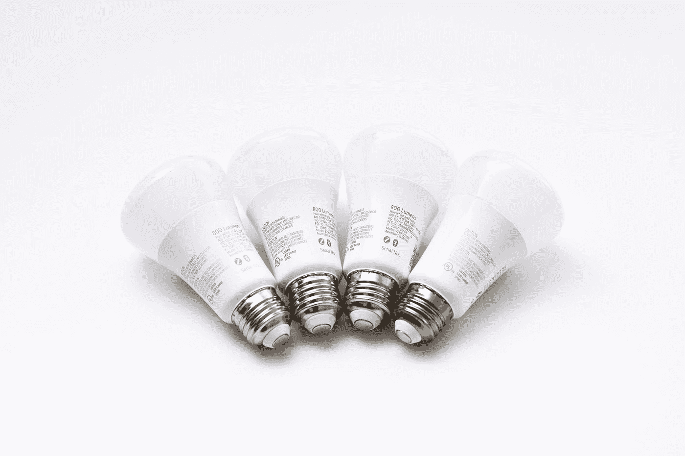

# 使用最新技术，努力打造终极“智能”家居！第四部分

> 原文：<https://medium.com/codex/striving-for-the-ultimate-smart-home-using-the-latest-tech-part-4-68c544b14c62?source=collection_archive---------12----------------------->

## *我想增加我家的智能*

由[杰里米·贝赞格](https://unsplash.com/@jeremybezanger?utm_source=medium&utm_medium=referral)在 [Unsplash](https://unsplash.com?utm_source=medium&utm_medium=referral) 上拍摄的照片

除了智能物品清单，我还会使用智能照明。美国消费者有许多选择。我目前使用飞利浦的几个选项，他们的智能灯色调品牌线。我已经投资了我的上一个家，而且…