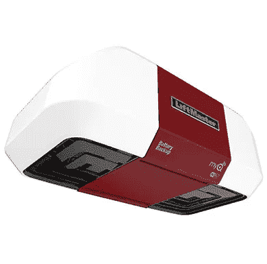

# 使用最新技术，努力打造终极“智能”家居！第五部分

> 原文：<https://medium.com/codex/striving-for-the-ultimate-smart-home-using-the-latest-tech-part-5-d3821d0c38d8?source=collection_archive---------15----------------------->

## *我想增加我家的智能*

Liftmaster 车库门开门器

我们新买的房子配有一个带传动 Liftmaster 车库门开门器，采用了最新的 MyQ 技术。我们已经从一个没有智能功能的链条驱动单元切换到我们以前的家的张伯伦皮带驱动单元。说这是一种进步会…