# 面向对象编程的结构化控制流(第二部分)

> 原文：<https://medium.com/codex/structural-control-flow-with-object-oriented-programming-part-2-7d18526146de?source=collection_archive---------1----------------------->

这两篇文章的前提是对我们如何考虑面向对象编程范例以及通过采用它们我们能获得什么好处进行一点重新想象。

我们将从更加实际和实用的角度来看待 OOP，而不是非常典型的学术`Shape`、`Circle`、`Square`方法。

[**在上一篇文章**](https://chrlschn.medium.com/weve-been-teaching-object-oriented-programming-all-wrong-part-1-e171f57aa209) 中，我们谈到了采用面向对象方法的一些简单原因，即使是在像 JavaScript 和 TypeScript 这样的面向函数的语言中。面向对象封装的一个简单且非常容易实现的好处是可发现性，并帮助我们避免当代码库遵循[***事务脚本*模式**](https://martinfowler.com/eaaCatalog/transactionScript.html) 时变得常见的不同行为。

但是对我来说，面向对象思想的主要好处是它让你能够通过行为设计模式将*改变为 ***结构控制流*** ，这使得复杂的代码更容易推理、扩展和维护。*

*我特别选择在示例中使用 TypeScript，因为它跨越了函数范式和对象范式之间的界限，开发人员经常忽略使用 TypeScript 的面向对象的可能性，但是这些技术和设计模式适用于任何支持面向对象原则的语言。*

# *过程流与结构流*

*所有开发人员都熟悉过程控制流。当我们开始编写代码时，这些是我们所有人首先学到的核心结构:*

*   *`if`报表*
*   *`if-else-if`语句*
*   *`switch-case`报表*

*让我们举一个例子，我们有一个`Order`，基于`Order`的运输方式，我们想计算运输价格:*

*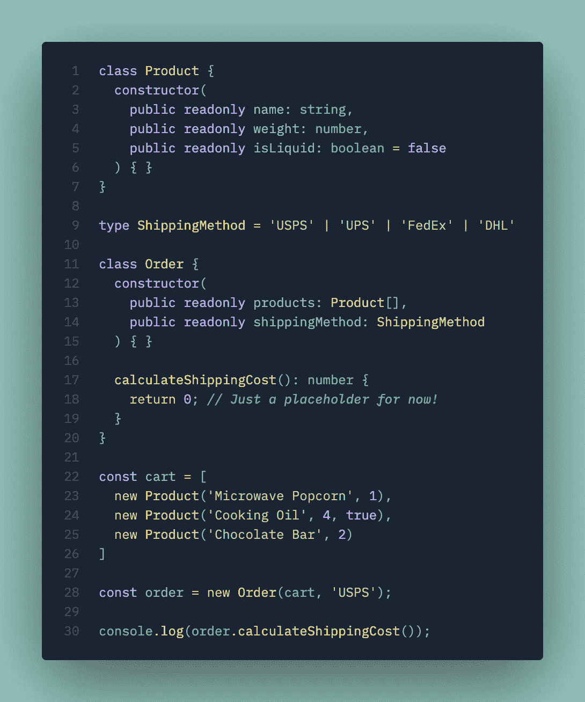*

*我们描述问题域的起始代码列表。第 17–19 行是我们要关注的地方。*

*我们感兴趣的是第 17–19 行的`calculateShippingCost()`方法。我们的每种运输方式都有一套不同的规则，基于:*

*   *运输提供商*
*   *每种运输方式特定层的产品重量*
*   *并且如果包裹中有液体的话，可能需要额外费用*

*当然，实现这一点的简单方法是使用`if-else`条件语句或`switch-case`:*

*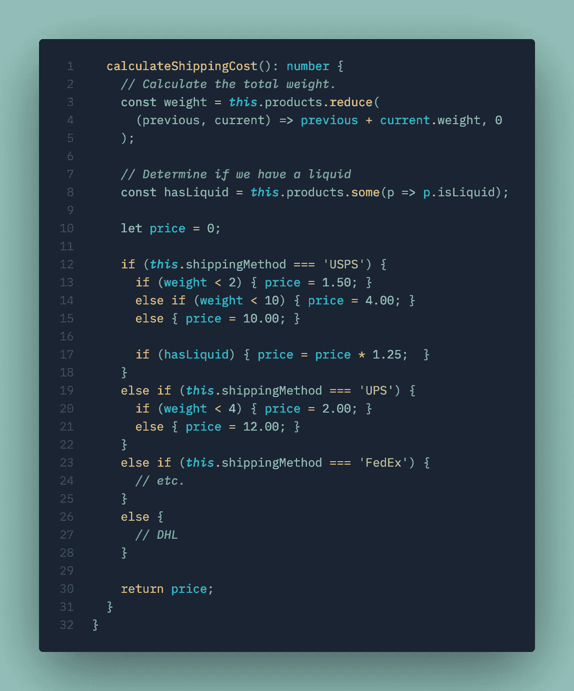*

*我对 if-else 条件进行了改动，使代码清单更加紧凑，但这是这种逻辑的典型代码。*

*我确信这段代码看起来很熟悉，因为每个代码库都有一些像这样的 100-200 行的条件块🤣(不知何故，有一个人*可以毫不犹豫地阅读它！).**

*这种类型的代码存在许多问题。首先，代码很难阅读。我们只处理几个不同的变体，这已经相当复杂和有点草率了。其次，我们已经可以看到，这段代码的维护将是一个挑战。如果我们将来提供更多的交付选项，或者我们对现有的运输方式有了新的规则，我们就必须向这个条件语句添加更多的分支(例如，如果我们想添加国际运输费率)。*

*在这里，我们可以使用面向对象的设计原则将这个*程序逻辑*转换成*结构逻辑*。在这种情况下，我们将使用 [**策略模式**](https://en.wikipedia.org/wiki/Strategy_pattern) 结合 [**工厂模式**](https://en.wikipedia.org/wiki/Factory_method_pattern) 的变体来封装我们的规则。*

*我们将创建一个 ***抽象*** 基类，对所有运输策略的公共行为和属性进行建模；把它想象成一个模板，它定义了我们如何使用任何运输策略:*

*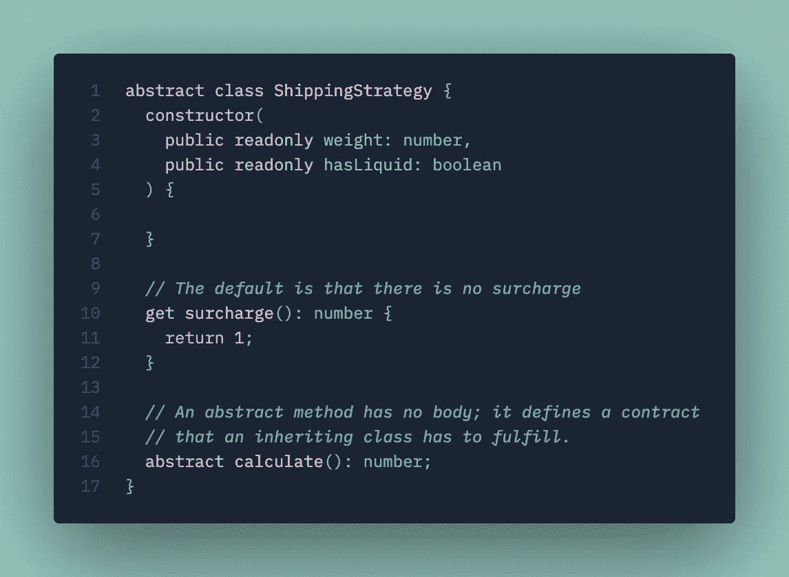*

*抽象基类不能被直接实例化，它定义了所有运输策略必须如何表现的契约和模板。*

*现在我们可以实现代表每个方法的 ***具体的*** 类。在 TypeScript 中，这是使用`extends`关键字完成的。注意当我们扩展`ShippingStrategy`时会发生什么:*

*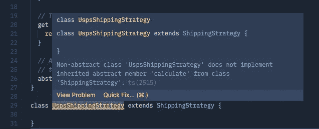*

*我们的 intellisense 检测到我们的实现有错误，因为根据约定，我们的实现是不完整的。*

*抽象类*定义了一个契约——*任何`abstract`成员 ***都必须*** 被实现——因此，直到我们实现了`calculate()`方法，我们的实现才是完整的。*

*这比看起来更强大。通过定义契约，它向代码库中的其他人提供了如何在未来创建新的运输策略的提示，并且该契约包含来自订单逻辑其余部分的`calculate()`的行为。*

*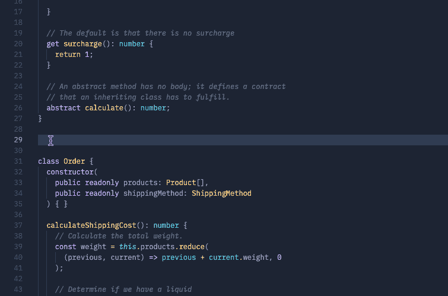*

*请注意基类是如何为我们提供契约的。*

*现在我们可以将我们的逻辑移到`UspsShippingStrategy`中，并将其与我们的其他运输策略完全隔离开来！这有很多好处，包括易于测试策略，以及更好地将代码与回归测试隔离开来。*

*因为 USPS 要求对运输液体收取额外费用，所以我们也可以通过*覆盖*基类行为将此逻辑移入策略中:*

*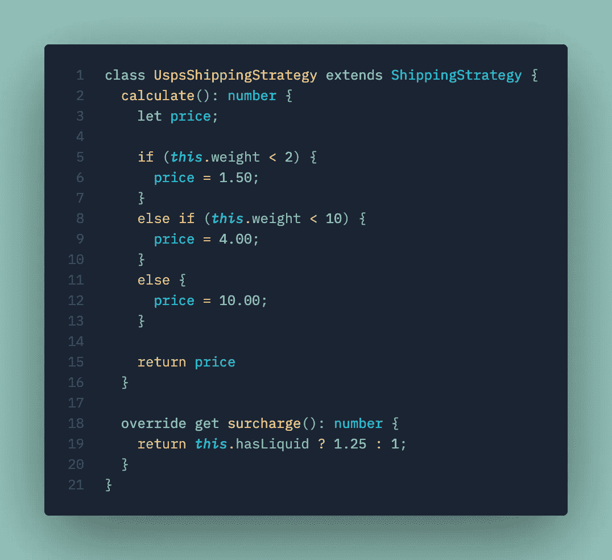*

*可以选择重写基类方法，以在具体的类中提供自定义逻辑。*

*值得注意的一件有趣的事情是对`this.weight`和`this.hasLiquid`的引用。这些是由基类`ShippingStrategy`自动提供给我们的代码的。*

*对于每种运输方式，我们可以实施不同的策略:*

*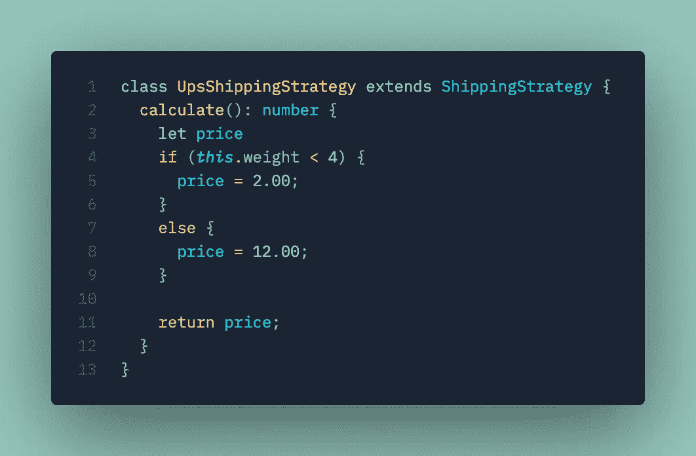*

*UPS 运输策略的逻辑(不要与 USPS 混淆)。*

*请注意，我们没有覆盖`surcharge`吸气剂，因为 UPS 不收取运输液体的附加费。在这种情况下，它将简单地从基类获取实现，基类返回乘数 1x。*

*既然我们已经有了自己的策略，我们需要一种将运输方法字符串映射到策略的机制。为此，我们通常会求助于所谓的 [**工厂模式**](https://en.wikipedia.org/wiki/Factory_method_pattern) ，但我们不需要太花哨。在这种情况下，我们可以创建一个简单的映射并创建一个伪工厂:*

*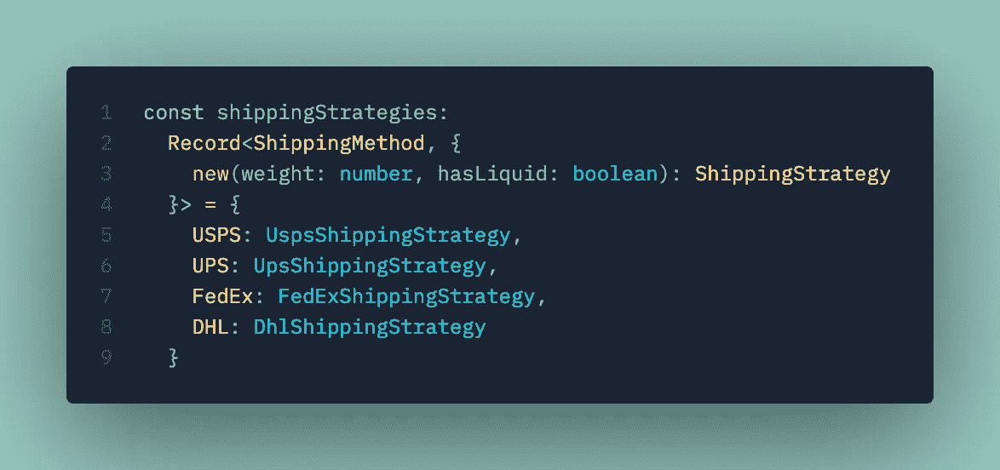*

*这看起来很复杂，但是我们只是将构造函数映射到我们的运输方法。*

*工厂返回抽象类 `ShippingStrategy`而不是具体类*。这是因为每一个具体的运输策略都实现了由抽象基类定义的契约，因此，我们的调用者不需要确切地知道它在与哪个策略一起工作，因为契约确保了我们与抽象类的交互对任何具体类都有效。**

*换句话说，我们有一个 ***保证*** 任何运输策略都将为我们提供一个`calculate()`方法和`surcharge`属性。你可以把它想象成向你的朋友借他们的`Phone`来做一个`call()`。它可能是一辆`iOSPhone`或`AndoidPhone`；双方执行`Phone.call()`的合同。*

*这让我们能够将`calculateShippingCost()`中的高度程序化逻辑转化为结构化逻辑:*

*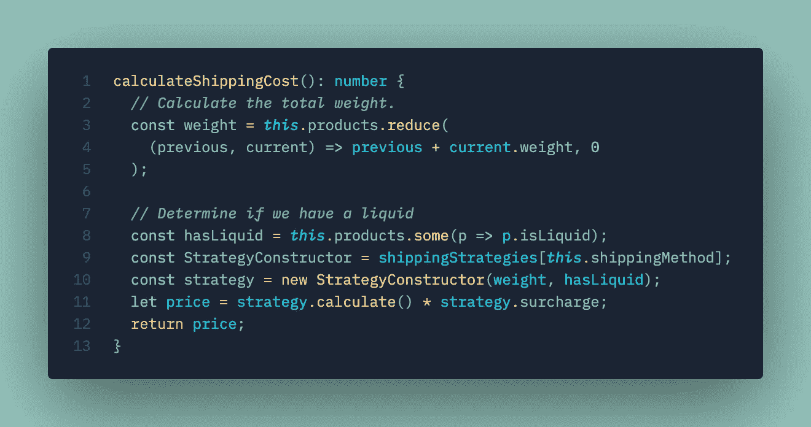*

*我们将在第 11 行重温应用附加费的代码。*

*现在有几个主要优势:*

*   *由于我们已经将每个策略的逻辑隔离或封装在一个类中，因此`calculateShippingCost()`方法的逻辑非常清晰且易于理解。*
*   *添加一个新的运输策略很容易，而且隔离得很好；如果我们在条件逻辑中犯了一个错误，我们不再需要担心破坏其他运输策略。*
*   *当添加一个新的运输策略时——比如说优步本地——我们不需要回归测试`calculateShippingCost()`方法，因为我们根本不接触那个代码！*
*   *如果我们需要对所有的运输策略做一个共同的改变，我们可以在基类中做，也可以在 T10 中做。*

*即使在这个简单的例子中，好处也应该是显而易见的。这种将过程条件转移到结构化的、面向对象的逻辑的方法允许我们极大地简化核心业务逻辑的实现。*

# *集中公共逻辑*

*因为我们总是希望收取附加费(无论是 1 倍还是 1.25 倍)，所以我们很容易像这样改变我们的 USPS 策略:*

*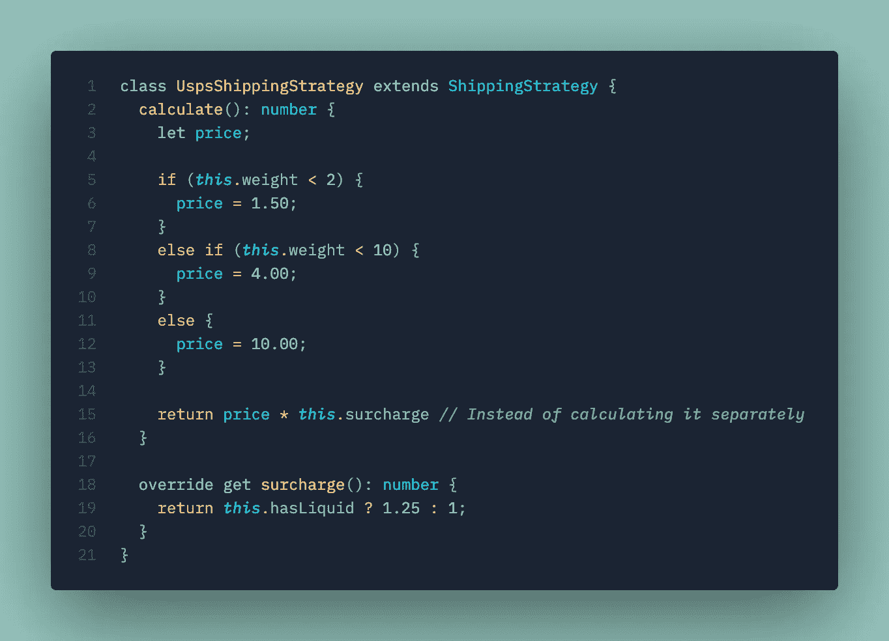*

*我们计算价格时，只需在第 15 行加上附加费。*

*但是这样做意味着*任何实现该逻辑的人都必须记住应用乘数*。拥有抽象基类为我们提供了另一种机制，通过将调用包装到`calculate`方法，使管理变得更容易:*

*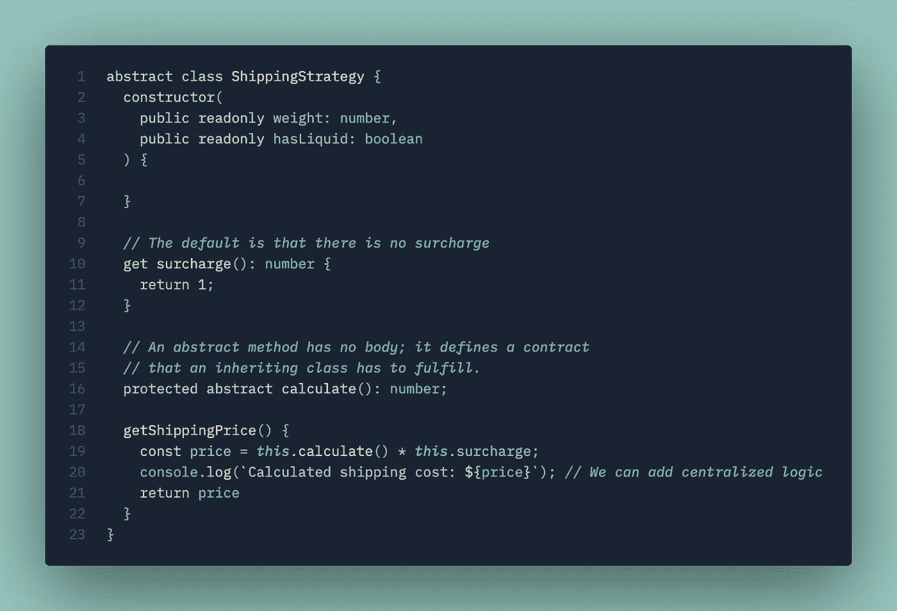*

*注意第 16 行的变化，在第 18 行应用了 protected 修饰符并添加了一个新方法*

*同样，我们使用类的结构来帮助定义我们的逻辑。*

*在第 16 行，我们将`calculate`方法更改为`protected`，并添加了一个实际调用该方法的新方法`getShippingPrice()`。这种方法的一个主要好处是，它允许我们像在第 20 行中所做的那样，为增加遥测和记录之类的事情集中逻辑。*

*如果我们查看下面的调用站点，我们可以看到`calculate()`方法现在已经不可访问了:*

*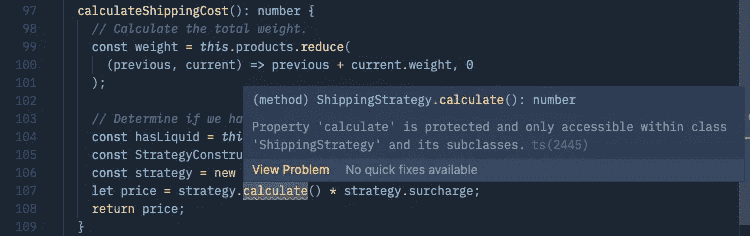*

*我们无法再访问此方法，因为我们将其标记为受保护。*

*这是面向对象编程和正确使用访问修饰符如`private`、`protected`和`public`的另一个好处。*

*虽然这看起来微不足道，但这让我们能够通过将计算的内部逻辑指定为`protected`并将我们的算法与外部 API 分离，来通知我们的调用者——你知道，我们的队友和合作者——在对象上允许什么操作。*

*这是我们最后的`Order`课:*

*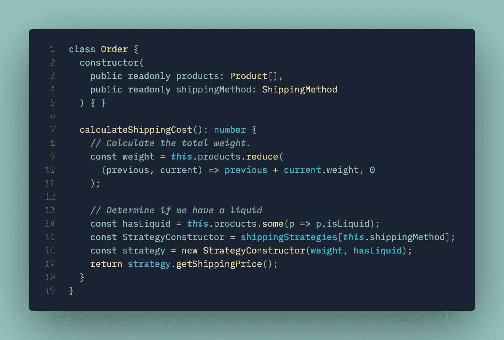*

*注意第 17 行的变化。*

# *适应性*

*您可以看到这种模式在解决许多代码复杂的问题中的普遍适用性，这些问题通常使代码难以维护、重构和测试。*

*特别是，任何时候基于鉴别器存在离散的行为边界，策略和工厂模式都可以用来从结构上组织逻辑，而不是使用过程逻辑来清理代码。*

*例子包括:*

*   *支付处理— `VisaProcessor`、`MasterCardProcessor`、`DiscoverProcessor`等等。*
*   *员工薪酬— `HourlyCompensationStrategy`、`SalariedCompensationStrategy`、`ContractorCompensationStrategy`*
*   *供应商定价管理— `AmazonPricingStrategy`、`WalmartPricingStrategy`、`TargetPricingStrategy`等等。*

*面向对象编程和相关的设计模式已经发展到可以帮助解决以逻辑的、可伸缩的和可维护的方式组织业务规则的挑战。*

*虽然函数式编程目前似乎很流行，但事实是面向对象编程通常可以提供更清晰的结构化方式来组织复杂的行为和逻辑，使代码更容易理解、维护和扩展。*

*面向对象的设计模式似乎已经失宠，因为应用它们需要学习曲线和经验(坦率地说，在大多数情况下，过于学术化的表述使它们难以接近)。许多年轻的开发人员可能仅仅通过查看试图解释这些概念的 UML 图而碰壁，因为随着团队采用“敏捷”并回避文档和设计，UML 本身已经变得古板。但是这些设计模式经常在大型复杂的项目中经受考验，甚至可以帮助小团队对代码库进行重大改进。*

*如果你想更深入地探索，我强烈推荐两本关于这个主题的开创性书籍:*

1.  *[**设计模式:可复用面向对象软件的要素**](https://www.amazon.com/Design-Patterns-Elements-Reusable-Object-Oriented/dp/0201633612)*
2.  *[**企业应用架构模式**](https://www.amazon.com/Patterns-Enterprise-Application-Architecture-Martin/dp/0321127420)*

*这些设计模式融合了几十年软件开发中积累的经验和知识，几乎可以应用于任何项目，因为很少有代码库是真正新颖的。*

*希望在这个简短而实用的旅程之后，你会发现面向对象的原则是一个强大的工具——即使是在使用函数式语言的时候——并且发现这些概念不再那么抽象。*

*(完整的代码清单如下)*