# 使用 Stylify CSS 更快地设计你的 Nette 框架网站

> 原文：<https://medium.com/codex/style-your-nette-framework-website-faster-with-stylify-css-31b8a9055606?source=collection_archive---------7----------------------->

使用 [Stylify](https://stylifycss.com/) 更快地设计你的 Nette 框架网站。不要研究选择器和语法。使用纯 CSS 语法，并获得生成的 CSS 与先进的优化生产。

对于下面的例子，你可以查看 [Nette 框架集成示例](https://github.com/stylify/integrations-examples/tree/master/nette)。

# 🚀Nette 简介

Nette 是 David Grudl 的 PHP 框架，它是 Symfony 和 Laravel 的优秀替代品。它有一个令人惊叹的模板系统，叫做 [Latte](https://latte.nette.org/) ，使用与 PHP 相似的语法，默认情况下有上下文相关的转义(其他框架都没有)。在我看来，它更容易学习，因为它默认带有一个简单的结构，它没有依赖性，需要学习的模式也更少。

# 💎风格化介绍

[Stylify](https://stylifycss.com/) 根据你写的东西动态生成 CSS。语法类似于 CSS `property:value`。定义的实用程序与组件选择器相结合，并在生产中被最小化，如`.color\:red,.button {color:red}`到`._zx, ._ga{color:red}`。

Stylify 允许您获得非常小的包，生成额外的 lazyloaded CSS 块，并通过编写 HTML 和选择器来设计页面样式🤟。

# 网状安装

从 Nette 开始最简单的方法是按照本指南使用 Composer:

*   运行`composer create-project nette/web-project nette-blog`
*   转到项目目录`cd nette-blog`
*   开始网络运行`php -S 0.0.0.0:80 -t www`
*   该网站应该在`[http://localhost](http://localhost)`可用

# 风格化设置

因为默认情况下 Nette 既没有捆绑器也没有 javascript 包，所以我们将使用 Stylify 捆绑器。

安装捆扎机`yarn add -D @stylify/bundler`。
在项目根目录下创建`bundles.js`文件，内容如下:

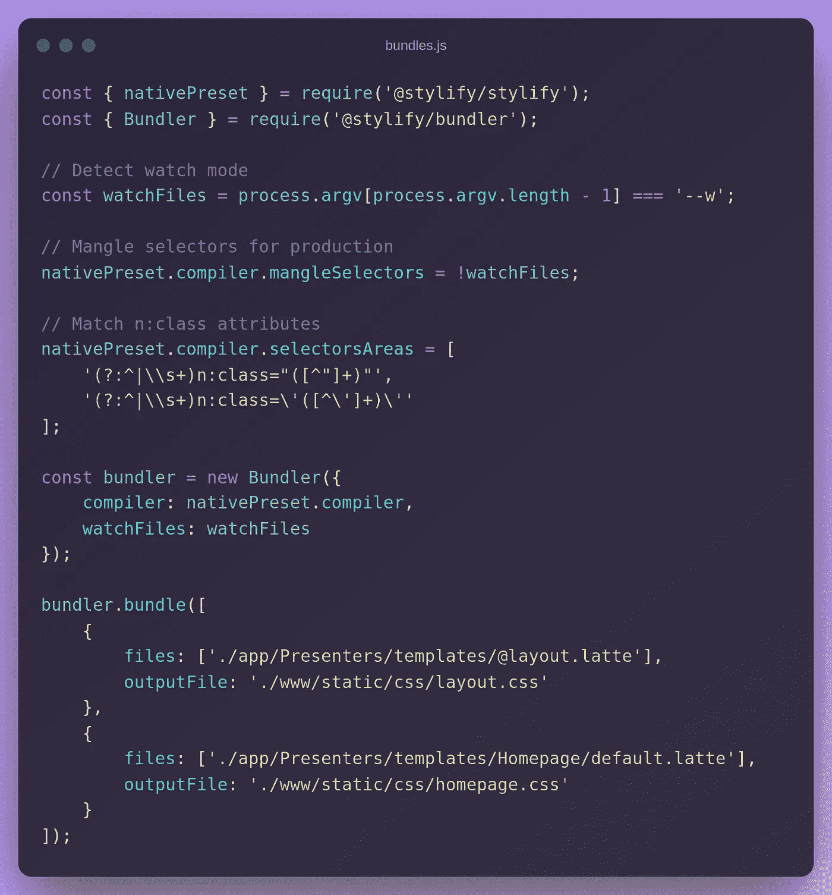

上面的配置将生成两个包:

*   `Layout` -全球通用
*   `Homepage` -仅用于主页

我们当然可以将整个项目的 CSS 生成到一个文件中。但是这会使 CSS 变得不必要的大。

现在打开`package.json`文件并添加以下脚本:

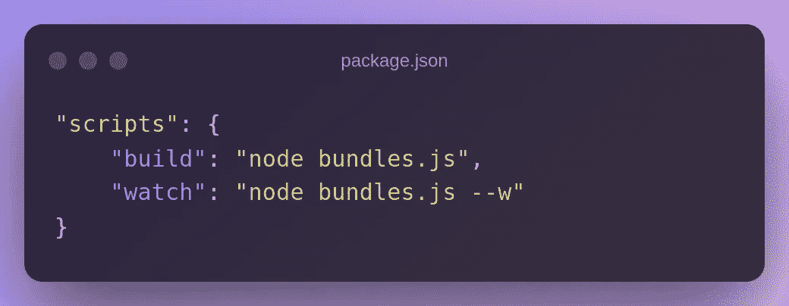

最后一步是编辑模板。打开`App/Presenters/Templates/@layout.latte`并将链接添加到布局 CSS 文件中:

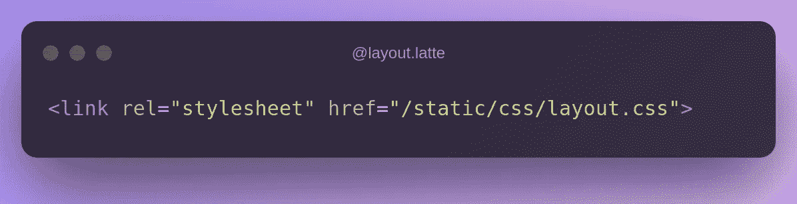

在`App/Presenters/Templates/Homepage/default.latte`中添加以下内容:

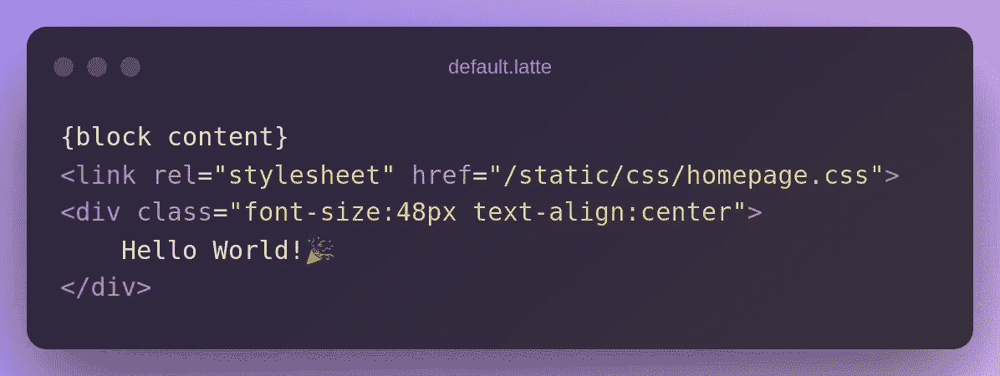

如果你运行`yarn watch`，Stylify 会生成 CSS，并会观察任何文件的变化。

# 成分

为了避免带有实用程序的臃肿模板，您可以直接在文件中配置
组件，在文件中使用[内容选项](https://stylifycss.com/docs/get-started#defining-a-component)(期望 javascript 对象不带括号)或在[编译器配置](https://stylifycss.com/docs/get-started#defining-a-component)中使用它们。

首先，让我们添加全局`container`组件。打开`bundles.js`，如下:

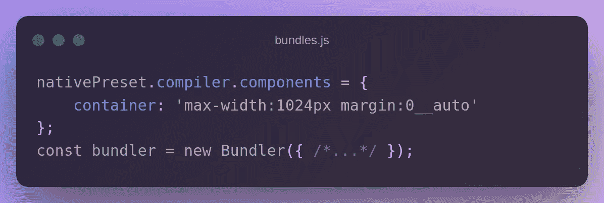

现在我们可以在整个项目中使用它。在我们的例子中，我们将其添加到布局中:

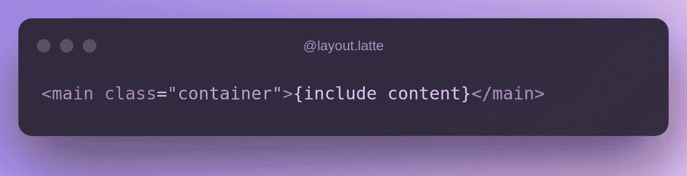

在主页中，我们可以使用内容选项为标题添加本地组件:

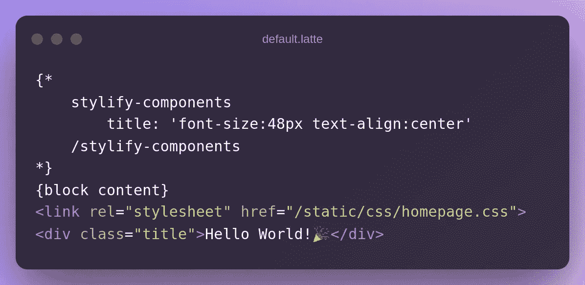

# 变量

拥有一个没有硬编码值的干净灵活的代码总是一个好主意。[变量](https://stylifycss.com/docs/get-started#adding-a-variable)可以像组件一样定义。让我们修改标题组件:

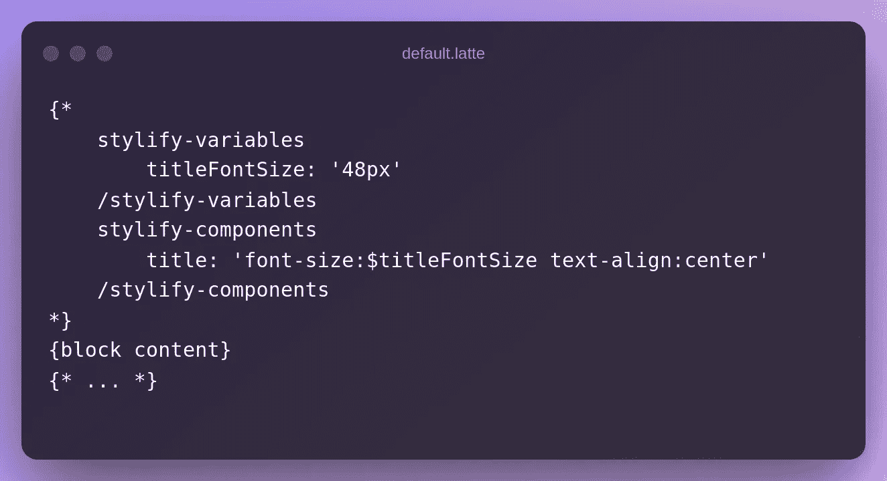

# 映射文件

当一个模板包含一个组件或一个嵌套模板部件时，我们可以使用`stylify-files`选项将其添加到包中。

让我们在`default.latte`旁边创建`_content.latte`模板部件，内容如下:

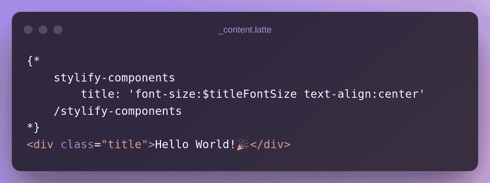

然后`Homepage/default.latte`使用`stylify-files`选项通知捆绑器外部路径，该选项要求路径由空格或新行分隔:

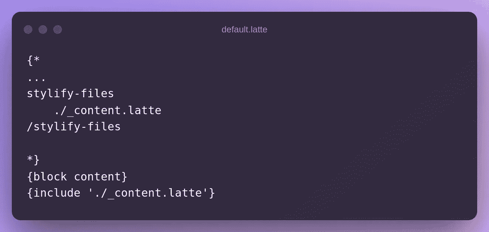

`./_content.latte`中的内容由捆扎机自动处理。

# 🔥生产构建

如果运行`yarn build`，选择器将会缩小，CSS 也会缩小:

`@layout.latte`:

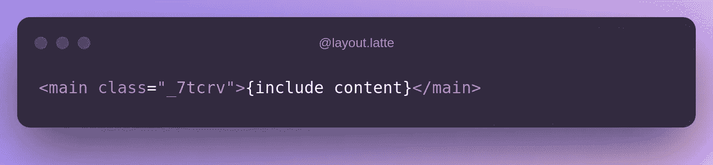

`_content.latte`:

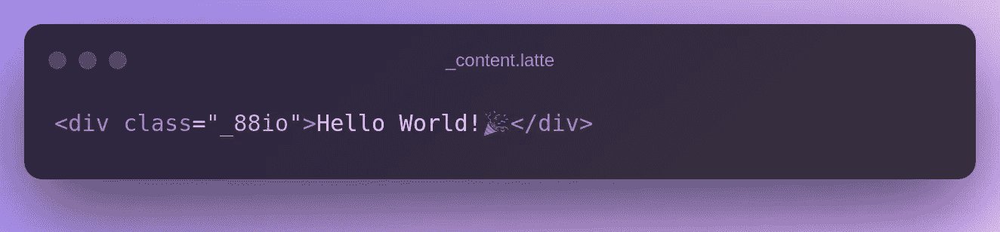

`layout.css`:

`homepage.css`:

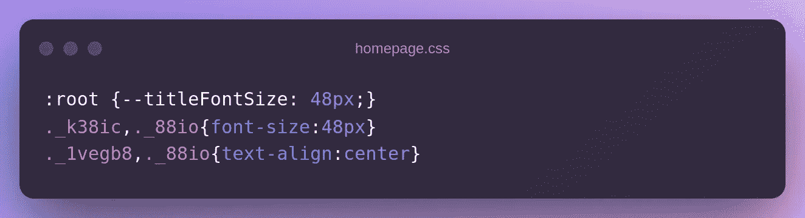

# 配置您需要的任何东西

上面的例子没有包括 Stylify 能做的所有事情:

*   您可以在模板中映射[嵌套文件](https://stylifycss.com/docs/bundler#files-content-option)
*   风格[全球选择器](https://stylifycss.com/docs/stylify/compiler#plainselectors)
*   定义[自定义屏幕](https://stylifycss.com/docs/stylify/compiler#screens)
*   添加你自己的[宏](https://stylifycss.com/docs/stylify/compiler#macros)，比如左边距的`ml:20px`
*   还有更多

请随意查看[文档](https://stylifycss.com/docs/get-started)以了解更多信息💎。

保持联系:
👉 [@8machy](https://twitter.com/8machy)
👉[@ stylifycss](https://twitter.com/stylifycss)👉[stylifycss.com](https://stylifycss.com/)👉【dev.to/machy8[👉](https://dev.to/machy8)[medium.com/@8machy](/@8machy)