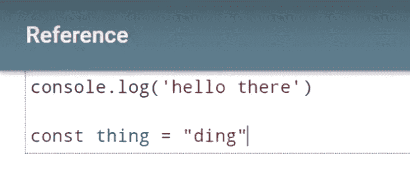
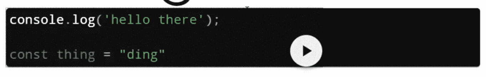
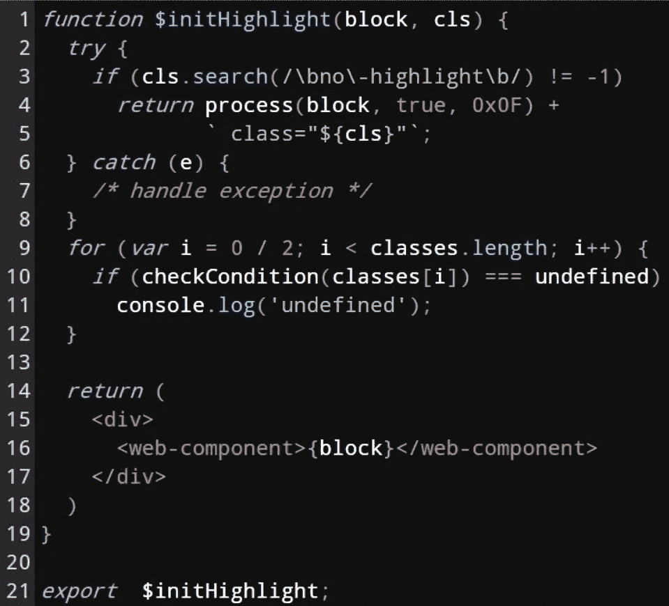
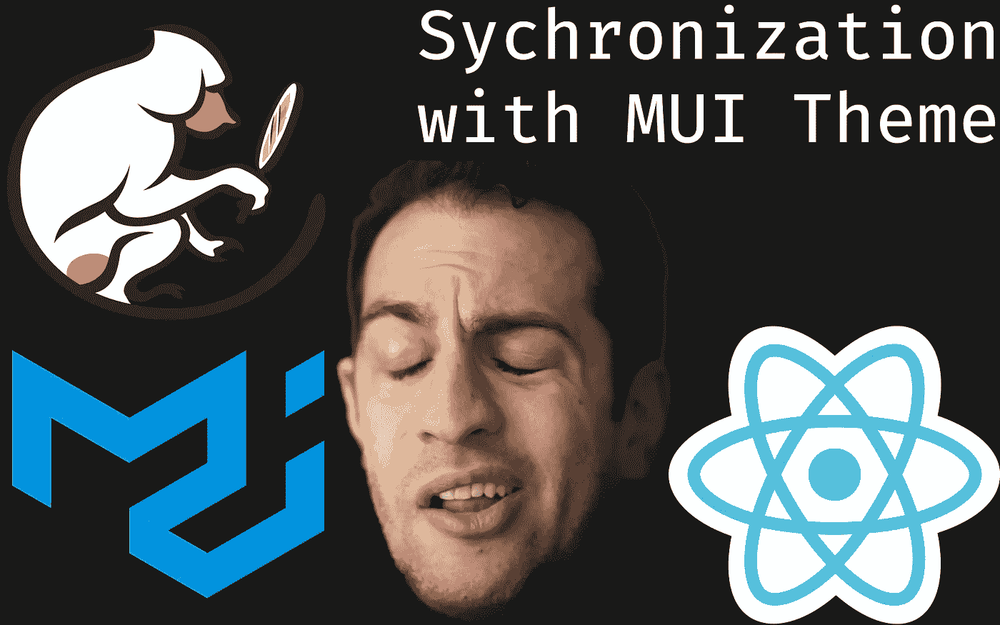

# 使用材质 UI 设计 CodeMirror v6 的样式

> 原文：<https://medium.com/codex/styling-codemirror-v6-with-material-ui-f3a7a3f765b1?source=collection_archive---------3----------------------->

## 创造统一的风格和调色板

在上一篇文章中，我用 react 组件包装了 CodeMirror v6。然而，当它应该看起来像一个代码编辑器时，它看起来仍然像一个普通的`<textarea>`。

CodeMirror 的[基础设置](https://github.com/codemirror/basic-setup/blob/main/src/basic-setup.ts)有杂货店价值的扩展，可以开始使用成熟的代码编辑器。我有一个更简单的目标，所以我挑选了两个我认为适用于我的用例的扩展:

*   @codemirror/highlight
*   @codemirror/matchbrackets

CodeMirror 本身与代码语法无关，需要一组规则来标记代码段。幸运的是，`[@codemirror/lang-javascrip](https://github.com/codemirror/lang-javascript#user-content-javascript)t`扩展包含了标记 JavaScript/JSX 和 TypeScript/TSX 的规则。

```
npm i \
@codemirror/highlight \
@codemirror/matchbrackets \
@codemirror/lang-javascript
```

我创建了一个新文件`~/components/editor/extensions.ts`并导入相关的扩展名。大多数扩展将是函数调用的返回值。有些，像`defaultHighlightStyle.fallback`，会是值。

```
*import* { *javascript* } *from* "@codemirror/lang-javascript";
*import* { defaultHighlightStyle } *from* "@codemirror/highlight";
*import* { *bracketMatching* } *from* "@codemirror/matchbrackets";

*export const* extensions = [
  *bracketMatching*(),
  defaultHighlightStyle.fallback,
  *javascript*(),
];
```

然后可以用扩展更新`~/components/editor/index.ts`中的`EditorState.create`配置对象。

```
*import* { extensions } *from* "./extensions";/* ... */*const* state = EditorState.*create*({
  doc: "console.log('hello there')",
  extensions,
});/* ... */
```

回到网站，曾经枯燥的文本框现在看起来像一个代码编辑器。



# 链接到材质用户界面

站点和代码编辑器有一个统一的调色板似乎是一个合理的要求。[材质 UI 的主题有很多颜色，我可以从](https://next.material-ui.com/customization/default-theme/#main-content)中挑选。

[CodeMirror 6 有一个修改高亮样式的简单方法。](https://codemirror.net/6/examples/styling/#highlighting)

```
import {tags, HighlightStyle} from "@codemirror/highlight"

const myHighlightStyle = HighlightStyle.define([
  {tag: tags.keyword, color: "#fc6"},
  {tag: tags.comment, color: "#f5d", fontStyle: "italic"}
])
```

在`@codemirror/lang-javascript`中，我可以看到哪些标签在使用。通过一些正则表达式的魔法，我能够将标签重新排列成一个`Map`。虽然很乏味，但我需要给每个标签映射一种颜色。

```
/* Note: In this case using a `Map` was not the best choice */const tagColorMap = new Map<Tag, Omit<TagStyle, "tag">>([
  [tags.angleBracket, { color: theme.palette.primary.light }],
  /* ... */
])
```

回想起来，我会选择更好的组织方式。也许，将键作为样式对象，值作为与该样式匹配的标签的`Array`。

我需要将`tagColorMap`转换成`HighlightStyle.define`需要的`TagStyle`对象的数组。

```
const specs = Array.from(tagColorMap.entries()).map(([tag, style]) => ({
  tag,
  ...style,
}))*export const* highlightStyle = HighlightStyle.*define*(specs)
```

在`~/components/editor/extensions.ts`中，我将导入`highlightStyle`并将其添加到导出的扩展中。

```
*import* { highlightStyle } *from* "./highlight-style";/* ... */*export const* extensions = [
  highlightStyle,
  /* ... */
];
```



# 换行和装订线编号

我注意到长长的队伍将输出框推离了屏幕。为了启用换行，需要将`EditorView.linewrapping`添加到`extensions`中。

本来觉得阴沟编号会不好看，后来改了主意。所需要的就是`@codemirror/gutter`库。

```
// ~/components/editor/extensions.ts*import* { EditorView } *from* "@codemirror/view";
*import* { *lineNumbers* } *from* "@codemirror/gutter";*/* ... */**export const* extensions = [
  EditorView.*lineWrapping*
  *lineNumbers*(),
  */* ... */* ];
```

# 打开黑暗模式

使用`EditorView.theme`并将第二个对象设置为`{ dark: true }`，将启用与深色主题的兼容性。最明显的是，装订线编号和光标变亮了。

```
// ~/components/editor/extensions.ts*/* ... */**export const* extensions = [
  EditorView.*theme({}, { dark: true });
  /* ... */* ];
```

经过所有的更改后，代码编辑器看起来是这样的:



# TL；速度三角形定位法(dead reckoning)

使用 CodeMirror 扩展和 Material UI 的主题对象向 CodeMirror v6 添加了自定义样式。

*最初来自:*

[](https://www.bayanbennett.com/posts/styling-codemirror-v6-with-material-ui-devlog-005) [## 使用材质 UI 设计 CodeMirror v6 的样式| DevLog 005

### 在上一篇文章中，我用 react 组件包装了 CodeMirror v6。然而，它仍然看起来像一个平原时，它应该…

www.bayanbennett.com](https://www.bayanbennett.com/posts/styling-codemirror-v6-with-material-ui-devlog-005) 

这只是为了缩略图