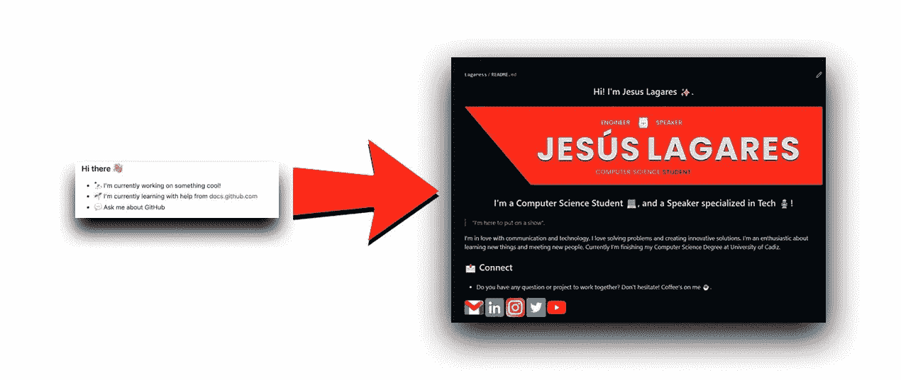
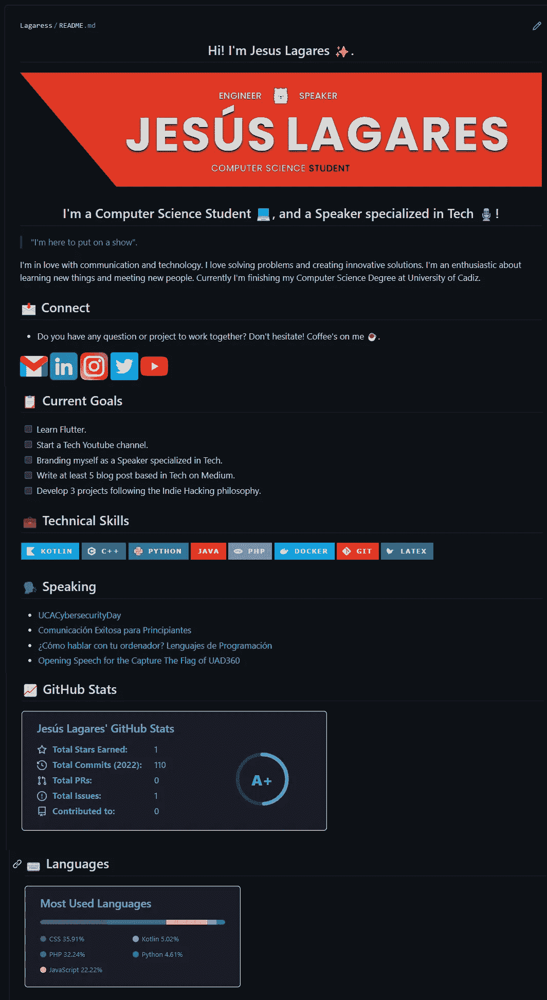
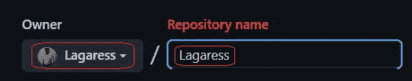
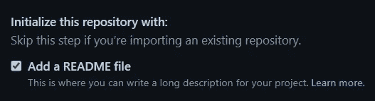
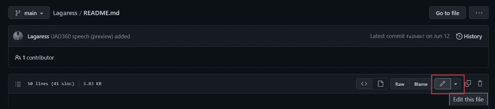
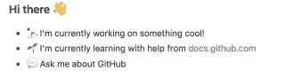
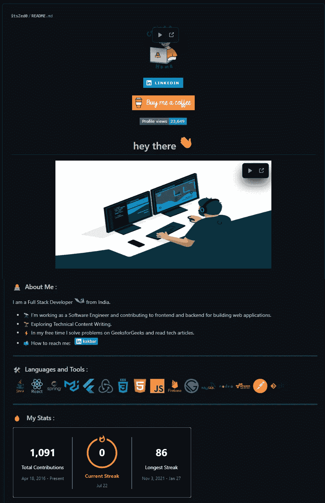
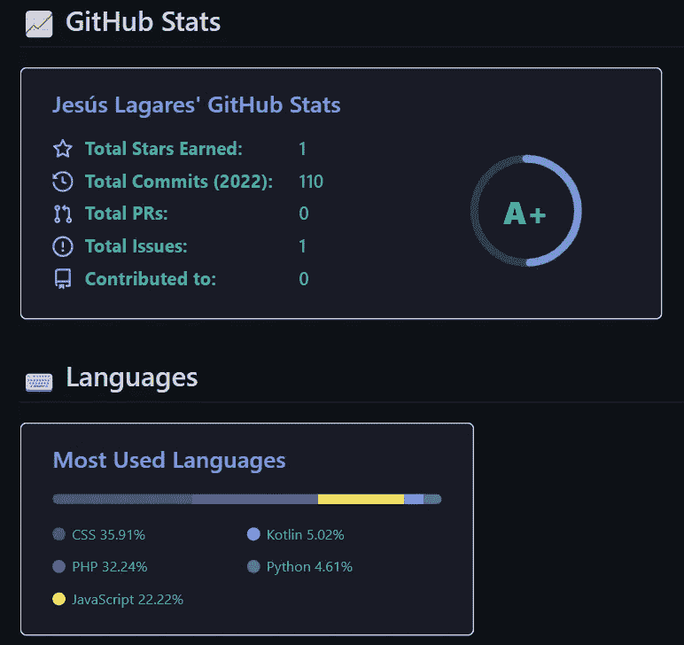
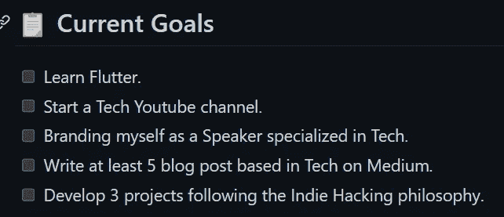

# 使用此 GitHub 个人资料成功进行下一次面试

> 原文：<https://medium.com/codex/succeed-in-your-next-interview-with-this-github-profile-5d37e870c64?source=collection_archive---------10----------------------->

## 你想在招聘人员收到的所有简历中脱颖而出吗？

你目前正在找工作吗？你知道招聘人员会在任何面试前检查你的 GitHub 个人资料吗？



等等！在你开始阅读这篇文章之前，让我给你看一下我的个人 GitHub 简介。看看它，想想你自己的个人资料是否需要类似的东西。你已经做了吗？好了，现在我们只需看一眼就能改变你的形象。



赫苏斯·拉加雷斯·吉图布简介

你喜欢吗？我喜欢它。此外，我写这篇文章是因为招聘人员告诉我的评论。

# 我为什么要更改我的 GitHub 个人资料？这真的很重要吗？

如果你想第一眼就脱颖而出，你应该改变你的个人资料，仅此而已。

前一段时间，我决定改变我自己的个人资料，给它一个不同的看法。目前，我正在完成我的计算机科学学位，我正在向就业市场迈出第一步。我知道如果我想在计算机工程市场找到一份工作，拥有一个好的 GitHub 档案是必须的。所以我想，如果我的个人资料能给人留下很好的第一印象，我会在招聘人员那里赢得一些分数。

在我改变了我的个人资料后，我可以参加许多面试程序。同时，我向其他同事展示了我的个人资料。招聘人员和同事对我的个人资料的评价是:

> *“你的个人资料太酷了！”。
> “哇！老实说，你的简介影响了我，我在关注你”。
> “我非常喜欢你的简介。怎么放…？”。*

所以，如果你也想收到这种类型的评论，或者你想在下一次面试中赢得一些分数，你必须改变你的 GitHub 个人资料。

# 如何用我的 GitHub 个人资料脱颖而出？

每个人都知道，一些良好的做法是在这个网络中获得良好形象的基本要求。定期上传代码，正确提交，或者对你的库进行排序，这些都是 GitHub 的基本功能。然而，这些都是基本的做法，每个人都知道。如果我们想与众不同，我们必须做不同的事情。更具体地说，我们将编辑秘密**自述**。

GitHub 不久前增加了一个新功能。这个特性在于可以创建一个名为 GitHub 用户的存储库。在这个回购中，我们可以添加一个**自述文件**，它将成为我们 GitHub 的封面。

要设计我们的概要文件，第一步是创建这个秘密存储库:

1.  创建新的回购。
2.  将这个存储库命名为您的 GitHub 用户。将这个存储库公开是很重要的。



创建一个名为 GitHub 用户的新 repo

3.将一个**自述文件**添加到存储库中。



添加一个**自述文件**

4.编辑这个**自述文件**。



编辑**自述文件**

## 如何编辑自述文件？

当您第一次编辑这个自述文件时，您可以看到 GitHub 提供的一个模板，作为编辑这个文件的指南。如果你遵循这个小指南，你可以得到一个快速定制，使你的个人资料看起来像这样:



Octocato GitHub 个人资料

但是我们不想要那种难看的空轮廓，我们想要这样的东西:



itsZed0 GitHub 配置文件

所以除了 GitHub 模板提供给我们的基本选项之外，我们必须添加更多的定制选项。在这些高级选项中，我们有很多可能性。事实上，如果我们考虑 GitHub 的编程能力，这些可能性几乎是无限的。这些可能性包括:盾牌，横幅，Spotify 播放列表，最新的 Youtube 视频，可视化计数器…

我将向你展示我最喜欢的选项，如果你想要更多，你可以在网上找到它。

*   **横幅**。设计你自己的横幅来展示你的品牌，或者你的作品可以成为你个人资料中非常独特的一笔。这将是一个直观的细节，招聘人员在检查您的个人资料时就会看到。我用 Photoshop 设计了我的横幅，但你可以使用任何你喜欢的工具。互联网上甚至有[在线发电机](https://liyasthomas.github.io/banner/)。一旦你设计好了，你只需要把它放到你的**自述文件**中，它就会被上传到 GitHub。现在它已经上传到了互联网上，你可以使用 HTML 或 Markdown 将它添加到你的**自述文件**中。以我为例:

```
<p align="center">
  <a href="[https://jesuslagares.com/](https://jesuslagares.com/)" target="_blank" rel="noreferrer"></a>
</p>
```

*   **Github 统计数据**。我喜欢的另一个细节是添加你的个人资料和 GitHub 数据。我非常喜欢看我的数据如何随着时间的推移而增长。添加你的统计数据是如此简单，你只需要[按照这个说明](https://github.com/anuraghazra/github-readme-stats)修改代码添加你的 GitHub 用户名。



我自己的 GitHub 统计

*   **社交媒体图标**。将图标添加到您的社交媒体将有助于联系您。如果你想在你的个人资料中添加一些联系人，你有很多选择。例如，您可以使用 HTML 添加一些社交媒体图标，并将您的社交媒体链接添加到该图标。这是我的做法。[GitHub 中也有很多图标库](https://github.com/topics/social-media-icons)。
*   **目标**。我是一个喜欢设定和实现目标的人。如果你把你的目标和下一个项目包含在你的知识库中，你就向任何查看你的个人资料的人展示了你是一个非常渴望学习和实现你的目标的人。您可以使用[降价列表](https://www.markdownguide.org/basic-syntax/) (-)或使用降价复选框([ ])将您的目标添加到您的个人资料中。这是我目前的目标:



GitHub 个人资料中的目标

*   **语言**。您可以在个人资料中添加盾牌或图标，以显示您最喜欢的编码语言。GitHub 中有很多库，你可以在那里获得这些图标。虽然，我更喜欢展示我的语言，在我的 GitHub 上添加个人项目。
*   **模因**。如果你是一个有趣的开发者，在你的个人资料中添加一些迷因或笑话应该是必须的。你可以[按照这个指示自动给你的回购](https://github.com/ABSphreak/readme-jokes)添加好的笑话。
*   **Spotify 最近玩**。你不喜欢迷因吗？好吧…但是你热爱音乐！你工作听音乐，你开车听音乐，你做饭听音乐…你需要音乐来生活。因此，向世界展示你最近播放的 spotify 播放列表对你来说很重要。现在你可以按照这个指示去做[。](https://github.com/JeffreyCA/spotify-recently-played-readme)

如果你在网上稍微搜索一下，你会发现更多的功能，你可以把它们添加到你的个人资料中，以便脱颖而出。但是，如果我可以给你一些建议，请记住，我们不是在创建一个拼贴画，我们正在创建一个良好的 GitHub 配置文件。所以不要把你看到的所有东西都加起来。只添加这些代表你或者你非常喜欢的东西。

你还不确定在你的个人资料里写些什么吗？别担心，你总能找到一点灵感。

## 一些需要记住的好例子

如果你不知道你想在你的个人资料中包括哪些东西，我建议你去看看其他的个人资料来“获得一些灵感”。

这里有两个充满灵感的仓库:

*   [**Awesome-github-profile-readme**](https://github.com/abhisheknaiidu/awesome-github-profile-readme#github-actions-)**。**
*   [Awesome-github-profiles。](https://github.com/EddieHubCommunity/awesome-github-profiles)

# 结论👋

谢谢大家！非常感谢您阅读这篇文章。我很想知道你对此的看法，所以不要在评论里写，我会读给你听。

反过来，如果这篇文章已经帮助你记住了，你可以为它鼓掌，并与你的同志分享。如果你不想错过我的任何文章，别忘了关注我。

# 关于作者🤓

我的两个爱好是技术和交流，所以我抓住一切机会谈论或写关于技术的东西。

# 想要连接吗？📲

📩**jesuslagaresgalan@gmail.com**

📸[insta gram](https://instagram.com/jesuslagares_)

💼 [**领英**](https://www.linkedin.com/in/jesus-lagares/)

📹 [**Youtube**](https://www.youtube.com/c/Jes%C3%BAsLagares)

🐦 [**推特**](https://twitter.com/jesuslagares_)

谢谢！❣️