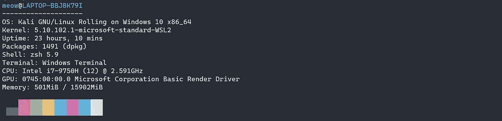

# 增强您的 Linux 终端体验

> 原文：<https://medium.com/codex/supercharge-your-terminal-experience-3917e0135613?source=collection_archive---------0----------------------->

## 如何提高自己的 Linux 终端体验？


来源:SAP 新闻

在下面的博客中，我将列出一些有助于改善您的 Linux 终端体验的技巧。我确信许多读者更喜欢 GUI，但是一旦你掌握了一些，使用终端完成所有任务也是一种乐趣。尽管有一些常见的技巧，我还是放下了一些很少使用的工具，或者可以通过减少时间和提高生产率来改善开发体验的工具。让我们开始吧。

## [外壳检查](https://github.com/koalaman/shellcheck#on-the-web)

对于编写大量 Bash 脚本的人来说，运行和调试 Bash 脚本可能是一个问题，尽管存在错误。一种方法是使用

```
bash -n file.sh
```

然而，当代码可能在语法上是正确的，但在逻辑上有缺陷时，-n 会失败，从而导致逻辑、风格错误等。因此，我们可以使用棉绒，如 Shellcheck。

要安装它，只需使用:

```
sudo apt install shellcheck **#Debian based**sudo pacman -S shellcheck **# Arch based**sudo dnf install ShellCheck **# Fedora based**
```

使用它很简单，只需运行:

```
shellcheck file.sh
OR
shellcheck -s sh file.sh **#shellcheck -s your_shell_name file.sh**
```

在给定的示例中，您可以看到我遗漏了一句结束语:


它提供了人们应该使用的很棒的文体技巧，


风格推荐

并使用 Shellcheck ID 来引用它，我们可以参考 shell check ID 来获取更多信息。这是 **SC2034** 的维基页面


在 GitHub 上看到的 shellcheck/Wiki/SC2034 的 wiki

它还维护着一个[坏代码库](https://github.com/koalaman/shellcheck#gallery-of-bad-code)


名人堂没那么多

# Exa

Exa 是流行的`ls`命令的现代替代品。这是对`ls`的一次全新挑战。它很容易使用，因为它的选项像原来的命令，但它有不同的选项，允许更好的查看体验，如删除和查看时间，某些格式的日期，查看图标，git-ignore 中的文件和许多其他功能。要简单安装:

```
apt install exa  **# Debian based**
sudo apt install exa  **# Ubuntu**
sudo dnf install exa  **# Fedora based**
brew install exa      **# Mac**
sudo pacman -S exa    **# Arch based**
```

语法和`ls`一样，只是用`exa`命令代替。下面是几个例子:

> 查看上面列出的当前文件夹和一个目的地中的所有文件和目录，并将所有目录分组在一起。

```
exa -l --all -l --all --group-directories-first
```


> 递归查看`tmp`文件夹中的所有文件，仅向下到单一深度(级别)。

```
exa --tree --level=1 tmp
```


# 进入黑屏

Duf 是另一个很棒的工具，你可以用它来查看磁盘使用摘要，以颜色和表格的形式，它还可以根据你的终端的宽度和高度进行调整，并允许输出分组，JSON 输出和其他功能。要安装:

```
sudo apt install duf  **#Ubuntu**
brew install duf   **# Mac**
sudo pacman install duf **# Arch based**choco instlal duf **# Windows** 
```

下面是几个例子:

> 隐藏给定文件系统的目录，并以 70 像素的最大宽度显示输出表。

```
duf --hide-fs tmpfs --width 70
```


> 现在，隐藏给定文件系统的目录以 JSON 格式显示最大宽度为 70 像素的输出表。

```
duf --hide-fs tmpfs --width 60 --json
```


> 现在，隐藏给定文件系统的目录以 70 像素的最大宽度显示输出表，但采用 JSON 格式并转换为 CSV 格式

```
duf --json | jq '.[] | join(",")'
```


用于转换为 csv 的 jq 处理器

# **球棒**

蝙蝠可以被认为是猫指挥，但类固醇。Bat 可以与许多其他工具结合使用，如 man、grep 等。要安装 run:

```
sudo apt install bat
```

Bat 有一些额外的实用程序，您可以按照 GitHub repo 中的说明进行安装，例如:

## 勤务兵

使用 bat 样式查看手册页。


## 漂亮的巴特

漂亮地打印源代码并用 bat 突出显示。


# **fzf**

如果您通常喜欢使用图形文件系统来查找文件，但是发现使用`find`很难找到文件，或者在服务器上工作很多，并且对尝试遍历文件的绝对路径感到不安，那么 **fzf** 是您的朋友。Fzf 是一个模糊文件查找工具。安装

```
sudo apt-get install fzf 
sudo pacman -S fzf
sudo zypper install fzf
```

当您有一个大的存储库，并且被反复遍历以获得正确的文件路径，或者只是根据文件名或正则表达式查找文件时，Fzf 是一个很好的工具。下面是几个例子:

> 在存储库中查找 Makefile


fzf 窗口

> 在这个例子中，我在包含二进制文件`src/bin`的文件夹中搜索一个没有`.o`或`.cc`扩展名的文件，并以前缀 fst 开始。


带有正则表达式的 Fzf 非常强大

fzf 的一个奇妙之处是它可以作为 Vim 插件使用。设置为 Vim 插件的更多细节在这里提到[。](https://github.com/junegunn/fzf/blob/master/README-VIM.md)


作为 Vim 插件的 fzf 文件查找器

# 新获取


新获取 Windows ASCII 图片

在你说出来之前，我会通过向你展示这个 neofetch 输出来触发你的内部发行版。Neofetch 是一个简单的命令行工具，显示您的发行版的 ASCII 标志以及系统信息。使用起来很有趣，所以没有理由不包括它。为了简单地安装 neofetch，下面显示了一些如何使用 neofetch 的示例:

```
sudo apt install neofetch OR
sudo pacman -S neofetch
```

> 与 neofetch 交互以不显示徽标或仅显示徽标。

以下命令可以帮助您实现同样的目的。

```
neofetch --off 
```



仅获取系统详细信息

```
neofetch -L
```


只获取 ASCII 标志

但是，一定要记得调整 neofetch 的选项，因为它可能会显示潜在的敏感信息，如 IP 或正常运行时间。

# mktemp

当您在处理创建管道和进行各种文件处理时，您的逻辑中可能会有涉及创建临时文件的步骤。`mktemp`是帮助你创建临时文件和目录的工具之一。类似于`tempfile`这种已经弃用的。它通常是预安装的，但可以使用以下方式安装:

```
sudo apt-get update -y
sudo apt-get -y install mktemp
```

> 在指定位置创建带有特定后缀的临时文件:

```
mktemp — tmpdir=./Docs -t transscript_XXX — suffix=.txt
```


临时创建的文件

> 在特定位置创建带有后缀的临时目录:


需要注意的是，默认的临时目录是`/tmp/`，除非另有说明。需要注意的是，mktemp 目录和文件名使用了“模板”的概念，即在给定文件名末尾指定的 XXX 作为一个字母数字随机数来区分文件。在另一个例子中，我将展示一个没有任何用户指定选项的简单文件。


默认 mktemp

在上面的输出中，我们可以看到模板的概念，即`tmp.XXXXXXXXXX`和默认的`$TMPDIR`。

请随时在 Twitter[**@ agro over 112**](https://twitter.com/agrover112)上跟进你的想法，接受这个艰巨的任务来改变我的想法。

[**加入我的电子邮件列表，获取更多关于技术和非技术的有用见解！**](https://agrover112.medium.com/subscribe)

**延伸阅读&参考文献**

[1][koalaman/shell check:shell check，一个 shell 脚本的静态分析工具(github.com)](https://github.com/koalaman/shellcheck)

[2] [ogham/exa:对“ls”的现代替代。(github.com)](https://github.com/ogham/exa)

[3] [muesli/duf:磁盘使用/免费实用程序—更好的“df”替代方案(github.com)](https://github.com/muesli/duf)

[4] [junegunn/fzf:一个命令行模糊查找器(github.com)](https://github.com/junegunn/fzf)

【5】【zoomadmin.com】如何在 Ubuntu 20.04/Ubuntu 18.04/Ubuntu 19.04/Ubuntu 16.04 上安装 mktemp ubuntu 包