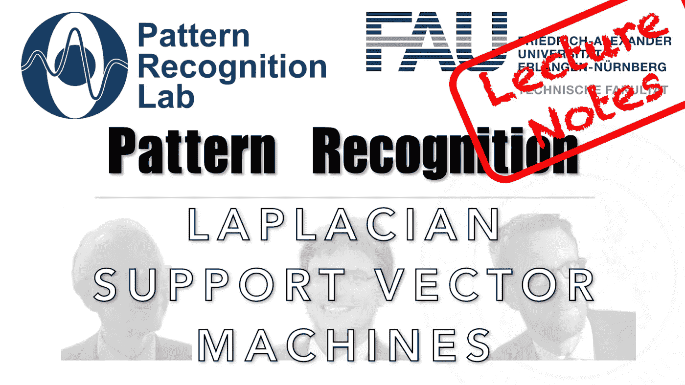

# 单一 SVM 中的监督和非监督学习？！

> 原文：<https://medium.com/codex/supervised-and-unsupervised-learning-in-a-single-svm-2f4b4421cf43?source=collection_archive---------7----------------------->

## 模式识别中的 FAU 讲义

## 拉普拉斯支持向量机

来自[模式识别讲座](https://www.youtube.com/playlist?list=PLpOGQvPCDQzsWvT_bqmexrJ359RTQQuMO)的 [CC BY 4.0](https://creativecommons.org/licenses/by/4.0/) 下的图片

**这些是 FAU 的 YouTube 讲座“** [**模式识别**](https://www.youtube.com/playlist?list=PLpOGQvPCDQzsWvT_bqmexrJ359RTQQuMO) **”的讲义。这是讲座视频&** [**配套幻灯片**](https://doi.org/10.5281/zenodo.4429576) **的完整抄本。幻灯片的来源可在** [**此处**](https://github.com/akmaier/pr-slides) **获得。我们希望，你会和**一样喜欢这个…