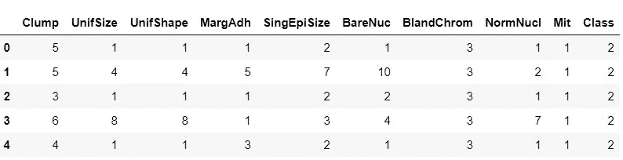
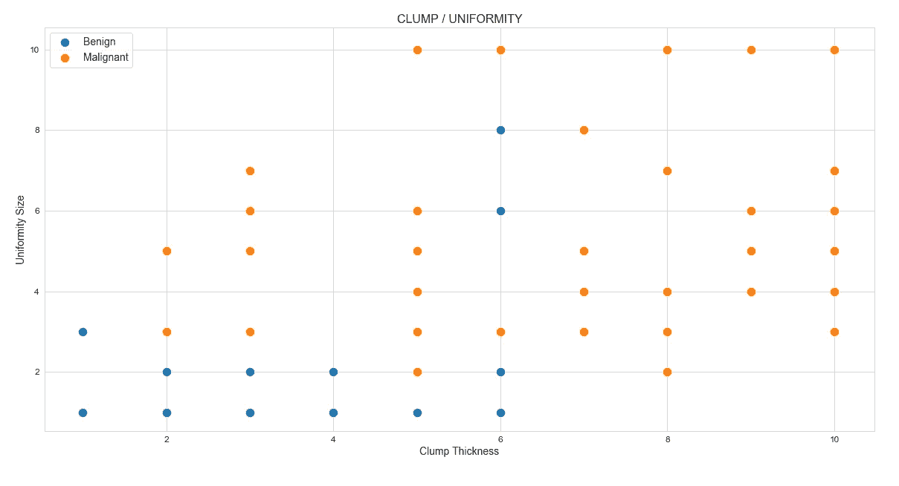
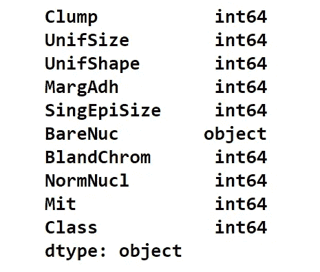
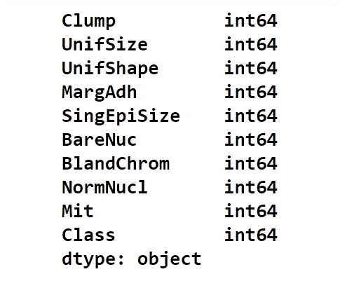
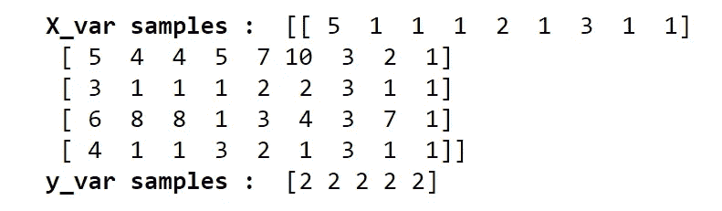
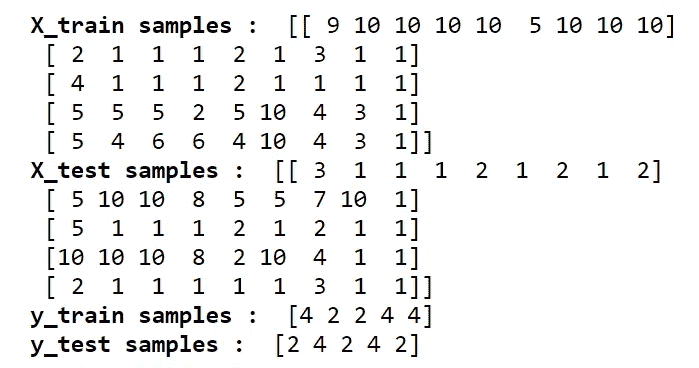
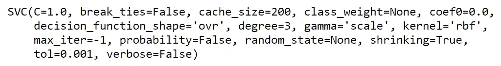
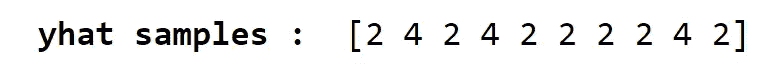
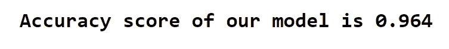
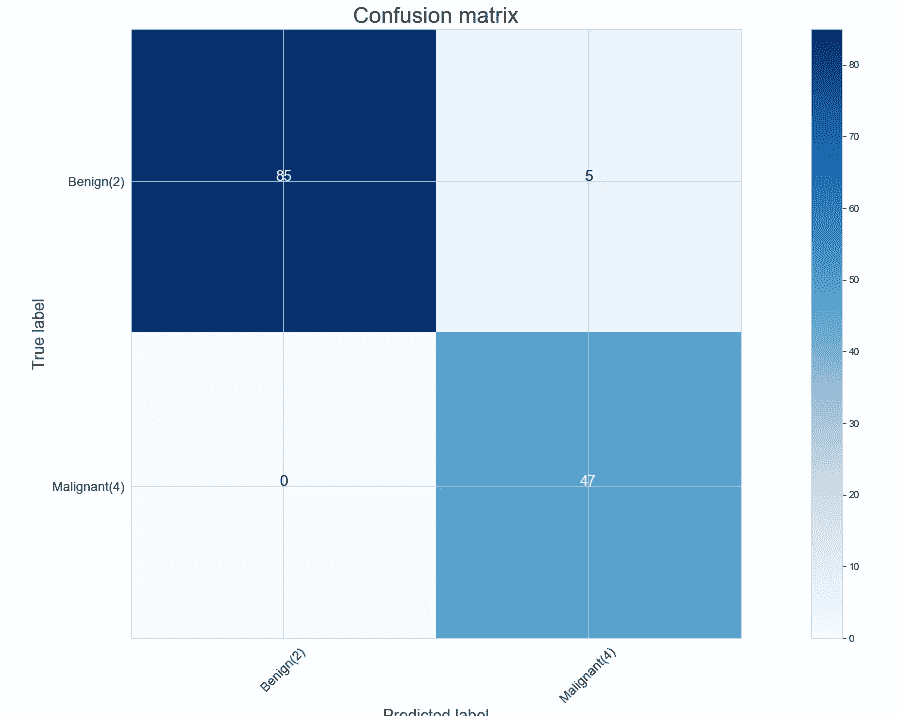

# 用 Python 实现支持向量机

> 原文：<https://medium.com/codex/support-vector-machine-with-python-in-just-100-lines-of-code-35e74707f8e1?source=collection_archive---------0----------------------->

## 学习使用 python 构建分类问题的支持向量机模型

# 支持向量机

SVM 的工作原理是将数据映射到一个高维特征空间，以便可以对数据点进行分类，即使数据不是线性可分的。找到类别之间的分隔符，然后对数据进行转换，使得分隔符可以绘制为超平面。接下来，新数据的特征可以用于预测新记录应该属于哪个组。

# 优势

*   如果我们对数据了解不多，SVM 是一个非常有用的方法。它可用于图像、文本、音频等数据。它可以用于不规则分布和未知分布的数据。
*   有许多算法用于机器学习中的分类，但 SVM 比大多数其他算法更好，因为它在结果中具有更好的准确性。
*   SVM 在样本外数据上表现和推广得很好。由于这一点，因为它在泛化样本数据上表现良好，SVM 证明了自己是快速的，因为确定的事实表明，在 SVM 中，对于一个样本的分类，对每个支持向量评估和执行核函数。
*   SVM 通常不会遭受过度拟合的情况，并且当存在类之间分离的明确指示时表现良好。当样本总数小于维数时，可以使用 SVM，它在记忆方面表现很好。
*   支持向量机在寻找分离超平面方面是有用的，寻找超平面可以用于在不同组之间正确地分类数据。

# 不足之处

*   支持向量机在高度倾斜/不平衡的数据集上表现不佳。这些是训练数据集，其中属于一个类的样本数量远远超过属于另一个类的样本数量。另一方面，逻辑回归擅长处理有偏差的数据集。
*   支持向量机也不是一个好的选择，尤其是当你有多个类的时候。最终，在这种情况下，您回到二元分类器，然后使用某种投票机制将样本分类到其中一个类别。
*   如果与训练样本相比，特征的数量非常大，则支持向量机是无效的。

# SVM 应用

*   图像识别
*   文本类别分配
*   垃圾邮件检测
*   情感分析
*   基因表达分类
*   回归
*   离群点检测
*   使聚集

# 适用于 SVM 的 Python

完成 SVM 的理论部分后，我们现在准备用 python 来构建和训练一个 SVM 模型。在此之前，为什么要使用 python 呢？Python 是一种通用且高效的语言，很容易学习。我们可以用 python 构建各种可行的机器学习模型。在本文中，我们将建立一个 SVM 模型来预测患者是否处于轻度和重度癌症阶段(良性或恶性)。就这样，让我们开始吧。

# 导入包

为了构建我们的 SVM 模型，我们的主要软件包将是 scikit——学习构建和训练模型，pandas 处理数据，NumPy 处理数组，最后是 matplotlib 和 seaborn 进行可视化。按照代码将我们的主包导入 python 环境。

**Python 实现:**

# 导入数据和 EDA

在本文中，我们将使用一个包含所有细胞数据和信息的癌症数据集。按照代码导入 python 中的数据。

**Python 实现:**

输出:

作者图片

来自每个患者的细胞样本的特征包含在字段'*丛*'至' *Mit* '中。这些值从 1 到 10 分级，1 最接近良性。“*类*”字段包含由独立医疗程序确认的关于样本是良性(值= 2)还是恶性(值= 4)的诊断。

让我们使用 python 中的散点图来看看基于块厚度的类分布和像元大小的一致性。

**Python 实现:**

输出:

作者图片

# 数据处理

让我们先来看看癌症数据中变量的数据类型。为此，我们可以使用 python 中 Pandas 包提供的*‘dtypes’*函数。

**Python 实现:**

输出:

作者图片

看起来' *BareNuc* **'** 列包含非数字值。使用*‘as type’*函数和*‘numeric’*函数，我们可以将对象类型变量转换成整数变量。按照代码转换 python 中的值。

**Python 实现:**

输出:

作者图片

我们的下一步是定义自变量和因变量，并使用它将我们的数据分成训练集和测试集。

# 特征选择和训练测试分割

我之前说过，我们要定义 X 和 Y 变量。定义变量后，强烈建议将它们转换成数组，以便在构建模型时有所帮助。按照代码在 python 中定义变量。

**Python 实现:**

输出:

作者图片

现在，我们可以使用我们定义的 X 和 Y 变量将数据分成训练集和测试集。为此，我们可以使用 python 中 scikit-learn 提供的 *'train_test_split'* 函数。

**Python 实现:**

输出:

作者图片

# 建模和预测

SVM 算法为执行其处理提供了核函数的选择。基本上，将数据映射到一个更高维的空间被称为内核化。用于变换的数学函数称为核函数，可以是不同的类型，例如:

*   线性的
*   多项式
*   径向基函数
*   乙状结肠的

这些函数各有其特点、优缺点和等式，但由于没有简单的方法知道哪个函数在任何给定的数据集上表现最佳，我们通常依次选择不同的函数并比较结果。在本文中，我们将使用径向基函数(RBF)核来构建和训练我们的模型。用 python 来做吧！

**Python 实现:**

输出:

作者图片

有了经过训练的 SVM 模型，我们可以将一些测试值传递给它来进行一些预测。按照代码用 Python 做预测。

**Python 实现:**

输出:

作者图片

# 估价

现在，我们已经使用我们的 SVM 模型构建、训练并做出了一些预测。为了检查我们的模型结果的准确性，我们可以使用 python 中的 scikit-learn 提供的评估度量函数。在本文中，我们将使用*‘准确度 _ 得分’*指标和*‘混淆 _ 矩阵’*指标来评估我们的模型。让我们从 python 中的*‘accuracy _ score’*评估指标开始。

**Python 实现:**

输出:

作者图片

我们的下一个评估指标是*“混淆矩阵”。*不仅仅是打印混淆矩阵，当它被图形化或绘制时会更有意义。即使有内置函数来做混淆矩阵图，手动绘图也会更好理解。按照代码用 python 制作一个混淆矩阵图。

**Python 实现:**

输出:

作者图片

# 最后的想法！

在本文中，我们介绍了 SVM 的基本知识，它的优点和缺点。接下来，我们学会了用 python 编写 SVM 模型来处理癌症数据，并做了一些预测。最后，我们学会了使用 python 中的评估指标来评估我们的模型。我们唯一漏掉的是数学部分。所以，在你进入下一个概念之前，不要忘记覆盖它。此外，在本文中，我们只使用了一个内核，还有其他内核。所以确保你也用它来练习解决问题。至此，我们到了本文的结尾，我已经在文章的结尾提供了构建的 SVM 模型的源代码。

**快乐的机器学习！**

完整代码: