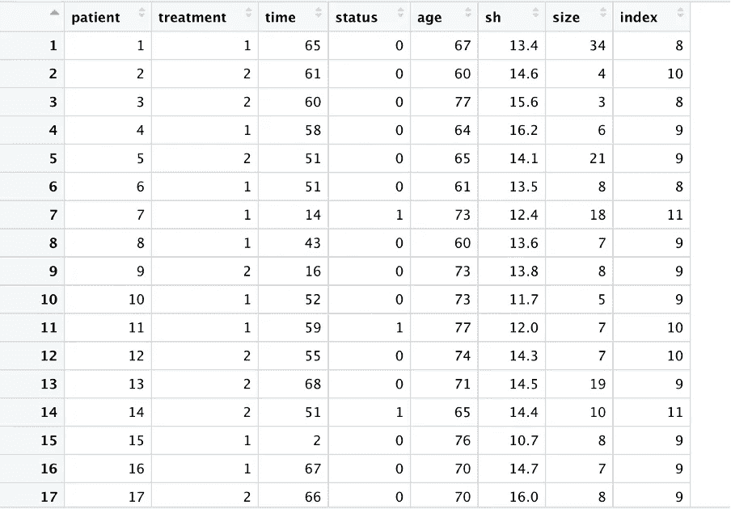
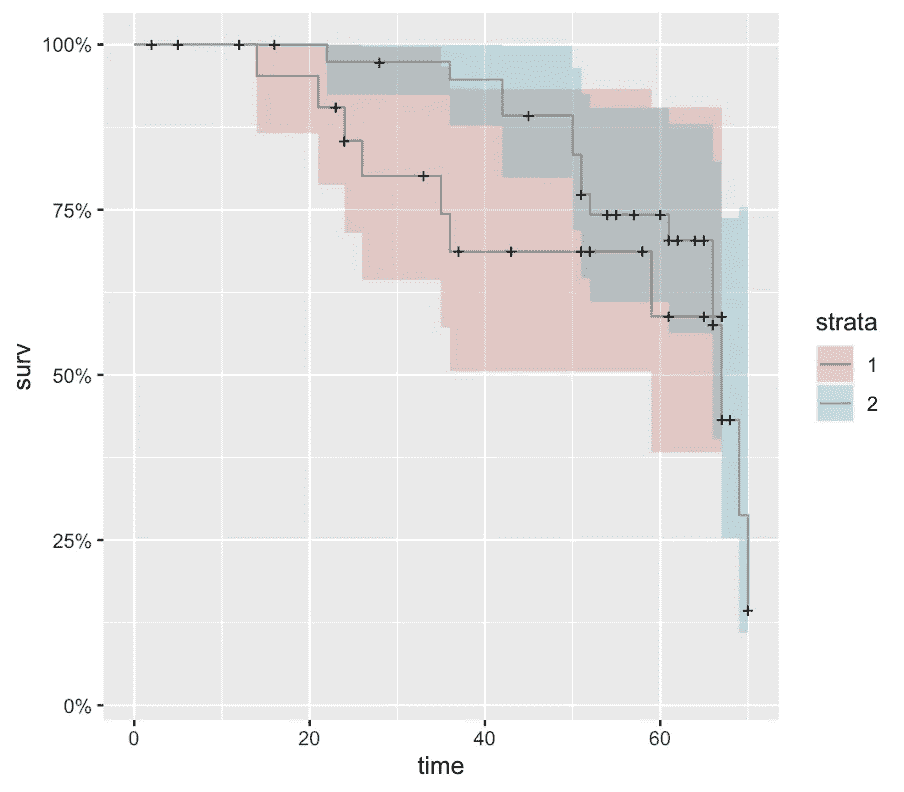

# 生存分析:第二部分

> 原文：<https://medium.com/codex/survival-analysis-part-ii-ddbbae048d3f?source=collection_archive---------11----------------------->

凯尔·格伦在 [Unsplash](https://unsplash.com?utm_source=medium&utm_medium=referral) 上的照片

在本帖中，我们将回顾如何将我们在[第一部分](/mlearning-ai/survival-analysis-part-i-7a84fd270644)中讨论的生存情节和模型付诸实践，学习中最有趣的部分是它的实际实施。首先，让我们看看我们的数据集并理解。

这个数据集是关于前列腺癌的:

数据集的前几行

列的详细信息:

*   **患者:**患者的唯一 id
*   **治疗:**治疗有 1 型和 2 型两种。
*   **状态:**包含数据的数据帧中事件状态的状态称为前列腺癌。
*   **时间:**时间以一个时间分量进入状态列。
*   **年龄**是患者的年龄。
*   **大小:**癌瘤大小。

我在 R 中执行分析，为了生存分析，我们需要安装某些库:

在 r 中安装所需的库。

我们来看看时间和状态，

surv 函数的结果

从上面，我们看到一些观察结果的末尾有一个加号，加号表示删截。这是一个标准的操作程序和生存分析，状态栏用 0 或 1 表示。1 将事件编码为 0 表示审查遵循该约定，并相应地标记数据。

1.  **卡普兰·迈耶情节**

这个生存适应模型。我们不能直接打包成一个图来得到卡普兰迈耶图。

卡普兰·迈耶图代码

前列腺癌卡普兰迈耶图

*   时间显示在 *x 轴*上。生存概率显示在 *y 轴*上，以月为单位。我们有审查事件，用这些符号表示。
*   我们将这种影响添加到图中，因为我们设置了标记时间为真，我们用这些步骤表示死亡事件，每一步都显示存活概率的下降。
*   该图也有 95%的置信区间。因为上下波段实际上是整个图。

**2。分层卡普兰迈耶图**

前列腺癌的分层 Kaplan Meier 图

*   我们可以容易地识别哪条线属于哪个处理组。在这种情况下，很明显治疗 2 有更好的生存机会。
*   例如，在 40 个月时，治疗组 1 已经低至大约 70%的存活率，而替代组仍然高达 95%。
*   现在，大约 65 个月后，曲线彼此接近，概率相等。此外，注意治疗 1 的置信区间相当宽。

3.**对数秩检验**

当我们实际上想知道两个治疗组之间是否有显著的生存差异时。这些组在治疗栏中进行标识。

对数秩检验的 Survdif 函数

日志等级的结果

*   在这种情况下，p 值不重要。这意味着我们必须坚持零假设，即两个治疗组的存活率没有差异。
*   我们得到了每组的受试者总数。我们得到每组观察到的事件数量，以及从观察到的数量得到的预期事件。
*   现在从 prost$treatment 开始，我们计算每组的卡方统计量以及每组的方差。
*   所以我们可以看到，实际上比较这两组的生存概率是相当简单的

4. **Cox 比例风险模型和参数模型**

Cox 比例风险方法的最终目的是注意我们数据集中的不同因素(协变量)如何影响感兴趣的事件。

*   ***危险率*** :事件发生所需时间的概率估计。
*   ***协变量:*** 确实存在影响事件发生概率的外部因素。在比例风险模型中，这些外部因素被称为协方差。
*   ***一致性:*** 它告诉我们从两个随机选择的观察值中选择一个风险较高的观察值的正确几率。
*   现在简而言之，我们希望尽可能接近一致。低于零点五的都是很差的型号。
*   exp(bi)值称为危险比(HR)。HR 大于 1 表明，随着 ith 协变量的值增加，事件风险增加，因此生存时间减少。

风险比的影响

Cox 比例风险模型的结果

*   从我们的 Cox 模型中，如果我们检查汇总输出，我们首先会看到模型公式和事件数与观察总数的对比。
*   我们在这里有所有的协方差，包括它们的模型系数，对墙壁的预测和显著性。
*   带有 p 值的星表明这些协方差对模型是重要的。
*   在我们的例子中，我们有两个重要的变量 H size 和 index，特别是因为 index 变量对模型很重要。
*   这些信息实际上非常有趣，因为有了这些信息，我们可以简化模型，并可能从模型中消除不感兴趣的协方差。

人力资源的卡普兰迈耶图

**5。生存树**

*   生存分析之类的学科生存树是根据生存数据拟合的决策树，它允许使用协方差，就像在 Cox 比例风险回归模型中一样。
*   结果我们实际上是在模拟我们的生存概率，你们中的很多人已经知道决策树，或者至少已经清楚地看到了它们。
*   通常，您会看到这种决策树的可视化表示本质上是一个类似流程图的结构，其中每个内部节点代表一个选定变量的测试。
*   我们必须在 x 轴上加上时间，y 轴上是平均存活概率。

生存树的 Ranger 函数

y 轴是生存概率，x 轴是以月为单位的时间。

基于树的模型的生存曲线

前列腺癌数据集的生存研究到此结束。希望已经为你阐明了生存分析的原理。

希望这有所帮助:)如果你喜欢我的帖子，请关注我。请随时留下任何澄清或问题的意见。快乐学习😃

随意连接: [*LinkedIn*](https://www.linkedin.com/in/afaf-athar-183621105/)