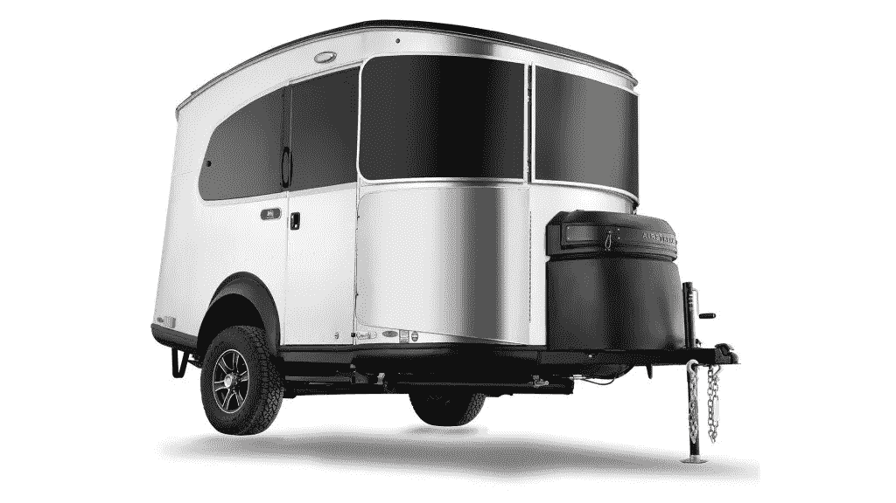

# 可持续性和离网:野营时两个令人兴奋的关键词

> 原文：<https://medium.com/codex/sustainability-and-off-grid-two-exciting-keywords-when-camping-ce1f3d32612e?source=collection_archive---------22----------------------->

## Airstream 和 REI 为我们带来了这款特别版的 Basecamp

[Basecamp(气流媒体)](https://cdn.airstream.com/wp-content/uploads/2022/06/REI-Special-Edition-Basecamp-16-1024x576.png)

在天气好的时候，野营是一般人最先去的地方之一。有什么比带上休闲车或旅行拖车更好的户外体验方式呢？这个由 Basecamp 制作的特别预告片是…