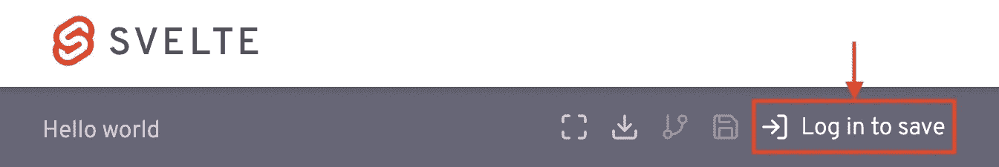
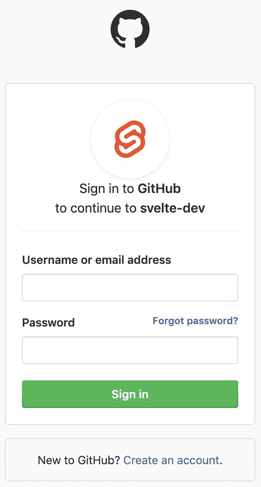
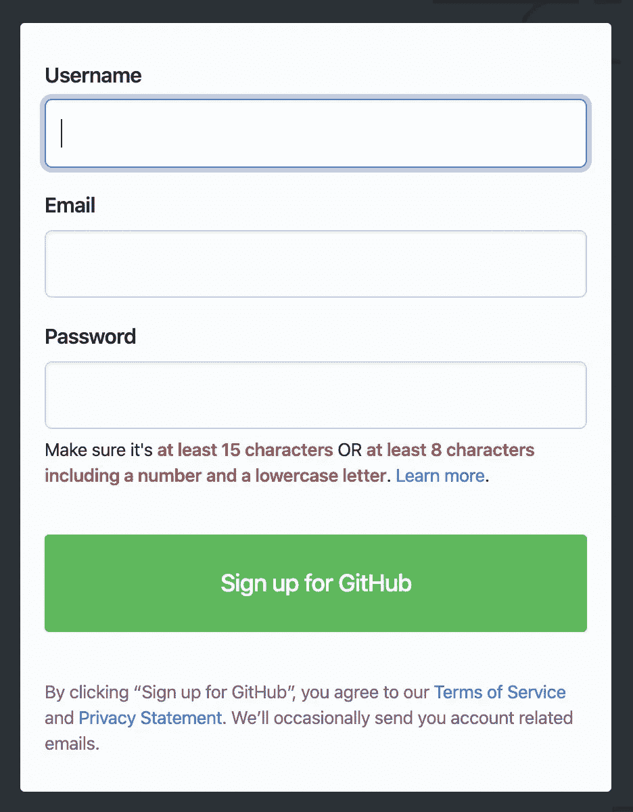
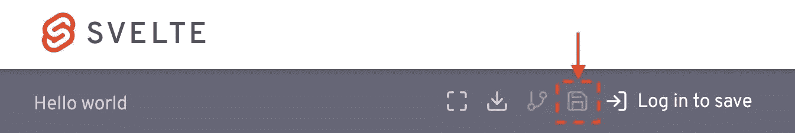
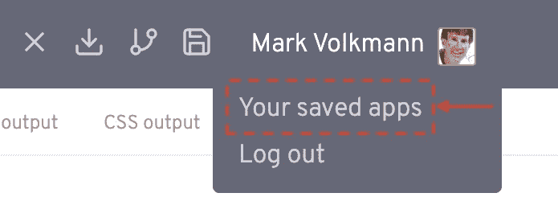
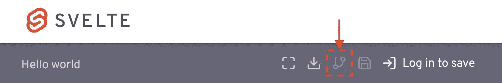
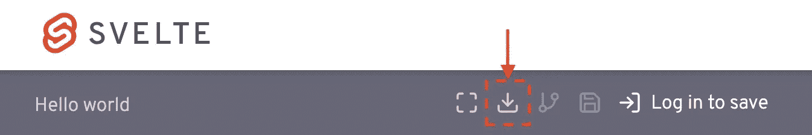

# 苗条的 REPL，第二部分

> 原文：<https://medium.com/codex/svelte-repl-part-2-2addab136f20?source=collection_archive---------9----------------------->

## 文章

## *出自* [*行动中的苗条和工整*](https://www.manning.com/books/svelte-and-sapper-in-action?utm_source=medium&utm_medium=organic&utm_campaign=book_volkmann_svelte_8_19_20) *作者马克·沃克曼*

这篇文章深入探讨了苗条的 REPL。

将 **fccvolkmann** 输入[manning.com](https://www.manning.com/?utm_source=medium&utm_medium=organic&utm_campaign=book_volkmann_svelte_8_19_20)收银台的折扣代码框，即可享受 40%的折扣。

查看第一部分了解苗条 REPL 的基本知识。

## **保存 REPL 应用程序**

要保存在 REPL 创建的应用程序以备将来调用，请点按右上角的“登录保存”。这将打开如下所示的浏览器窗口。



图一。REPL 登录保存

输入您的 GitHub 用户名和密码，然后点击“登录”按钮。



图二。REPL 签到

如果你还没有 GitHub 账户，请浏览[https://github.com/](https://github.com/)并点击绿色的大按钮“注册 GitHub ”,开始创建免费账户。



图 3。GitHub 注册

要保存当前应用程序，请在顶部灰色栏的左侧输入其名称，然后按下软盘图标。按 ctrl-s(或 macOS 上的 cmd-s)也会保存应用程序。



图 4。REPL 存扣

要加载之前保存的应用程序，请将鼠标悬停在右上角的用户名上，然后单击“您保存的应用程序”。



图 5。REPL 你保存的应用程序

这将显示已保存的应用程序名称列表。单击一个来加载它。

要复制当前应用程序以修改它而不更改当前应用程序，请按“叉”图标。



图 6。REPL 叉形按钮

目前无法删除已保存的 REPL 应用程序。此功能已被请求。参见 https://github.com/sveltejs/svelte/issues/3457 的。在添加之前，考虑将你不再需要的 REPL 应用重命名为“删除我”。

## **分享 REPL 应用**

要与其他开发人员共享 REPL 应用程序，请从浏览器地址栏中复制其 URL。

然后通过聊天、短信或电子邮件提供给其他人。他们可以修改 REPL 应用并将更改保存为他们自己的应用，但他们不能修改你的应用版本。

分享 REPL 应用程序对于在苗条的不和谐聊天中问问题是很棒的。发布一个问题和一个 REPL 网址。

## **REPL 网址**

每个 REPL 应用程序的 URL 都以一个名为“version”的查询参数结尾，该参数指定了正在使用的 Svelte 的版本。它默认为最新版本。你可以更改它，用不同版本的 Svelte 测试 REPL 应用。

如果你怀疑一个 bug 被引入到了 Svelte 中，这是非常有用的。您可以尝试几个版本的 REPL 应用程序，并确定其行为是否会发生变化。

## **导出 REPL 应用**

在 REPL 开发应用程序的某个时候，你可能想要跳出 REPL。许多原因解释了为什么您应该这样做:

*   为了避免下一节中描述的 REPL 的局限性
*   在 Git 这样的源代码控制系统中管理项目
*   使用构建系统(如 npm 脚本)来完成任务，如构建用于部署的应用程序和运行单元/端到端测试

要下载当前应用程序以继续在本地开发，请按下载图标。



图 6。REPL 下载按钮

这将下载一个 zip 文件，其名称默认为`svelte-app.zip`。

要在本地运行应用程序:

1.  如果尚未安装，请从[https://nodejs.org](https://nodejs.org/)安装 Node.js。

这将安装`node`、`npm`和`npx`命令。解压缩这个文件，

1.  解压缩下载的 zip 文件。
2.  `cd`到它创建的目录。
3.  输入`npm install`
4.  输入`npm run dev`以开发模式运行应用程序。

## **使用 npm 包**

REPL 应用程序可以从 npm 包导入。例如，要使用 lodash 包中的`capitalize`函数:

```
import capitalize from 'lodash/capitalize';
```

用大写( *someString* )调用这个函数。

或者，可以导入整个库。

```
import _ from 'lodash';
```

对于这种导入，用 _ 调用 capitalize 函数。大写( *someString* )。

https://unpkg.com 是 npm 中所有包的内容传递网络(CDN ), REPL 从该网络获得 npm 包代码。

要导入特定版本的 npm 软件包，请在名称后加上@并后跟版本。例如:

```
import _ from 'lodash@4.16.6'
```

## **REPL 的局限性**

苗条的 REPL 是伟大的，但它有一些局限性。它不能做这些事情:

*   删除选定的已保存项目。
*   按名称或日期对保存的项目进行排序。
*   根据项目名称中的文本或在项目文件中找到的文本过滤已存储项目的列表。
*   编辑提供的文件`src/main.js`和`public/global.css`。

## **CodeSandbox**

CodeSandbox 提供了一种替代苗条 REPL 的方法，无需下载或安装任何东西就可以构建苗条的应用程序。这是 VS 代码编辑器的在线版本。

要使用它，请浏览 [https://codesandbox.io](https://codesandbox.io/) 。不需要注册。要启用保存工作，请使用您的 GitHub 帐户登录。

要创建一个苗条的项目，点击“+创建沙箱”。在“官方模板”下，选择“苗条”。

要启用 VIM 键绑定，请选择文件…首选项…代码沙盒设置…编辑器，并将“启用 Vim 扩展”切换到开。

与 REPL 相比，使用 CodeSandbox 的一个优点是，除了`.svelte`文件之外，您还可以创建`.js`文件。

在 CodeSandbox 中开发的应用程序可以通过点击左侧导航部署到 Netlify 或 ZEIT Now。包含火箭图标的按钮，展开“Now”或“netlify”部分，然后单击“Deploy”按钮。这需要几分钟才能完成。现在，点击提供的链接访问新的应用程序。对于 Netlify，单击“访问”按钮访问新应用程序，然后单击“认领”按钮将应用程序添加到您的 Netlify 仪表板。

CodeSandbox 支持“实时”模式，在这种模式下，您可以与其他人协作实时编辑应用程序的文件。

如果你想了解这本书的更多信息，可以在曼宁的 liveBook 平台上查看[这里](https://livebook.manning.com/book/svelte-and-sapper-in-action?origin=product-look-inside&utm_source=medium&utm_medium=organic&utm_campaign=book_volkmann_svelte_8_19_20)。