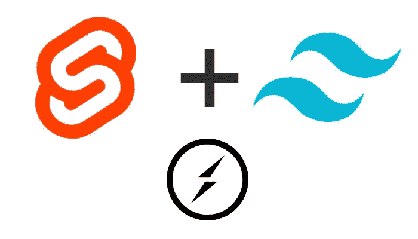
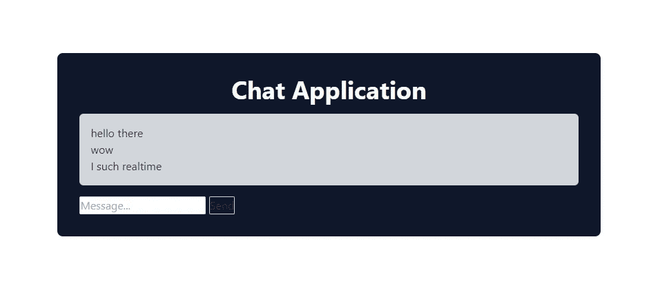
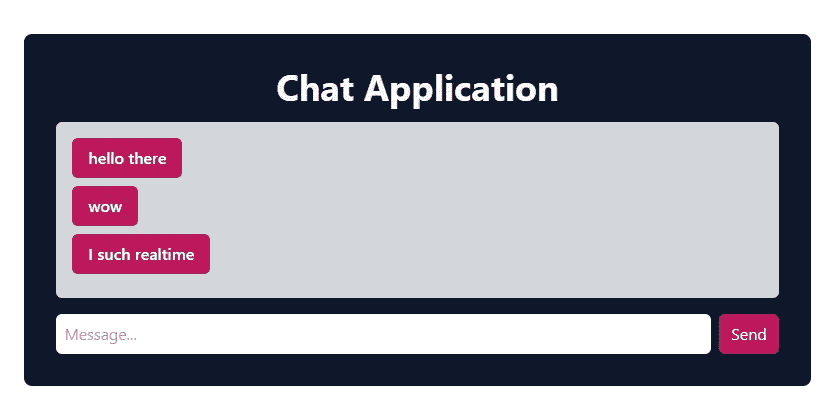
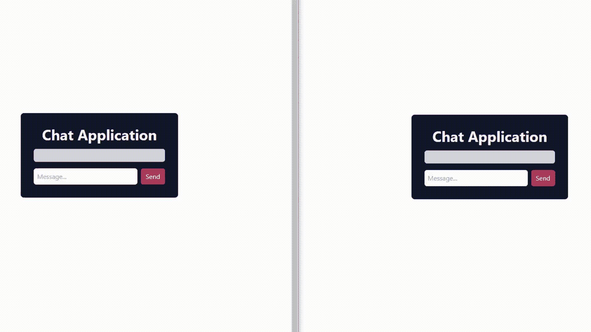

# 使用 Socket.io 聊天应用程序示例进行第一次查看🚀

> 原文：<https://medium.com/codex/svelte-tailwind-first-look-with-socket-io-chat-application-example-3fb588149010?source=collection_archive---------3----------------------->

你好，在这篇文章中，我们将首先看看苗条和顺风 CSS。



细长-尾翼-插座。超正析象管(Image Orthicon)

在开发我的周末项目之初，我从 React 开始，我注意到我真的厌倦了使用状态管理，并开始寻找新的旅程。那个时候，苗条出现在我的脑海里，从[苗条教程](https://svelte.dev/tutorial)开始。两个小时后，我开始了我的苗条计划。在 Svelte，发展和结果真的很快。

我开始思考，如果我开始学习一项新技术，为什么不更激进一点呢？从而开始学习 TailwindCSS。

# TL；速度三角形定位法(dead reckoning)

[](https://github.com/muhammedikinci/svelte-tailwind-socketio-medium) [## GitHub-muhammedikinci/svelte-tail wind-socket io-medium:针对 Medium 文章的 Svelte 项目

### Psst -寻找更完整的解决方案？查看 SvelteKit，构建 web 应用程序的官方框架…

github.com](https://github.com/muhammedikinci/svelte-tailwind-socketio-medium) 

# 苗条的

Svelte 不像其他框架(React 和 Vue)那样使用传统方法。没有虚拟 DOM，因此更多的具有超快的构建时间和运行时。

# 顺风 CSS

如果你正在开发一个应用程序，那么 Tailwind CSS 是一个非常快速的 CSS 框架。Tailwind 有一个记录良好且不复杂的站点。

# 🚦开始

我们需要将模板项目克隆到我们的本地。我们可以克隆如下所示的项目[这个文档](https://svelte.dev/blog/the-easiest-way-to-get-started):

```
npx degit your-name/template svelte-tailwind
```

要启动项目，您必须转到项目目录并运行`npm install`。安装完依赖项后，在终端输入`npm run dev`命令。苗条在`localhost:8080`准备好了

# 🌐安装顺风

转到 [Tailwind PostCss 安装](https://tailwindcss.com/docs/installation/using-postcss)页面，向终端输入以下命令:

```
npm install -D tailwindcss postcss autoprefixer
npx tailwindcss init
```

## 添加到苗条

打开`rollup.config.js`并像这样导入依赖项:

```
import sveltePreprocess from 'svelte-preprocess';
import tailwindcss from 'tailwindcss';
import autoprefixer from 'autoprefixer';
import postcss from 'postcss';
```

在这种情况下，我们应该安装`svelte-preprocess`

```
npm install svelte-preprocess
```

然后将预处理添加到`plugins -> svelte`下面，如下所示:

```
preprocess: sveltePreprocess({
  postcss: postcss({
    plugins: [tailwindcss(), autoprefixer()],
  }),
}),
```

并且`src/App.svelte`文件看起来如下:

App.svelte

就是这样。顺风 CSS 被成功导入到我们的项目中。如果你想了解如何使用`svelte-preprocess`，你可以看看[的文档](https://github.com/sveltejs/svelte-preprocess/blob/main/docs/preprocessing.md#stand-alone-processors)。

# 📖布局

在开始添加顺风类之前，我们必须创建一个布局。我们的新`App.svelte`文件看起来是这样的:

现在我们可以开始写一些顺风 CSS，首先我们添加一些类到主容器中，并设置屏幕的中心。

```
flex justify-center items-center h-screen
```

接下来，有一个应用程序容器等待新视图。添加带`rounded`的`border-radius`和带`px-8`和`py-8`的`padding`

```
class="flex flex-col w-5/12 bg-slate-900 px-8 py-8 rounded-lg"
```

向 H1 和消息容器添加类我们的应用程序如下所示:

```
mb-4 font-bold text-gray-50 text-4xl text-center -> H1
w-full mb-4 bg-gray-300 rounded-md px-4 py-4 -> DIV.messageContainer
```



将所有类添加到布局中后，应用程序如下所示:



# 🔌插座。超正析象管(Image Orthicon)

如果你是 socket.io 的新手，不要担心，这里我们只是重新设计了 [Socket 提供的自定义聊天应用。IO 文件](https://socket.io/get-started/chat)。

## 计算机网络服务器

我们想创建一个 socket.io 服务器，并在 svelte 中使用。如果你想要这个，我们必须加上`cors`来使服务更加苗条。创建`server.js`文件并将代码添加到下面:

运行这些命令并启动 socket.io 服务器:

```
npm install socket.io
node server.js
```

## 客户

安装[套筒。IO 客户端](https://socket.io/docs/v4/client-api/)

```
npm install socket.io-client
```

导入它并连接到服务器:

```
import io from 'socket.io-client'
const socket = io("http://localhost:3000")
```

为存储到来的消息创建`messages`数组，并监听从其他客户端发出的消息的`chat message`事件。

为了更新`messages`数组，我们应该重新赋值，你可以[阅读此链接了解为什么](https://svelte.dev/tutorial/updating-arrays-and-objects)。

```
let messages = []
socket.on('chat message', (data) => {
  messages = [...messages, data]
})
```

还有我们的`sendMessage`功能:

```
function sendMessage() {
  socket.emit('chat message', message)
  message = ''
}
```

最终我们的`App.svelte`看起来是这样的:

和结果:

