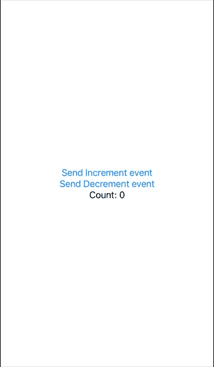
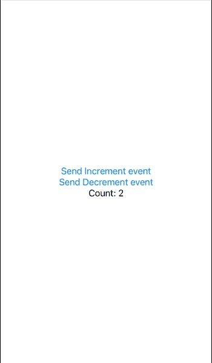
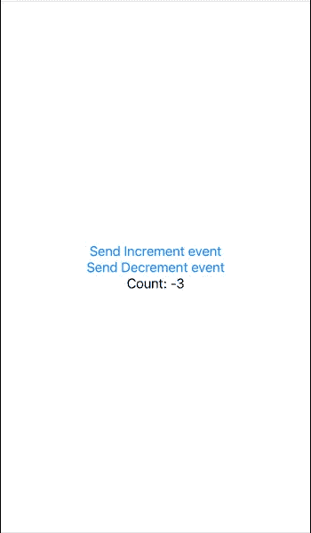

# Swift 业务逻辑组件(BLoC)

> 原文：<https://medium.com/codex/swift-business-logic-component-bloc-e54aca3f5b9f?source=collection_archive---------4----------------------->


除了 iOS 或 Android 的本地开发，还有许多不同的跨平台解决方案，其中之一就是 Flutter。这带来了一种有趣的划分业务逻辑和 UI 的方法，称为 BLoC — **业务逻辑组件模式**。

最初由[菲利克斯·安杰洛夫](https://medium.com/u/bd78eebef416?source=post_page-----c22d40f05a56--------------------------------)以颤振包`[flutter_bloc](https://pub.dev/packages/flutter_bloc)`和`[bloc](https://pub.dev/packages/bloc)`的形式呈现，该集团带来了一种新的声明方式，如何使用应用程序每个组件的事件/状态机制。

这个解决方案真正激发了我为 iOS 原生开发创建类似的东西，尽管我们已经有了一套好的架构模式——MVC、MVVM、VIPER。为什么我们需要另一个？

就我个人而言，我认为集团模式是简化的 MVVM 模式，降低了反应性结合的概念。输入-输出即事件-状态的概念被认为是一个整体。那么为什么不试一试呢…

在 [Combine](https://developer.apple.com/documentation/combine) 框架的帮助下，我能够在 pure Swift 中创建 BLoC 库，这对任何 [SwiftUI](https://developer.apple.com/documentation/swiftui/) 构建的应用程序都是一个很好的补充。

你可以在这里查看源代码，当然也欢迎贡献者:)

我们将尝试调整心爱的 Flutter 的入门应用程序“计数器”，但对于带有 [**SwiftBloc**](https://github.com/VictorKachalov/SwiftBloc) 库的原生 iOS。

该应用程序将是单视图，并且只执行两个操作——用户每次点击适当的按钮*时*增加*和*减少*一。*

## 状态和事件

应用程序工作流中发生的一切都可以分为事件和状态。事件促使状态被改变。这导致更清晰的想象，应用程序应该如何运行，而不需要描述小细节来使事情工作。

我们同意计数器应用程序只能加减“1”。让我们为这些创建一个简单的枚举。

```
**enum** CounterEvent { **case** increment **case** decrement}
```

好的，非常简单，因为我们同意用户在这个应用程序中只发出两个事件，所以我们不需要更多的东西。

现在让我们考虑一下可能的状态。我们知道这个想法是，如果两个事件*中的任何一个被调用，递增*或*递减*，计数器将增加或减少“1”。所以我们可以用一个变量创建一个**计数器**，这个变量将简单地保存一个带有更新值的整数。

```
**struct** CounterState: Equatable { **let** count: Int}
```

阻塞需要每个状态和事件的独特行为，这就是为什么**反状态**应该符合**等价。**

在这个阶段，我们已经可以认为，初始状态可以是 **CounterState(count: 0)** ，下一个状态可以是 **CounterState(count: N)** ，其中 **N = currentState“加”或“减”1。**

现在让我们创建一个 Bloc 类来操作事件和状态。

```
**final class** CounterBloc: Bloc<CounterEvent, CounterState> { **init**() { **super**.init(initialState: CounterState(count: 0)) } **override** **func** mapEventToState(event: CounterEvent) -> CounterState { **switch** event { **case** .increment: **return** CounterState(count: state.count + 1) **case** .decrement: **return** CounterState(count: state.count - 1) } }}
```

首先，我们需要从通用的 **Bloc** 类继承，并为我们的事件和状态提供类型。

我们需要提供一个 **init()** 并调用超级构造函数来传递 **CounterState** 的初始状态。

这里重要的是覆盖方法 **mapEventToState —** 这是 Bloc 如何工作的主要思想: ***每个事件只是映射到你需要的状态。*** 没有覆盖，**预处理失败**会使 app 崩溃。

非常清楚——如果事件是*递增*，那么计数器状态将获得 counter state 的新值，作为计数参数提供实际的当前状态，递增 1。Else —相同，但减 1。

现在让我们在一个 SwiftUI 视图中调整块逻辑。

```
**struct** BlocContentView: View { **var** body: **some** View { BlocView(builder: { (bloc) **in** VStack { Button(action: { bloc.add(event: .increment) }, label: { Text("Send Increment event") }) Button(action: { bloc.add(event: .decrement) }, label: { Text("Send Decrement event") }) Text("Count: \(bloc.state.count)") } }, base: CounterBloc()) }}
```

这里我们创建一个简单的 SwiftUI 视图 **BlocContentView。**

最有趣的是 **body** 属性内部的 **BlocView** 视图。

**BlocView** 期望 **@ViewBuilder** 闭包 **builder** 传递一个闭包参数，该参数引用了为构造函数参数 **base** 提供的 Bloc 对象。注意——这个 Bloc 对象“钻取”所有子视图，因为它是一个**环境对象。**

创建一个简单的带有几个按钮和一个文本的 VStack，我们可以为这个视图提供我们想要的行为。

让我们建造它并四处玩耍。



我们的初始状态。正如计划的那样，计数器归零。

如果我们点击两次**发送增量事件**按钮



不要轻击 5 次**发送减量事件**按钮



有一点需要注意。使用 BlocView，当任何状态改变时，整个视图都不会被重建，也就是说，body 属性不会被调用！只有构建器闭包被调用。

当然，您仍然可以使用封装在 BLoC 状态之上的 SwftUI 绑定，而不是“@State”:

```
CounterView() .alert(isPresented: Binding.constant(bloc.state.count < -6)) { Alert( title: Text("Hi"), message: Text("Message"), dismissButton: .cancel { **for** _ **in** 0..<6 { bloc.add(event: .increment) } } ) }
```

这种方法可以让你优化你的应用程序，减少重复调用 body property 来重绘整个视图。