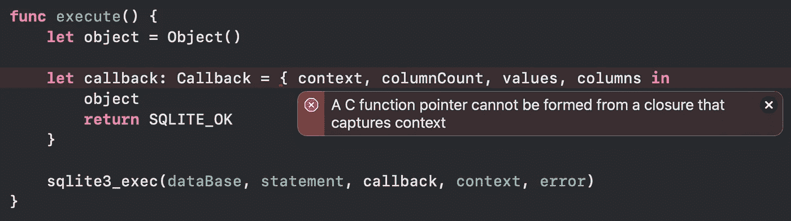

# Swift + C:回调互操作性

> 原文：<https://medium.com/codex/swift-c-callback-interoperability-6d57da6c8ee6?source=collection_archive---------6----------------------->

# 背景

编程语言中一个非常常见的模式是使用回调函数。回调函数是对作为参数传递给其他代码的可执行代码的引用，允许它在以后执行。

在 swift 中，我们经常遇到这种模式。一个特别常见的例子就是`URLSession.dataTask(with:completionHandler:)`。发出请求后，网络可能需要一些时间来响应。与其无所事事地等待，我们可以给出一个在收到响应时执行的完成处理程序，同时允许应用程序继续运行。

我们在 C 语言中看到这种模式的一个地方是与 Swift 打包在一起的`SQLite3`框架。`SQLite3`促进了结构化查询语言数据库的访问和操作，并且是支持`CoreData`的底层技术。

由于数据库需要时间来搜索或修改，`SQLite3`提供了一个 C 风格的回调函数`sqlite3_exec`。当该函数被桥接到 Swift 时，将应用`@convention(c)`注释。该注释表示回调将在 C 上下文中使用，并且必须遵循一定的标准。其中一个标准是函数不能捕获任何数据。这就产生了一个问题，因为我们可能希望将回调参数传递给回调之外的其他对象——我们可能希望将数据库信息传递给视图层示例。

# 解决办法

许多 C APIs 解决这个限制的一种方法是传递一个额外的上下文参数。除了稍后返回的参数之外，这还允许将对某个对象的引用传递给回调。然后我们可以将其他参数传递给对象，这样它们就可以被传递到回调范围之外。

假设以下设置:

为了简洁起见，传递给`sqlite3_exec`的大多数变量都保留为零。

这里我们可以看到`Callback` typealias 用前面提到的`@convention(c)`标注进行了标记。如果我们修改代码来捕获`callback`范围内的对象，我们会看到以下错误:

C 函数指针不能由捕获上下文的闭包形成

解决这个问题的方法是将我们的对象作为上下文参数传递，如下所示:

这里我们创建了一个`Unmanaged`对象，我们希望手动管理它的生命周期。我们将它转换成一个`UnsafeMutableRawPointer`，这样它就可以作为上下文数据传入`sqlite3_exec`。然后，上下文数据被传递到我们的回调函数中，在回调函数中，数据可以被转换回我们的`Object`类型，以备使用。

`passRetained`创建一个引用，使对象无限期地保持活动，直到`takeRetainedValue`被调用。此时，保持器被消耗，对象可以被释放。如果保证对象在回调执行时仍然是活动的，那么可以使用`passUnretained`和`takeUnretainedValue`，但是要注意，如果对象超出了作用域，这将导致崩溃，非常类似于`unowned`变量的工作方式。

# 奖励材料

理想情况下，我们希望扩展这种模式，这样我们就不依赖任何一个对象来处理 C API 的响应。实现这一点的一种方法是传递一个快速闭包作为上下文参数。以下回购为感兴趣的人提供了一个这种模式的示例:

 [## 加法器/加法器.斯威夫特在主奥康纳托比/加法器

### 一个通过 C 头文件将 c++对象桥接到 Swift 的人为例子。-加法器/加法器.斯威夫特在主奥康纳托比/加法器

github.com](https://github.com/oconnelltoby/Adder/blob/master/Sources/Adder/Adder.swift)