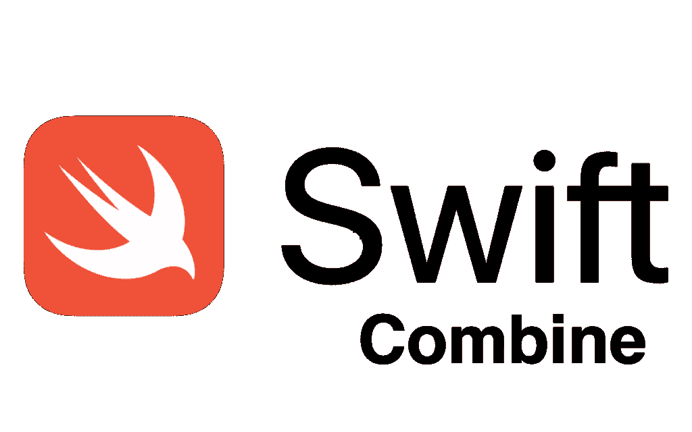

# Swift 联合-了解[出版商、订户、运营商]

> 原文：<https://medium.com/codex/swift-combine-understanding-publisher-subscriber-operator-e491112d0fad?source=collection_archive---------3----------------------->

联合框架是苹果在 2019 年 WWDC 上推出的一个新框架。框架**提供了一个声明性的 Swift API，用于处理随时间变化的值**,可以被视为 RxSwift 和 ReactiveSwift 等流行框架的第三方替代方案。

我们跳进去结合一下，了解一下是什么？本博客将讨论关键🔑联合框架的皮勒。从苹果的文档来看，联合收割机是。 ***“通过组合事件处理操作符自定义异步事件的处理。”***[来源](https://developer.apple.com/documentation/combine)

联合收割机的三个关键支柱**是**

1.  **发布者**[参考](https://developer.apple.com/documentation/combine/publisher)
2.  **操作员**
3.  **订户** [ [参考](https://developer.apple.com/documentation/combine/subscriber) ]

让我们一个一个地看一下，了解这三个支柱是什么

# **出版商**

为了理解出版商，举一个花店的例子，他们卖多种花，因为他们也卖一种非常罕见的花名，朱丽叶玫瑰，这是最昂贵和最美丽的玫瑰。现在，每当鲜花进入库存时，它就会销售一空，你想将鲜花送给你所爱的人，所以你每天要做的就是去商店检查库存，如果没有库存，你就回来，但如果有某种机制可以让你在鲜花可用时获得信息，为此，你必须有人可以给你这些信息。

朱丽叶·罗斯

在这个组合中，有人被称为发布者，所以发布者是可以随着时间的推移向一个或多个利益相关方释放价值的类型，这些利益相关方在技术上被称为 [**订户**](https://developer.apple.com/documentation/combine/subscriber) 。这里我们有更多感兴趣的团体，因为许多人或订户可能想要该信息。

发布者可以发出其类型的多个事件，它们是:

1.  输出值[ [泛型类型](https://docs.swift.org/swift-book/LanguageGuide/Generics.html) ]。
2.  成功的完成。
3.  故障类型错误的完成。

发布者可以发出零个或多个值，如果它完成了，无论是成功还是失败，它都不会发出任何值。

例如 Publishet <int never="">，这里输出值是 Int 类型，Never 用来表示这个 publisher 永远不会产生任何错误。</int>

发布者最好的特性之一是他们内置了错误处理功能。

发布者协议是两种类型的泛型。

1.  Publisher.output -> Int，String 等
2.  Publisher.failure ->错误类型

如果说它从不失败，你可以用 never 来指定。

# **订户**

每个订阅都以订阅者结束，订阅者通常对发出的输出或完成事件做一些事情。

发布者<int never="">0–1–3–5–6-订阅者——在屏幕上显示或将数据发送到服务器。</int>

Currently combined 提供了两个内置订阅器，使得处理数据流变得简单明了。订户如下:

1.  接收器:接收器订户允许您为代码提供闭包，该代码将接收值和完成块。
2.  赋值:赋值订阅者将结果输出绑定到数据模型的某个属性上。

# **操作员**

运算符是在发布者协议上声明的方法，它返回相同的发布者或新的发布者。你可以把一堆操作符串在一起。

操作员专注于处理他们从前一个操作员那里收到的数据，并将他们的输出提供给链中的下一个操作员。

在这篇博客中，我刚刚讨论了 **Combine** 框架的基础，它将帮助你开始。

***如果你喜欢这个，点击💚所以其他人会在媒体上看到这个。如有任何疑问或建议，欢迎随时评论或打我的***[***Twitter***](https://twitter.com/b_banzara)***，或***[***Linkedin***](https://www.linkedin.com/in/rranjanchchn/)***。***