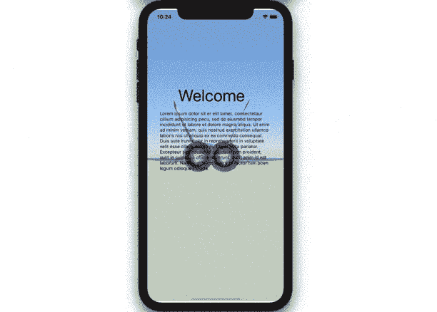

# Swift 将 Scenekit 场景添加到您的应用程序中

> 原文：<https://medium.com/codex/swift-easily-add-a-scenekit-scene-to-your-app-4d1fd2b4a58f?source=collection_archive---------1----------------------->

## [法典](http://medium.com/codex)

## 了解如何将 Apple 的 3D SceneKit 场景嵌入到您的应用程序中。

假设您有一个好看的 SceneKit 场景，想要添加为应用程序的背景。问题是你考虑的应用是用 UIKit 实现的，而 3D 场景是用 SceneKit 制作的。