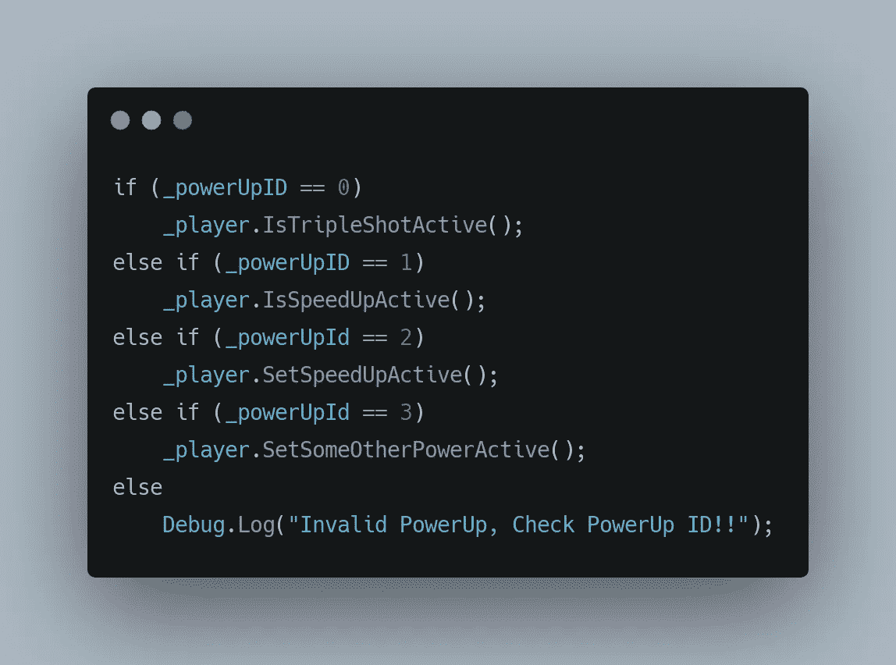
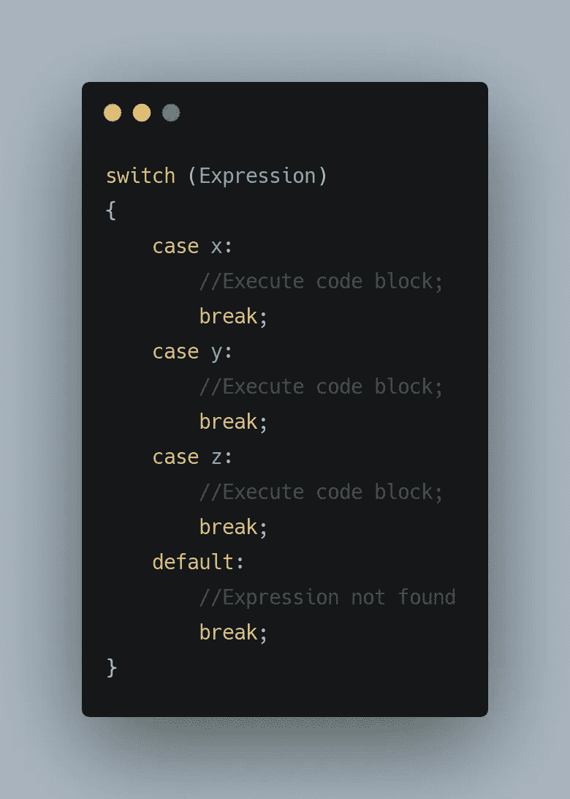
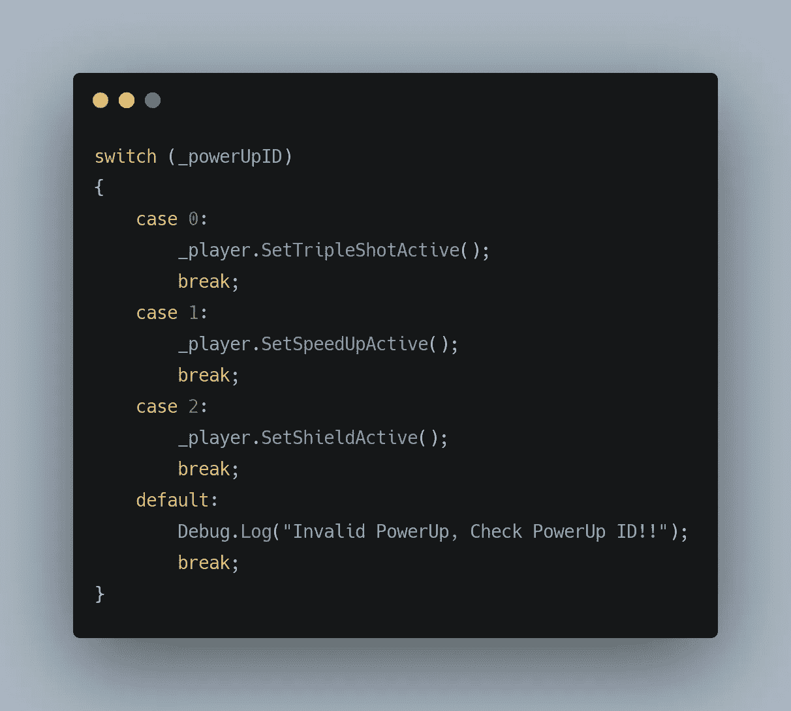
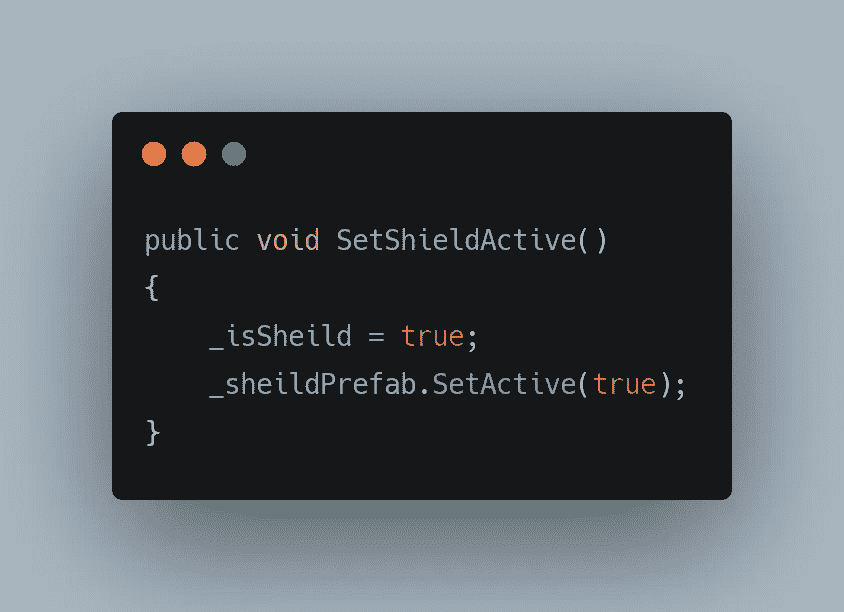
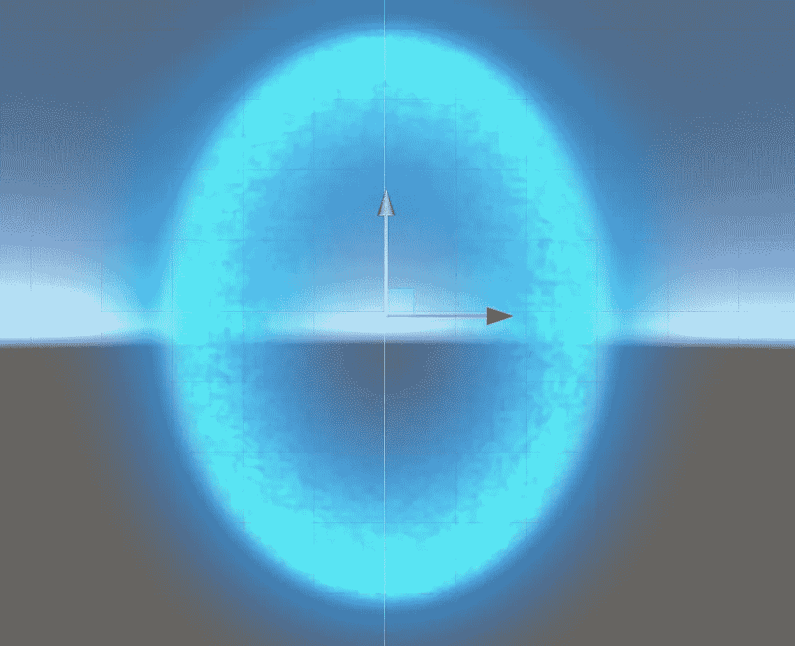
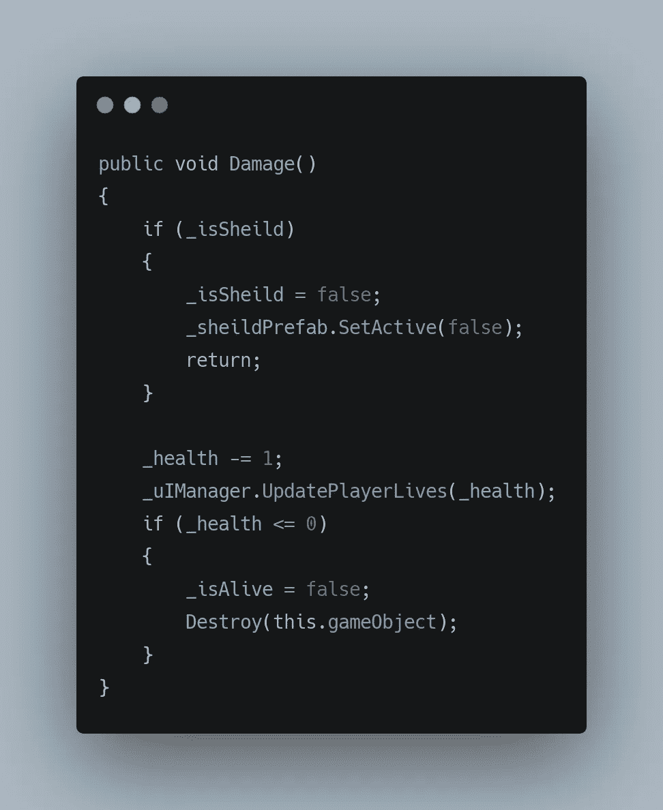
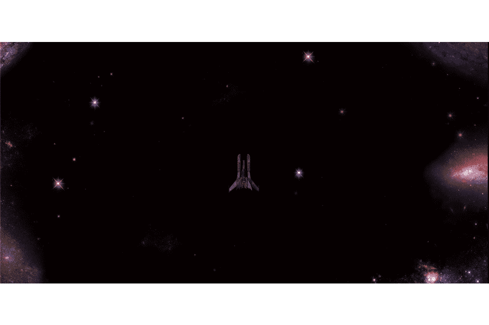

# 将陈述转换为救援

> 原文：<https://medium.com/codex/switch-statements-to-the-rescue-2da680de7207?source=collection_archive---------10----------------------->

在前一篇文章中，我们已经创建了一个[模块化系统](/codex/creating-modular-powerup-systems-dad9d8b41721)。多亏了 **If-Else** 语句，这个系统才成为可能。但是，如果我们希望增加更多的功率，那么这些条件语句会给我们的代码增加一点混乱。 **If-Else** 语句确实很有帮助，但有时看起来会有点乱。

这就是 **Switch** 语句发挥作用的地方，也称为 case 语句，它们是对 **if** 条件的可行替代。它们使用简单，易于阅读。尽管在实现它们时需要注意某些条件，

→传递到 switch 语句中的条件必须是一个常数值。比如 _powerUpId，在这种情况下，它始终是一个 0 到 3 之间的常量整数。

switch 语句中的每个选项都以一个**案例**开始，后面是可能的常数值，在我们的例子中是范围从 0 到 3 的值。

→每个**案例**必须包含一个**中断**语句，以便在所需条件完成时退出开关语句。

switch 语句语法如下所示，

这里，基本上 Expression 与所有情况(x，y，z)进行比较，如果发现匹配，它执行相关的代码块并退出 switch 语句。

因此，如果我们要使用 switch 语句重写我们的模块化系统，这就是我们将得到的结果，

其中案例 2 是我们新的能量提升，它为玩家提供了一个盾牌，为玩家承受一次打击。

这里， **SetShieldActive()** 如下:

这里我们设置一个布尔值为真，表示盾牌能量已经被玩家拿起，并实例化盾牌预设，它是我们的**玩家**游戏对象的子对象。这样做是为了确保盾牌总是随着玩家移动。

屏蔽预制件

现在我们有了一个布尔函数，它可以检查玩家是否已经启动了护盾，我们可以给**伤害()**添加一个检查，其中，如果布尔函数为**真**(意味着护盾处于活动状态)**玩家**没有受到伤害，意味着生命值保持不变。

所以我们检查护盾是否激活，如果是，我们首先关闭护盾，同时关闭**预置**。这里，return 基本上退出了函数。这个功能与使用 if-else 是一样的，在 if-else 中，您将执行其中一个，而不是两个。

这给了我们以下结果，

在这里，我在死之前撞上了四个敌人，这意味着这个盾牌起了作用，因为玩家有 3 点生命值，每个敌人造成 1 点伤害。

感谢您的阅读。更多即将推出！！！