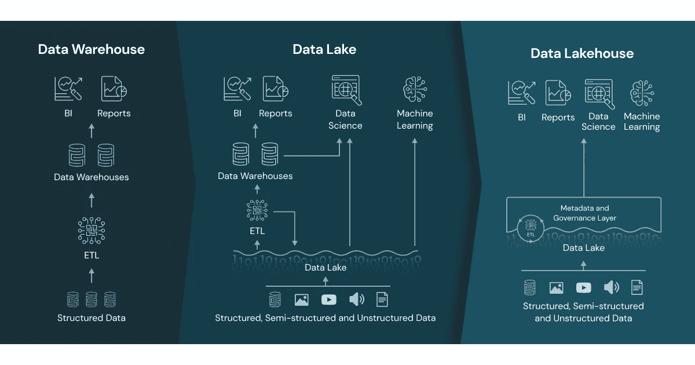
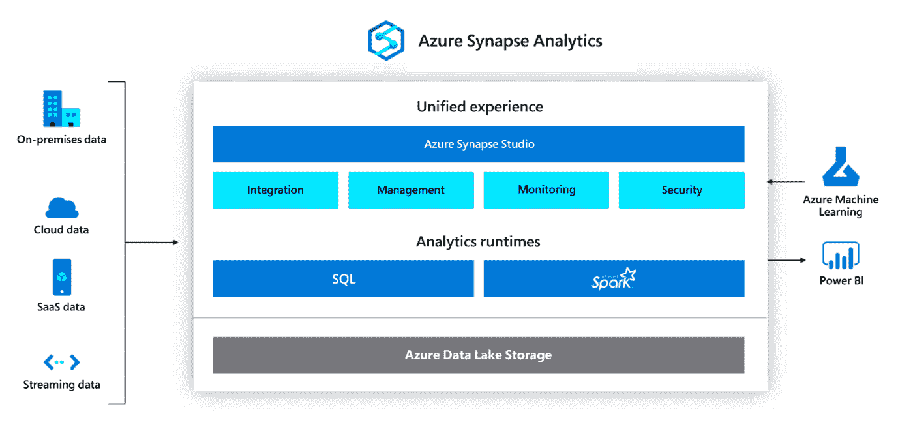
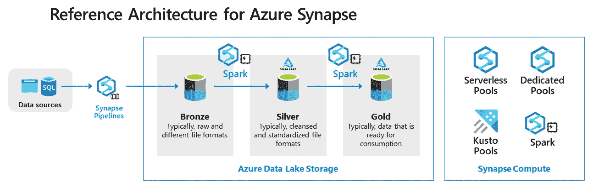
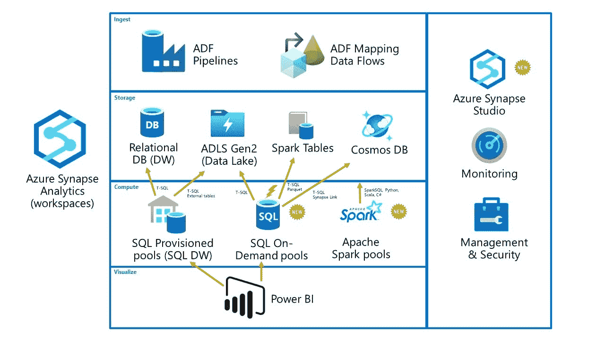

# synapse:Azure 顶尖 1%工程师使用的多用途平台

> 原文：<https://medium.com/codex/synapse-the-multipurpose-platform-used-by-the-top-1-of-azure-engineers-9a0ff1c1bf51?source=collection_archive---------2----------------------->

## 了解微软构建数据生态系统的基石

艾伦·芬德利在 [Unsplash](https://unsplash.com/) 上的照片

我们通常使用非常分散的云解决方案架构，这使得处理和使用我们的数据极其困难。

我们不能跨大型数据集执行查询分析。

我们无法实时塑造、模拟或转换数据。

我们无法选择使用 SQL 工作负载的方式。

我们无法确保数据安全。

但是我们可以找到一种新的方法来管理我们的数据并解决所有这些问题:数据湖屋的概念和 Azure Synapse 分析平台。

## 数据仓库

是数据仓库与数据湖的结合，在数据仓库中，数据分析师和业务用户可以从结构化数据中获得洞察力，在数据湖中，数据科学家可以从任何类型的来源探索数据并构建模型。

团队希望并需要在一个集成的环境中执行商业智能和数据科学任务，这就产生了 Lakehouse:两全其美。

图片由[数据公司](https://www.databricks.com/blog/2020/01/30/what-is-a-data-lakehouse.html)提供

让我们看看湖边小屋应该包括哪些要点:

*   它必须能够处理任何类型的数据，无论是结构化、半结构化还是非结构化数据。
*   允许使用开放文件格式，如 parquet、JSON、txt 和 csv。
*   与安全和数据治理工具集成。
*   涵盖机器学习、流解决方案的高级分析需求。
*   避免不必要的数据复制，以有效地维护单一的事实来源。
*   使源和系统的元数据的咨询能够以简单的方式进行搜索和跟踪。
*   提供对数据集进行快速查询的可能性，甚至识别字段的可能类型。
*   易于与 ETL 流程集成，甚至与虚拟化技术和解决方案集成。
*   它允许您隔离存储和计算层，这提供了快速的可扩展性，避免了以前的不便。

Lakehouse 应该是一个结合了数据集成、大数据分析和企业数据仓库的统一分析服务。这正是 Synapse Analytics 可以为您提供的，甚至更多。

图片由[微软](https://clouddamcdnprodep.azureedge.net/gdc/gdcJNSn71/original)提供

Synapse 是微软希望围绕数据集中整个过程的工具，并以非常简单的方式将其与生态系统的其余部分集成。其架构分为五层。

## 第一层:存储

基于 Azure DataLake Gen2 构建，这是一个具有分层命名空间的 Azure 存储帐户。多个数据源可以链接到它，使您能够实现:

*   存储成本低
*   存储开放格式的文件
*   所有类型数据的存储可用性
*   使用 Azure Storage Explorer 快速查询数据集并查看预览

## 第二层:计算

您可以配置专用和预配置的池，包括 Spark 和 SQL，甚至可以整合无服务器 SQL。这允许您使用 T-SQL 运行复杂的查询。

我们甚至可以有一个专用的 SQL 池来帮助我们实施大规模并行处理(MPP)架构，分离存储层，并为计算层提供巨大的弹性。

典型的 Synapse 数据湖结构(鸣谢: [Piethein Strengholt](https://piethein.medium.com/)

## 第三层:摄入

Azure 数据工厂&映射数据流作为 Synapse 中的集成工具在这一层中使用。这两个工具都可以定制管道并开发满足数据移动要求的复杂工作流。

具体来说，数据工厂是数据流程中的一个编排工具，因为它允许多种资源的组合，甚至支持使用 Azure 功能。

## **第四层:连接服务**

它与 Power BI、Azure 机器学习、Azure Cosmos DB 甚至是数据治理解决方案 Azure without 都有关联。

这使得定制响应任何可能出现的需求的数据解决方案变得容易。在 Azure 机器学习的情况下，还可以与 Azure 认知服务直接集成，以利用微软的人工智能能力。

[在这篇文章中，我谈到了一个自动化监控的认知服务工具。](/illumination/this-aiops-platform-automates-your-monitoring-in-3-steps-123ab5cd884)

Azure Synapse 分析工作区(致谢:[詹姆斯·塞拉](https://www.jamesserra.com/archive/author/jamserra/)

## 第五层:安全性

微软提供高级安全和隐私功能，如自动威胁检测和不间断加密。它们还使您能够确保细粒度的控制。

这是通过列级和行级安全性、列级加密和动态数据屏蔽实现的。这一切都确保您将自动实时保护敏感数据。

总之，我们面对的是当前云环境中最通用的分布式处理平台。不再有任何痛点阻止 Azure Synapse Analytics 成为您的分析系统的引擎，并允许您向前迈出一步。

💡在 [Azure Synapse 分析概述](https://learn.microsoft.com/en-us/azure/synapse-analytics/)&[Azure Synapse 分析入门中了解更多信息](https://www.youtube.com/watch?v=tWFAxOI7CF0)