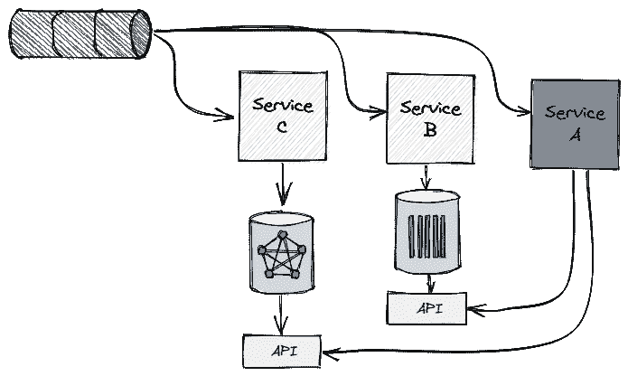
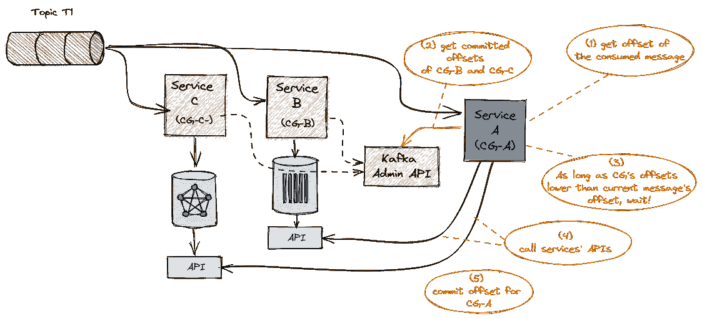
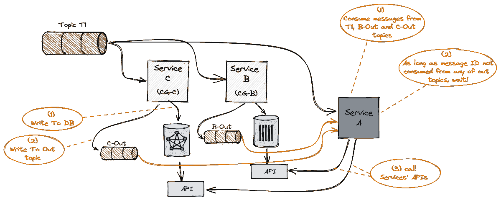

# 同步同一 Kafka 主题的不同消费者

> 原文：<https://medium.com/codex/synchronize-different-consumers-of-the-same-kafka-topic-23b30851158e?source=collection_archive---------4----------------------->

分布式系统中的同步是困难的。你的目标可能是尽可能地阻止它。但是有时业务需求引入了协调不同服务的需求，这些服务对数据新鲜度有很强的依赖性。

为了一般化，假设架构由 *Service-A、Service-B* 和 *Service-C.* 组成，它们都使用来自同一个 Kafka 主题的消息，但显然根据各自的业务逻辑、API 和 SLA 对它们进行不同的处理。当 *Service-A* 处理一条消息时，调用 *Service-B* 和 *Service-C* 的 API，并期望这条消息包含在其中。这就是为什么只有在 *Service-B* 和 *Service-C* 成功处理了之后 *Service-A* 才能处理一条消息。如果其中一个*T21 出现故障或者那里的数据没有更新，那么*服务-A* 唯一能做的就是停止并等待。换句话说，**从*可用性*和*数据新鲜度*方面**来看，都存在对 Service-B 和 Service-C 的硬依赖。*



服务 A 应该在消息被 B 和 c 处理之后才处理消息。

架构挑战是如何通过最可扩展、最具成本效益和最简单的方法在*服务-A* 及其依赖关系之间进行同步。是的，我相信 huber 系统的设计原则是降低复杂性。(如果你还不够确信，可以看看这本伟大的书[](https://www.amazon.com/Philosophy-Software-Design-2nd/dp/173210221X)**】软件设计的哲学，它以对软件和系统设计中复杂性的危险的高尚解释开始)。**

**那么，为什么我们最初会给自己制造这个问题呢？**

**现在你可能会问自己，如果 *Service-A* 对消息顺序如此敏感，那么最简单的(也许是唯一的！)保证顺序的方法是执行由*服务-B* 和*服务-C* 完成的加工，作为*服务-A* 内的连续步骤。你为什么把它们分发到各处？**

**因此，毫无疑问，微(或迷你)服务架构有其成本，但这种架构风格提高了团队速度，因为每项服务都更容易开发、测试、部署，更重要的是，更容易扩展、维护和运营。这肯定不是我们组织独有的，但就个人而言，通过观察 Dev org 的实际情况，我已经确信并欣赏了这些好处。想象一下 *Service-A* 是一个反洗钱检测流程，它消耗付款并评估其风险。 *Service-B* 处理从同一个支付主题中提取的实体关系，而 *Service-C* 负责聚合这些支付，并提供有效的时间感知聚合查询。与 AML 检测( *Service-A* )一样，也存在欺诈(姑且称之为 *Service-A1* )，它们具有完全不同的业务逻辑，但仍然需要查询实体关系图和聚合简档。我们不希望每个团队都投资于时序数据库和图形数据库技术选择，获得如何扩展(或不扩展)和操作的经验，而不是专注于各自的业务，即反洗钱或欺诈检测。**

****回到我们最初的问题…****

**如果我们继续使用 AML 检测作为 *Service-A* 的具体示例，它如何确保一旦调用关系 API(由 *Service-B* 公开)或聚合 API(由 *Service-C* 公开)，它将获得最新的结果？如果他们因为某种原因暂时停机或变慢了怎么办？在所有需要的信息都可用之前，检测过程不能处理消息。使用陈旧的信息可能会错过数百万美元的洗钱活动！**

# **架构模式**

**这里的核心思想是利用 Kafka 偏移管理作为跟踪各种服务进度的单一真实来源。偏移量是一个简单的整数，Kafka 使用它来保持消费者的当前位置。当前偏移量是指向 Kafka 在最近一次轮询中已经发送给消费者的最后一条记录的指针。以便消费者不会因为当前偏移而两次获得相同的记录。由于 Kafka 管理每个主题、消费群和分区的偏移量，这实际上意味着每个单独的记录只能由<topic partition="" offset="">来标识。对于消费者如何向 Kafka 提交 offset 有不同的策略，这里我们依赖于只有在消费者成功处理消息之后才完成的提交。</topic>**

**当 *Service-A* 从主题中轮询一条消息时，应该先提取这条消息的分区和偏移量。然后，它调用 Kafka admin API 来验证这个偏移量已经被与 *Service-B* 和 *Service-C* 相关联的消费者组处理了。Kafka admin API 是为每个消费者组调用的，用于检索主题分区到偏移量的映射(查看 Kafka admin Java 客户端的 [listConsumerGroupOffsets](https://kafka.apache.org/20/javadoc/org/apache/kafka/clients/admin/AdminClient.html#listConsumerGroupOffsets-java.lang.String-) 函数)。每个分区的最小偏移量表示最慢服务的偏移量。**

****

**Kafka 的 admin 用于确定服务 B 和服务 C 的进度**

**请注意，服务可能会消费各种主题，如消费不同事件类型的 *Service-C* 来聚合，因此 *Service-A* 应该清楚地将其依赖关系定义为一个组合< service、topic >的组合，从技术上来说，该组合被转换为一个消费者组。**

**只要*服务-B* 和*服务-C* 之间的最小偏移量低于*服务-A* 消耗的消息偏移量，它就等待。**

## **更详细的算法…**

**让我们假设一种情况，其中主题 T1 的提交偏移量如下:**

*   **消费者组 CG-A(服务-A):
    分区 p1 (C1): 0
    分区 p2 (C1): 0
    分区 p3 (C2): 0**
*   **消费群 CG-B (Service-B):
    分区 p1 (C1): 30
    分区 p2 (C2): 30
    分区 p3 (C3): 10**
*   **消费群 CG-C (Service-C):
    分区 p1 (C1): 23
    分区 p2 (C2): 52
    分区 p3 (C3): 15**

**如您所见，t1 主题被划分为 3 个分区。CG-A 和 CG-B 组各由 3 个消费者组成，因此每个消费者只处理一个分区。但是在 CG-A 中，p1 和 p2 都由消费者 C1 处理。**

**CG-A 中的每个消费者都应该保持一个更新的分区图。该地图可以定期更新:**

```
****for** each dependency consumer group // CG-B, CG-C{  
admin.listConsumerGroupOffsets 
/// (CG-B -> ( p1 -> 30, p2 -> 30, p3 -> 10)), (CG-C -> ( p1 -> 23, p2 -> 52, p3 -> 15))
update partitionMinOffset map **with** minimal offset 
/// (P1 -> 23), (p2 -> 30), (p3 -> 10)
}**
```

**在正在进行的消息轮询期间:**

```
****for** every consumed message /// (sorted from early to latest) 
{set message.offset  = extract the offset of the current message
set message.partition  = extract the partition of the current message**while** (message.offset > partitionMinOffset[message.partition]) waitprocess /// only now service-A can process the messagemanual commit offset /// commit offset after processing successfully}**
```

**由于最佳实践是防止将分区静态分配给使用者，因此使用者不能假定已处理分区的列表，而是需要保留所有主题分区偏移量，因为它可能在任何给定的时间点处理这些分区中的任何一个。**

## **假设**

**这种方法在很大程度上基于卡夫卡的抵消，以反映服务的实际进展。实际上，对于如何向卡夫卡提交《偏移》有不同的策略。我们在内部使用 [flink-connector-kafka](https://javadoc.io/doc/org.apache.flink/flink-connector-kafka_2.12/1.12.2/index.html) ，它仅在检查点完成后提交偏移量(当 [OffsetCommitMode](https://nightlies.apache.org/flink/flink-docs-master/api/java/org/apache/flink/streaming/connectors/kafka/config/OffsetCommitMode.html) 设置为 [ON_CHECKPOINTS](https://nightlies.apache.org/flink/flink-docs-master/api/java/org/apache/flink/streaming/connectors/kafka/config/OffsetCommitMode.html#ON_CHECKPOINTS) )。无论如何，不考虑具体的技术，假设消费者正在禁用默认的自动提交，但是只有在消息被成功处理之后才手动提交偏移量，即使在异步操作的情况下也是如此。**

# **建议的替代方案**

**已经考虑的另一种方法是 *Service-B* 和 *Service-C* 将省略已处理消息的消息 ID 到专用输出主题中，并且 *Service-A* 将加入输出主题和原始主题以获得完整的有效负载。只有当所有三个主题的消息 ID 都被使用后， *Service-A* 才会处理该消息。**

****

**输出主题方法**

**由于以下缺点，这种方法已被拒绝:**

*   ****来自生产者端的复杂性**:事实上 *Service-B* (和 *Service-C)* 需要写入它自己的内部 DB 以及输出主题(当然，还要提交 Kafka 偏移量)，这增加了在某些情况下 DB 和输出主题这两个接收器不同步的可能性。**
*   ****复杂性**来自消费者端:*服务-A* 需要在原始 T1 主题和两个输出主题之间加入，并小心处理其中一个(或多个)非常落后的情况。它可以不崩溃(由于 OOM)，但只是停止消费和等待。诚然，像 Flink 这样的流处理引擎可以通过管理每个源的阻塞队列来处理[背压](https://www.ververica.com/blog/how-flink-handles-backpressure)，但是这大大增加了复杂性。**
*   ****大规模消息量**:这种方法只是大大增加了消息的数量，因为每条消息实际上都是重复的(或三倍的),会影响事件总线的性能和成本。**

# ****总结一下****

**如果你是一个卡夫卡专家，这可能对你来说是显而易见的，但令人惊讶的是，这不是那么微不足道，以说服人们摆脱额外的输出主题，因为那些基本上已经被卡夫卡抵消本身捕获。**

**这种模式非常适合同一主题的多个消费者。实际上，它甚至可以扩展到他们消费不同主题的情况，只要他们都从一个共同的主题开始。但是这绝对是更复杂的模式，需要后续的文章来证明…**