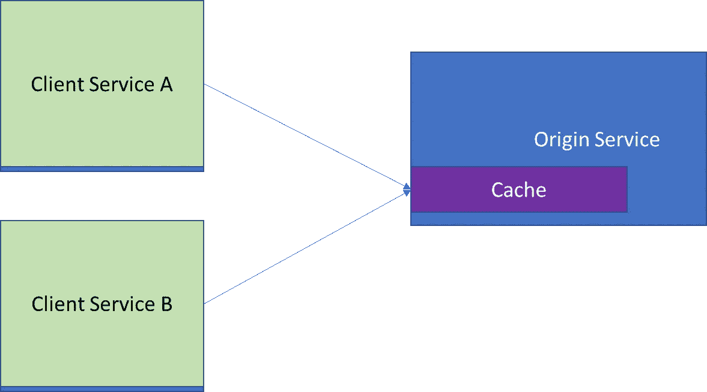

# 同步通信—查询和缓存(第 3/3 部分)

> 原文：<https://medium.com/codex/synchronous-communication-queries-and-cache-part-3-3-755d2a19dc33?source=collection_archive---------3----------------------->

## 缓存在哪里？服务器端还是客户端？共享还是私有？代理还是反向代理还是 CDN？这篇文章谈到了对每一个问题的考虑。

缓存大图

在[的上一篇文章中，](/codex/synchronous-communication-queries-cache-c91124a0aad0)我介绍了保持缓存与数据源一致的策略。在这篇文章中，以上面的图片为参考，我将涵盖所有我们可以缓存它们的含义的地方。

# 1.服务器端缓存

origin 管理数据的快照，以便更快地为查询服务。

有几个好处—

1.  所有的客户都得到好处。
2.  缓存的数据仍然归原始数据所有。在某些情况下，由于法律限制，可能不希望在拥有数据的服务之外复制数据。
3.  可伸缩性—服务可以处理更多的读取请求，因为它不需要一次又一次地执行昂贵的操作。
4.  可用性—如果下游服务之一不可用，缓存可以为查询提供服务。
5.  保持缓存更新更容易(前一篇文章中提到的策略)。

**不利的一面是**，请求仍然必须通过**的网络**才能到达源/服务。

服务器端缓存

## **1.1 私有/应用缓存**

这是实现缓存的最简单和最基本的方式之一，这意味着应用程序的每个实例都有自己的数据副本供查看。

这是检索缓存数据的最快方式，实现为内存哈希表或文件存储，无论哪种情况，都避免了网络延迟。

它可以在服务器端或客户端实现。

服务器和客户端的应用缓存

应用程序缓存—图像信用[https://learn . Microsoft . com/en-us/azure/architecture/best-practices/caching](https://learn.microsoft.com/en-us/azure/architecture/best-practices/caching)

从上图可以明显看出，每个应用程序都有自己的数据副本，如果有几个应用程序实例，就会有几个数据副本，这不仅**会增加存储**，而且还会根据哪个应用程序实例回答查询或处理数据而给出**不一致的结果**。此外，当这样的应用程序向外扩展时，它们可能会淹没原始的 T21，因为它们的缓存在启动时是空的。

## 1.2 分布式/共享缓存

与应用程序缓存不同，在应用程序缓存中，每个应用程序实例都有自己的专用缓存，而在分布式缓存**中，有一个外部缓存供所有应用程序实例**在进一步操作之前查找。

它可以在服务器级别实现，也可以在客户端实现。

应用程序的所有实例共享一个公共缓存。image credit[https://learn . Microsoft . com/en-us/azure/architecture/best-practices/caching](https://learn.microsoft.com/en-us/azure/architecture/best-practices/caching)

它带来的好处是提供了缓存数据的**一致视图**，缓存可以有多个节点来提供伸缩性和弹性。Redis 等产品可用于支持复杂的数据类型和高级用例(如发布者-订阅者模型、批处理操作、事务和地理空间数据)。

不利的一面是**，因为它是一个外部服务，它会受到网络延迟**(网络延迟的影响可以通过使用批处理操作来减少)，它**增加了复杂性**，因为它是一个要管理的独立车队**安全考虑变得更加重要**。

## 1.3 API 网关处的缓存(和反向代理)

缓存仍然在服务器上，但是已经从应用程序/服务中移除。缓存 HTTP 响应**很有帮助。**

根据 API Gateway 产品的不同，它可以是现成的解决方案，可以添加一些配置。或者它可以是像 Varnish cache 这样的产品，可以用反向代理来实现。

在调用后端服务之前，API gateway 首先根据查询查找其缓存。

API 网关中的缓存将有一段生存时间，这意味着它可以在这段时间内给出陈旧的值。如果客户端需要来自后端的实际数据，一些 API 网关产品支持 Cache-Control: max-age=0 头，这将使缓存无效。

然而，**如果客户端为了得到最终结果而必须对不同的端点进行多次查询，那么 API 的缓存就不是很有效。因为它会使界面变得喋喋不休，并放大网络延迟的影响。**

作为一个解决方案，一个聚合器服务([这里提到聚合器模式](https://www.enterpriseintegrationpatterns.com/Aggregator.html))可以位于一个 API 网关之后，该网关可以连接到各种服务以产生最终结果。拥有聚合器的另一个好处是，它可以与可能具有 API 网关产品不支持的不同协议的服务进行对话。**聚合器可以有一个缓存，并对其失效有更多的控制。**API 网关可以执行其他与业务无关的工作，如认证、日志记录和节流。

添加了一个聚合器来聚合来自服务的请求，从而减少了网络延迟，并使客户端不必了解各个服务。

Apigateways & aggregators 可能成为单点故障，因此考虑它们的资源分配至关重要。

# 2.客户端缓存

这意味着数据快照是在客户端管理的，原始服务对此没有控制权或不了解。

客户端服务 A 实例使用客户端(共享/分布式)缓存。

最显著的**好处是避免了网络调用，增强了性能和健壮性**。而**的挑战是保持客户端缓存与服务器保持最新**。

在**中，除了应用缓存和分布式缓存**、**之外，Web 代理缓存**可以在客户端使用。它是位于客户机和服务器/服务之间的服务器，可以缓存 HTTP 内容。代理服务器上的 Squid 缓存就是一个产品示例。

带缓存的代理服务器

# 3.内容交付网络

这就像**网络内的缓存**。当数据源远离网络和**消费者分散在世界各地**时，这是很有帮助的**。**

这是由 AWS、Akamai、Cloudflare 和 Google 等公司提供的一项服务，通过创建一个边缘位置网络来拉近数据与用户的距离。

**客户端请求一到达边缘位置就获得收益**。

主要用于传送媒体文件、软件包和流媒体视频。但是根据产品的不同，它可以用于传送静态、动态、交互式或流式内容。

本文发布时的 AWS 边缘和区域位置。[来源](https://aws.amazon.com/cloudfront/features/?nc=sn&loc=2&whats-new-cloudfront.sort-by=item.additionalFields.postDateTime&whats-new-cloudfront.sort-order=desc)

如上图所示，AWS CDN 有两种类型的缓存位置—区域缓存和边缘位置。

AWS CDN 中区域和边缘缓存的逻辑视图

区域边缘缓存具有更大的缓存，因此对象可以在那里停留更长时间。 *"* Get *"* 请求被缓存，可以配置生存时间和立即失效。

## 结束语

如果不需要，就不要添加缓存。数据副本增加了复杂性。如果不需要额外的数据拷贝就能满足性能、可用性和可扩展性方面的限制，这是一个不错的选择。

从源到目的地的缓存层数越多，陈旧数据被提供的机会就越多，狡猾的漏洞就越多。

## **总结**

在第[第一部分](/codex/synchronous-communication-queries-cache-c91124a0aad0)测试中，我通过参考 Gregory Young 2010 年&至 2012 年关于 CQRS 的论文，以最简单的形式提出了关于 CQRS 模式的问题&。然后继续展示如何将该模式应用于不同的上下文。

[第二部分](/codex/synchronous-communication-queries-cache-c91124a0aad0)讲述了缓存如何帮助 NFRs，同时为查询&策略提供服务，以保持缓存与数据源一致。

在这个结论部分，我试图涵盖所有我们可以缓存的地方。以及各自有什么好处和考虑。

我把它分成 3 部分，希望它能读得更好。请让我知道你的想法。

进一步阅读和学分[https://learn . Microsoft . com/en-us/azure/architecture/best-practices/caching](https://learn.microsoft.com/en-us/azure/architecture/best-practices/caching)