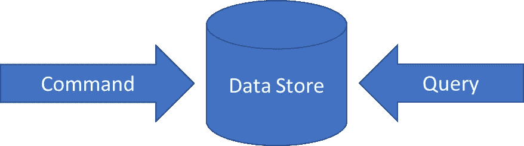
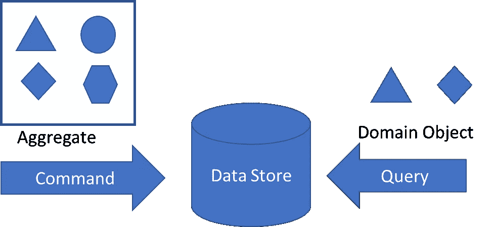
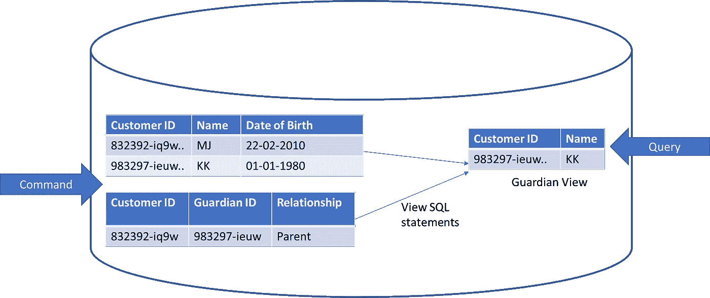
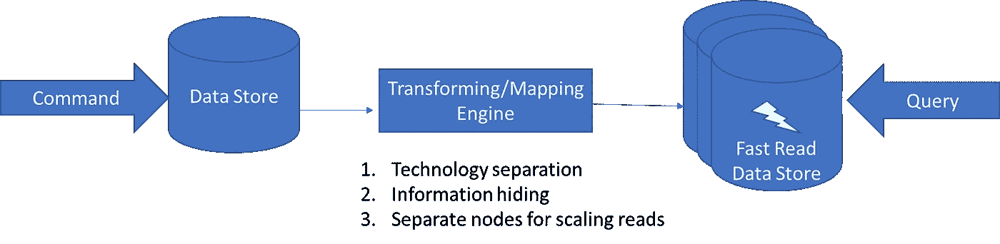
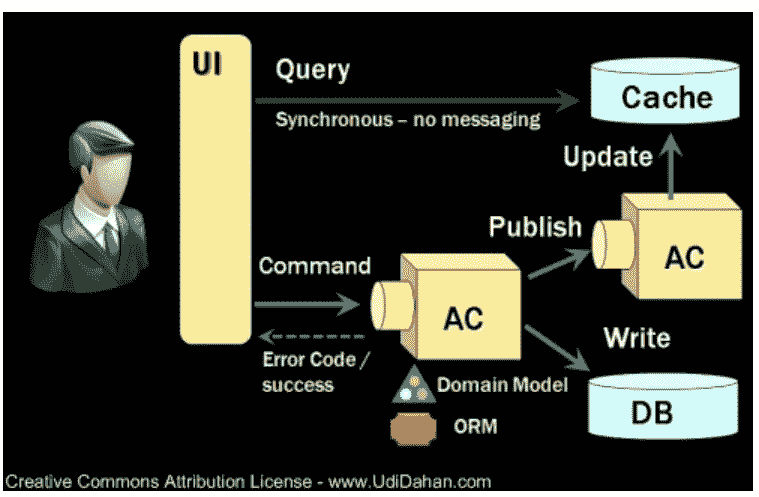

# 同步通信—查询和缓存(第 1/3 部分)

> 原文：<https://medium.com/codex/synchronous-communication-queries-cache-644ffcecf1d9?source=collection_archive---------7----------------------->

## 这篇文章围绕查询和 CQRS 为实现缓存策略奠定了基础。

照片由 [Unsplash](https://unsplash.com?utm_source=medium&utm_medium=referral) 上的[哈迪贾·赛义迪](https://unsplash.com/@hadijasaidi?utm_source=medium&utm_medium=referral)拍摄

在我之前的一篇[文章](/codex/asynchronous-communicaiton-how-much-information-do-we-pack-in-events-to-reduce-coupling-ef5749e01da8)中，我写道，如果我们能够实现一个发布者-订阅者的通信模型，并且发布者能够将所有关于状态变化的必要信息打包到事件中，那么订阅者就有了所有可以操作的数据，并且可以避免查询。虽然发布-订阅模型通常通过将应用程序的复杂性转移到基础设施中来产生高吞吐量、可伸缩的系统，但是我们不能在所有情况下都使用发布-订阅模型。

系统确实需要发出读取或搜索请求，因为它更好地模拟了用例，或者因为它很简单。这种获取数据的请求称为查询。

## **读写路径的分离有什么帮助？**

任何处理数据存储的软件既可以保持更新和读取数据的相同路径，这在 CRUD 风格的数据访问操作中很常见，也可以将数据更新操作与数据读取操作分开。**这种简单的分离被称为命令查询责任分离模式(CQRS)。命令负责改变状态，查询负责读取状态。**

CQRS —数据更新和读取的分离

出于学术兴趣，这里有几篇来自[2010](https://web.archive.org/web/20101223100708/http://codebetter.com/gregyoung/2010/02/16/cqrs-task-based-uis-event-sourcing-agh/)&2012[2013](https://web.archive.org/web/20160729165044/https://goodenoughsoftware.net/2012/03/02/cqrs/)的文章，作者是**格雷戈里·杨(他创造了 CQRS 这个术语)**，他在文章中解释说，CQRS 只是为了阅读和写作的目的，通过创建两个独立的对象来分离关注。并澄清了围绕 CQRS 的种种神话，这些神话往往使它看起来比预想的更复杂。

该模式简单明了，但是它**开启了在查询或更新数据时拥有不同认知和不对称需求的思维模式。随着这种心态应用于不同的环境，它开始发展成不同的形式。**

例如，在域驱动设计的**上下文中，可能一群域对象形成一个集合，并且必须一起更新以保持集合的完整性，尽管在读取时可能需要简单地从数据存储中获取一个或几个域对象。**

在查询仅读取特定域对象时维护聚合边界的命令

或者在关系数据库的上下文中，其中读取路径可能使用构建在数据表之上的视图。

RDBMS-命令在查询从同一物理数据库的物化视图中读取数据时更新数据表。

或者当读取数据存储是单独的物理节点时，用于高效读取数据存储、信息隐藏或者用于不对称读取缩放要求(或者它可以是简单的读取副本)。

独立物理数据存储上的 CQRS

或者另一种可能性是查询数据存储建立在事件之上，而不是建立在主数据存储之上。就像这个 Udi 达汗的[例子](https://udidahan.com/2009/12/09/clarified-cqrs/) —

1.  发送命令来更新状态。
2.  数据库中的状态被更新，并且事件被发布。
3.  查询存储(在本例中是一个缓存)得到更新。

根据读取模型的设计，无论是基于 CRUD 的数据访问还是分叉的 CQRS，都有可能应用几种缓存策略中的一种。在下一篇文章中，我将讨论缓存。

链接到[下一部分](/@kapoorabhinav/synchronous-communication-queries-cache-c91124a0aad0)

学分[https://learn . Microsoft . com/en-us/azure/architecture/patterns/cqrs](https://learn.microsoft.com/en-us/azure/architecture/patterns/cqrs)