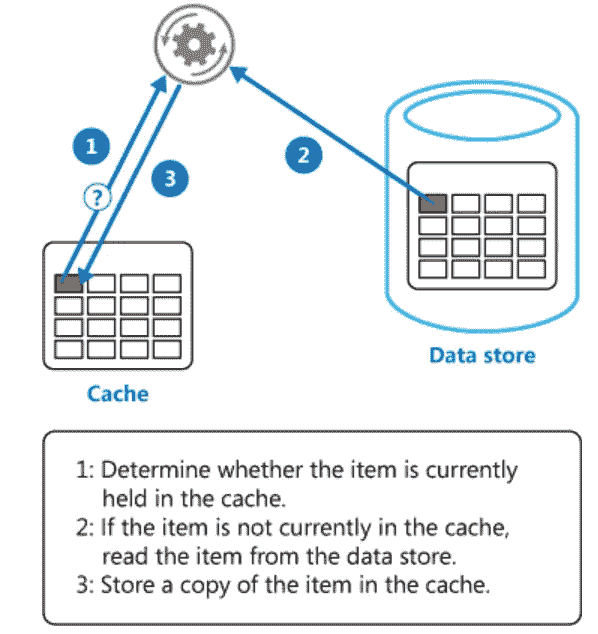
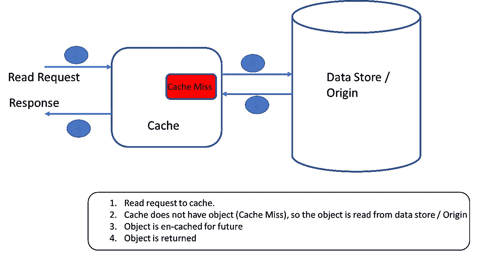
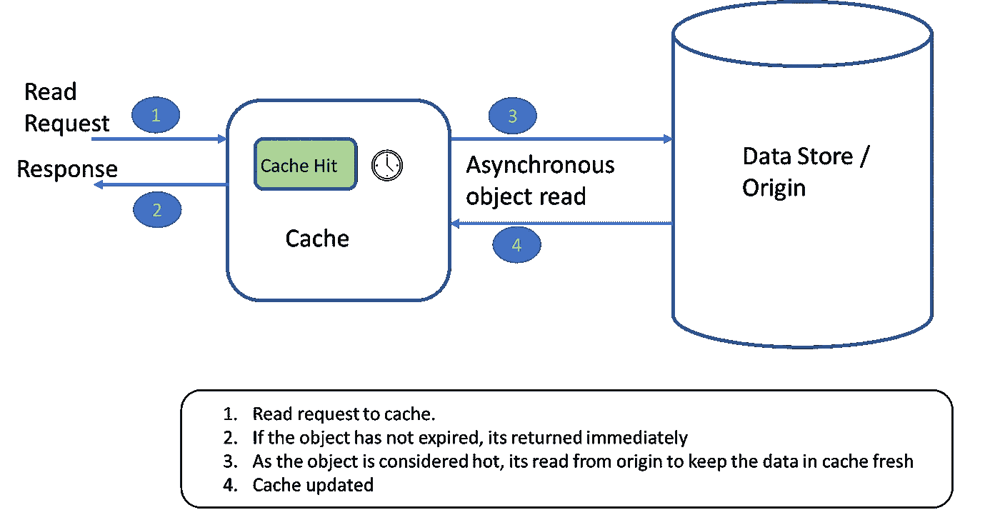
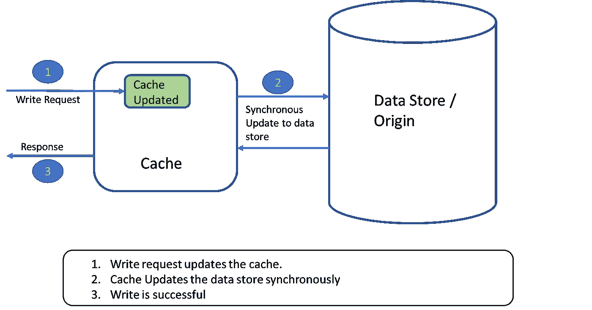
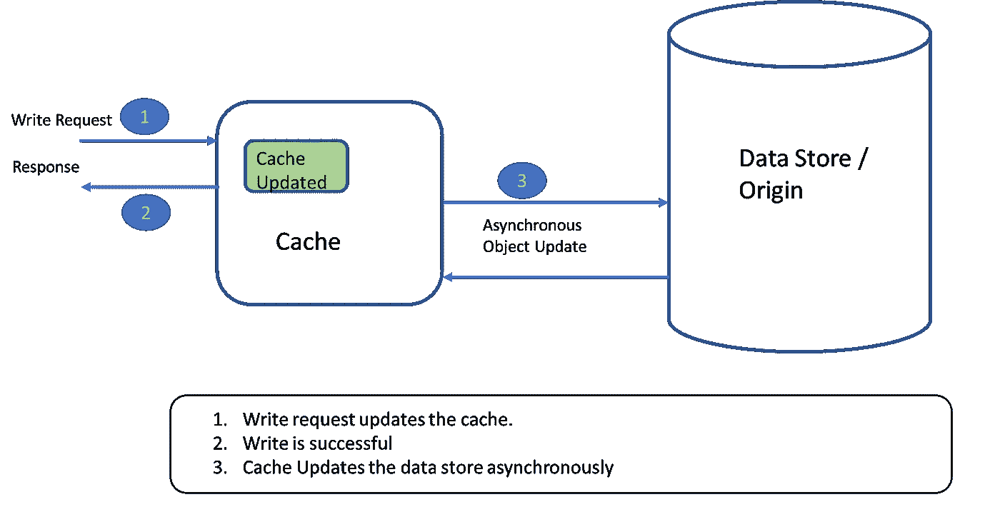

# 同步通信—查询和缓存(第 2/3 部分)

> 原文：<https://medium.com/codex/synchronous-communication-queries-cache-c91124a0aad0?source=collection_archive---------7----------------------->

## 这篇文章探讨了对缓存的需求、挑战以及保持缓存与数据源一致的策略。

由 [Unsplash](https://unsplash.com?utm_source=medium&utm_medium=referral) 上的 [GeoJango Maps](https://unsplash.com/@geojango_maps?utm_source=medium&utm_medium=referral) 拍摄

## 为什么要缓存数据？

高速缓存的想法是将数据的**副本**存储在离所需位置更近的**位置，或者**将数据保存在更快的数据存储**中，这可以比从数据库读取数据更快地提供查询，或者它甚至可以存储昂贵的计算操作的结果。**

除了**性能**之外，缓存还可以帮助提高**可用性**——如果源不可用(这意味着我们更喜欢可用性而不是一致性)，可伸缩性**——因为它可以通过减少争用来减轻源的压力，&也许**降低总体成本**，这取决于它在基础架构中的实施位置(下一部分将详细介绍)。**

## 缓存数据的挑战

缓存数据是原始数据的快照，随着时间的推移，随着对原始数据的更新，缓存可能会变得与原始数据不一致。因此，**缓存对于经常读取而很少更新的数据是有效的&直接了当的。**然而，对于一个必然会更新的数据模型，我们有一些考虑。

该策略必须考虑新鲜或陈旧数据的可接受程度，从而决定缓存过期或失效策略。如果高速缓存中的数据过早过期，则每个读取请求都可能被发送到源，从而违背了高速缓存的目的。如果太高，缓存可能会提供过时的数据。这种考虑是特定于应用程序及其领域的。

> 源数据的变化率以及刷新数据的缓存策略将决定数据的不一致性。[https://AWS . Amazon . com/builders-library/caching-challenges-and-strategies/？did = ba _ card&trk = ba _ card](https://aws.amazon.com/builders-library/caching-challenges-and-strategies/?did=ba_card&trk=ba_card)

## 保持缓存与源一致的策略(尽可能)

1.  **部分缓存** —不是缓存所有内容，而是只缓存一些字段。这些字段可能相对稳定，很少更新。
2.  **侧缓存(或侧缓存)** —应用程序保持缓存最新。**适用于缓存中的数据必须按需加载的情况**。或者当不支持内联高速缓存(通读或直写)操作时。关于这个模式的更多信息[https://learn . Microsoft . com/en-us/azure/architecture/patterns/cache-aside](https://learn.microsoft.com/en-us/azure/architecture/patterns/cache-aside)

缓存备用模式—图片来源[https://learn . Microsoft . com/en-us/azure/architecture/patterns/cache-Aside](https://learn.microsoft.com/en-us/azure/architecture/patterns/cache-aside)

**3。内联缓存** —缓存构成了数据访问 API 的一部分，缓存对数据访问 API 的消费者是透明的。线内缓存可以进一步分为以下几类

**3.1 通读缓存** —每个读请求首先在缓存中查找，如果它在缓存中不可用(或者已经无效)，缓存从数据源中读取它，并为将来的查找进行自我更新，然后返回结果。

通读缓存

**3.2 提前刷新缓存** —为了**减少通读缓存的延迟，并保持缓存中的热对象新鲜**，一些缓存可能支持提前加载数据。如果对象在到期后被访问，这是一个同步调用来读取和呈现结果(类似于通读)。但是，如果在过期前的某个配置时间访问了对象，则返回该值，但是来自源的异步读取会用最新值补充缓存。

**提前刷新缓存**

**3.3 直写缓存** —每次写入都会更新自身和源的缓存。直接用于服务器端缓存。它**减慢写操作**完成时数据被写入两者，高速缓存&原点。

**直写高速缓存**

**3.4 后写缓存** —它不同于直写缓存，因为它**通过异步写入原点来加速写入**。

**后写式高速缓存**

可以通过查看高速缓存未命中(当在高速缓存中没有找到对象并且从源读取时)与高速缓存命中(当在高速缓存中找到对象时)矩阵来确定高速缓存策略是否有效。

在下一部分中，我将写我们可以在哪里应用缓存，以及它会有什么好处或影响。

链接到[上一部分](/codex/synchronous-communication-queries-cache-644ffcecf1d9)涵盖—查询，CQRS&CQRS 在不同上下文中的应用。

学分—

*   [https://docs . Oracle . com/CD/e 15357 _ 01/coh . 360/e 15723/cache _ rtwtwbra . htm # cohdg 200](https://docs.oracle.com/cd/E15357_01/coh.360/e15723/cache_rtwtwbra.htm#COHDG200)
*   [https://AWS . Amazon . com/builders-library/caching-challenges-and-strategies/？did=ba_card & trk=ba_card](https://aws.amazon.com/builders-library/caching-challenges-and-strategies/?did=ba_card&trk=ba_card)