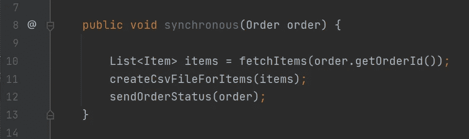

# 同步与异步编程

> 原文：<https://medium.com/codex/synchronous-vs-asynchronous-programming-4897070d640?source=collection_archive---------3----------------------->

## 编程模型之间的主要区别

**异步 Vs 同步**

# 介绍

在计算的早期，单处理器系统占主导地位。许多早期的编程语言都采用了同步编程模型。随着硬件的进步，需要开发更好的编程模型。充分利用所有资源的稳健模型将是最合适的模型。这就催生了异步编程。

对于初学者来说，很难理解这两种编程模型之间的区别。在这篇文章中，我将试图用通俗的语言来简化和解释两者的区别。我们还将看看一个简单的 Java 插图。我们将理解 Java 中为异步编程提供的 API。

# 现实世界的类比

在深入研究编程模型之前，我们将首先看看同步和异步系统。

# 超市作为一个同步系统

我们都去过超市购买日常用品。每个人都用手推车收集物品，然后去柜台。柜台的那个家伙会扫描所有的商品，准备账单，接受付款，最后给收据。对于每个客户来说，这都是一个耗时的过程。此外，所花费的时间与商品的数量、任何技术故障以及寻找变化的时间(现金支付)成比例。

想象一下，如果这是一个假日季节，超市正在大减价，会发生什么。顾客将不得不花很多时间排队，从而加重他们的挫折感。以下是每个顾客的恰当反应:-

在上面的例子中，你可以把收银员想象成一个 CPU &把顾客想象成一个编程函数。类似于编程功能，每个客户都需要不同的时间，并有不同的要求。收银员处理顾客的请求，根据顾客的购买和付款方式花费不同的时间。

每个顾客都被阻止，直到收银员释放他们的收据。他们做不了别的，只能排队等候。如果顾客可以把订单交给收银员，去别的地方看看，然后再回到超市，那就太好了。这将意味着减少客户的挫折感。

在同步系统中，我们等待一个任务完成&然后处理下一个任务。正如我们所见，它会导致瓶颈并降低系统的吞吐量。

# 麦当劳作为一个异步系统

麦当劳有自助服务亭终端。客户可以下订单并完成支付。付款完成后，收据将与订单号一起分发。订单准备就绪后，订单编号会显示在屏幕上。

在准备食物时，顾客可以同时做多件事情。他们不会被准备订单的人挡住，因此商店可以避免拥挤。客户不会按顺序收到订单。一个人可能会在另一个人之前收到他的食物，即使他会在另一个人之后点菜。这是异步系统的一个例子。

异步系统不会等待任务完成。当给定的任务正在进行时，它移动到另一个任务。让我们来看一个编程例子。

# 同步编程

在同步编程中，每行代码都是按顺序执行的。在网络或文件 IO 调用的情况下，执行线程会阻塞。让我们看一个同步代码执行的例子。

我们将举一个电子商务系统的例子。假设我们有一个函数，它获取给定订单的所有商品。然后，它为项目创建一个 CSV 文件并存储它。此外，它通过电子邮件向客户发送订单状态信息。在上面的例子中，我们的代码将按顺序执行，即第 10、11 和 12 行。

`**fetchItems**`函数执行数据库调用。数据库调用很昂贵，因为它是一个 IO 调用。我们一调用`**fetchItems**`方法，主线程就会阻塞。一旦所有项目都从数据库成功返回，它就会恢复。

`**createCsvFileForItems**`函数处理项目并生成一个 CSV 文件。这个函数再次将主线程置于等待状态。一旦文件创建成功，函数将返回。此外，它将调用`**sendOrderStatus**`方法。

方法`**sendOrderStatus**`使用电子邮件客户端。它使用电子邮件地址并将订单状态发送给客户。

假设每个函数花费的时间如下

*   `**fetchItems**` - 5 毫秒
*   `**createCsvFileForItems**` - 10 毫秒
*   `**sendOrderStatus**` - 8 毫秒

程序完成的总时间是 23 毫秒。15 毫秒后会调用`**sendOrderStatus**`函数。这个函数独立于获取和处理项目。不过还是要等前面两个功能完成。我们可以先给`**sendOrderStatus**`打电话。但是在这种情况下，`**createCsvFileForItems**`函数将不得不等待 8 毫秒。

**每个功能花费的时间**

此外，当函数被调用时，主线程会阻塞。当线程进入等待状态时，它不能做任何有用的工作。如果应用运行在多核 CPU 上，那么只有一个 CPU 得到利用。这将导致其他 CPU 闲置。

通过在不同的线程中执行独立的任务，我们可以充分利用所有的 CPU 内核。在上面的例子中，这可以通过并行运行`**fetchItems**`和`**sendOrderStatus**`来完成。完成后，我们可以使用结果&然后调用`**createCsvFileForItems**`。

# 异步编程

在异步编程中，独立的任务在不同的线程上并行执行。一旦任务完成并返回一个结果，一个依赖任务就会作为回调被调用。独立任务不会阻塞主线程，我们可以利用 CPU 的所有内核。

在上面的代码中，我们有每个方法的异步版本。代码没有按顺序执行第 32、33 和 34 行。它将调用`**fetchItemsAsync**`方法并将其卸载到其中一个线程。随后，它将调用`**sendOrderStatusAsync**`方法，而不等待第一个函数完成。该方法将在不同 CPU 上的单独线程上运行。在第 33 行，`**fetchItemsAsync**`方法返回一个未来值。主线程将在第 35 行等待这个 future 并获取它的值。

该功能的执行如下图所示

**异步功能执行**

# Java 中的异步编程

Java 提供了`**CompletionStage**`接口和`**CompletableFuture**`类来实现异步编程。一个`**Future**`或一个`**CompletableFuture**`代表未来计算的结果。例如:-你可以调用一个异步方法来返回一个未来值。调用此方法后，您可以继续执行代码。我们使用 API 来获得未来的计算结果。以下是一个简单的例子

在上面的例子中，方法`**fetchItemsAsync**`返回一个包含项目列表的未来。此方法定义并初始化 CompletableFuture。在 Executor API 的帮助下，它将执行任务卸载到一个新线程上。一旦计算完成，它完成未来(第 48 行)然后返回它。

由于`**fetchItemsAsync**`是异步的，主线程可以同时调用`**sendOrderStatus**` 方法。因此，它不需要等待前一个方法完成。然后，它将在将来使用 get 方法来获得最终结果。主线程将在调用 get 方法时阻塞，并在结果可用时恢复。

我们可以避免上面的样板代码&利用 CompletableFuture 的 API。CompletableFuture 提供了方法`**supplyAsync**`和`**runAsync**`。前者采用供应商接口，而后者使用 runnable。供应商接口是一个不带任何参数的函数接口。它返回一个参数化类型的值。

**使用可完成期货**

我们在上面的代码片段中使用了`**supplyAsync**`函数。在内部，这个函数将在 java 中的 ForkJoinPool 的一个线程中执行代码。`**thenApply**`构造处理异步计算阶段的结果。

如上所示，`**fetchItems**`调用异步返回一个项目列表。然后将结果反馈给`**createCsvFileForItems**`函数。这个函数作为一个回调函数，一旦`**fetchItems**`函数完成就会被调用。程序开始执行`**sendOrderStatus**` **、**功能，而不等待第一阶段计算完成。因此，我们使用异步编程分离了两个独立的任务。

# 同步编程的利与弊

## 赞成的意见

*   同步编程简单明了，易于实现。
*   它是 CPU 密集型任务的理想选择。
*   更适合简单的系统。
*   调试同步系统很容易。

**缺点**

*   它不适合 IO 绑定的任务。CPU 内核未得到充分利用。
*   它在两个任务之间引入了相关性。一个任务可以阻止另一个任务的执行。
*   不适合高吞吐量和低延迟系统

**异步编程的优点&缺点**

**优点**

*   独立的任务可以并行启动。它充分利用了所有的计算资源。
*   有利于 IO 相关的任务。
*   可扩展，适合高吞吐量工作负载。

**缺点**

*   需要很多回调函数。调试有时会变得很困难。
*   不利于 CPU 密集型任务。
*   在一些编程语言中难以实现。

# 参考

*   [封面图片](https://pyxis.nymag.com/v1/imgs/4db/9a9/78f0f50285dd11bef4946bc47283e49281-pills-lede.rhorizontal.w1200.jpg)
*   [同步和异步编程](https://www.makeuseof.com/synchronous-asynchronous-programming-different/)
*   [开发条款](https://dev.to/hardy613/asynchronous-vs-synchronous-programming-23ed)
*   [同步介绍&异步编程](https://www.koyeb.com/blog/introduction-to-synchronous-and-asynchronous-processing)
*   [Java 异步编程](https://www.baeldung.com/java-asynchronous-programming)