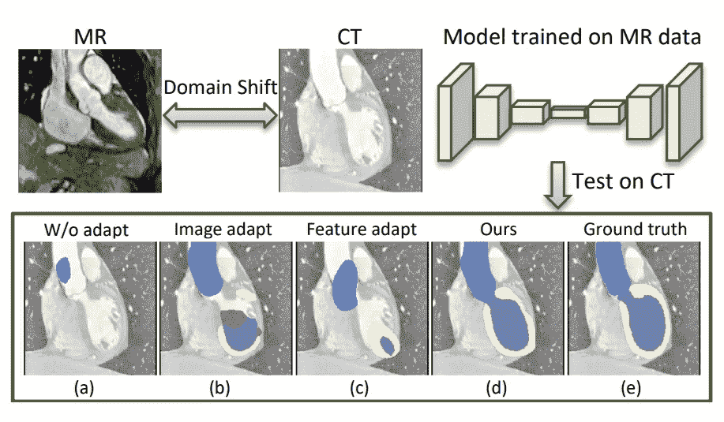
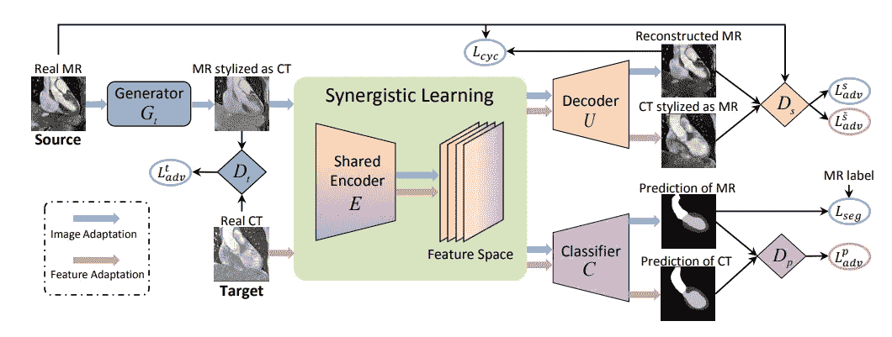
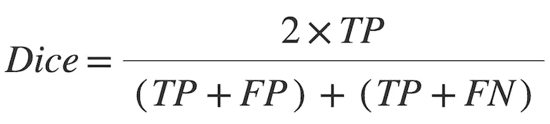
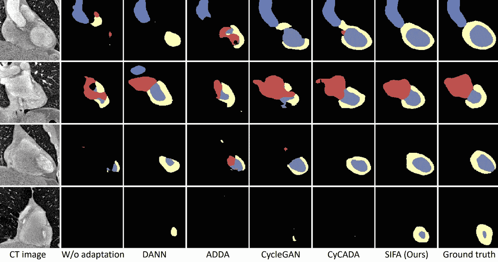
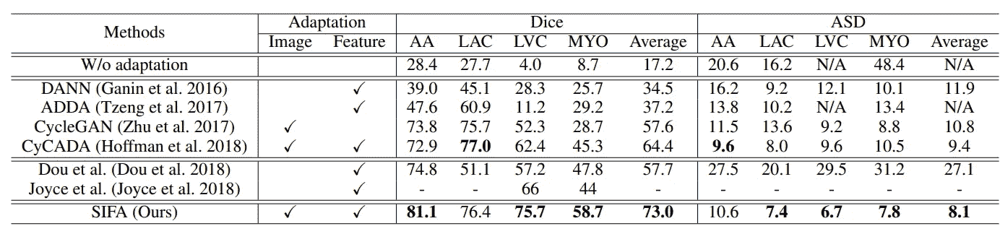

# 面向医学图像分割的跨模态域自适应的协同图像和特征自适应:综述

> 原文：<https://medium.com/codex/synergistic-image-and-feature-adaptation-towards-cross-modality-domain-adaptation-for-medical-70867d3d3155?source=collection_archive---------5----------------------->

艾莉娜·格鲁布尼亚克在 [Unsplash](https://unsplash.com?utm_source=medium&utm_medium=referral) 上的照片

领域自适应是最近深度学习研究中的一个重要课题，其目的是在将神经网络应用于新的测试领域时恢复性能退化。SIFA 也称为协同图像和特征适应是一种新的无监督领域适应框架，有效地解决领域转移的问题。

# 介绍

深度 CNN(dcnn)在遇到域转移时面临性能下降的问题，即，试图将学习的模型应用于与训练数据(源域)具有不同分布的测试数据(目标域)。在医学成像领域中，存在几种具有不同物理原理的成像模式，畴变甚至更加严重。

以上是在 MRI 数据上训练的模型性能的图示，同时在 CT 图像上测试。(图片由陈、程等提供)

磁畴移动主要在两个方向上处理:

*   图像自适应—通过像素到像素转换对齐域之间的图像外观来实现。以这种方式，在输入级解决了畴变。
*   特征自适应-旨在使用 DCNNs 提取域不变特征，而不考虑输入域之间的明显差异。这一系列中的大多数方法在对抗性学习场景中辨别源/目标域的特征分布。

这两种方法也可以在一个统一的框架内同时使用。通过图像变换，源图像朝着目标域的外观进行变换；之后，可以使用特征适应来进一步解决合成目标状图像和真实目标图像之间的剩余间隙。SIFA 成功地实现了医学图像。

# 方法和框架

图片由陈、程等提供。

上图展示了 SIFA 提出的模型框架。适应的两个角度被无缝集成到一个统一的模型中，因此，在端到端的培训过程中，这两个方面可以相互受益。

*   **用于外观对齐的图像适应—****旨在将源图像向目标图像的外观进行变换，由于域转移，目标图像具有不同的视觉外观。获得的变换图像看起来好像是从目标域绘制的，而具有结构语义的原始内容保持不受影响。为此，使用 GAN。生成器(Gt)旨在将源图像转换成类似目标的图像。鉴别器(Dt)与发生器竞争以正确区分假的变换图像和真实的目标图像。因此，在目标域中，Gt 和 Dt 形成一个极大极小双人游戏，并通过对抗学习进行优化。鉴别器试图最大化其目标以区分真实和伪造的图像，而生成器试图最小化该目标以将源图像转换成逼真的类似目标的图像。为了保留变换图像中的原始内容，使用反向生成器来实现循环一致性。**
*   ****针对域不变性的特征自适应—** 在医学图像的情况下，域偏移严重，图像自适应不足以提高性能。通常，为了使提取的特征域不变，在特征空间中直接使用对抗学习，使得鉴别器不能区分哪个特征来自哪个域。但是特征空间维数高，难以直接对齐。这里，通过使用经由 2 个紧凑的低维空间的对抗学习来增强域不变性。具体而言，对抗性损失由语义预测空间和生成的图像空间注入。**

**这里的关键特征是在图像和特征自适应之间共享的特征编码器 E。通过图像自适应的观点，利用对抗的和循环的一致性损失来优化 e。它还收集从鉴别器向特征适配器反向传播的梯度。所以它适合多任务学习场景。不同的任务带来互补的感应偏差，有助于缓解过拟合问题。**

**在每一次训练迭代中，所有模块都按照以下顺序依次更新:Gt → Dt → E → C → U → Ds → Dp。具体来说，**

1.  **首先更新生成器 Gt 以获得变换后的类似目标的图像。**
2.  **然后更新鉴别器 Dt 以区分类似目标的图像和真实的目标图像。**
3.  **接下来，更新编码器 E，用于从类似目标的图像和真实目标图像中提取特征。**
4.  **随后更新分类器 C 和解码器 U，以将提取的特征映射到分割预测并生成类似源的图像。**
5.  **最后，更新鉴别器 Ds 和 Dp 以对其输入的域进行分类，从而增强特征不变性。**

## **模块的网络配置**

****目标发生器 Gt** 是一个*周期杆*。它具有:**

*   **3 个 Conv 层**
*   **9 个剩余块**
*   **2 个去卷积层**
*   **一个最终的 Conv 层来获得生成的图像**

****源解码器 U** 有:**

*   **1 Conv 层**
*   **4 个剩余块**
*   **3 个去卷积层**
*   **1 个 Conv 输出层**

**所有 3 个**鉴别器(Dt、Ds、Dp)** 遵循 *PatchGAN 的配置。*网络有:**

*   **5 个 Conv 层(内核大小为 4x4，跨距为 2；最后 2 层使用 1)的步幅**
*   **每层的特征图数量分别为{64，128，256，512，1}。在前四层，每个卷积层之后是实例归一化和用 0.2 参数化的泄漏 ReLU。**

****编码器 E** 使用剩余连接和扩张卷积(扩张率= 2)来扩大感受野的大小，同时保持密集预测的空间分辨率。设{Ck，Rk，Dk}分别表示具有 k 个信道的卷积层、残差块和扩展残差块。M 代表跨度为 2 的最大池层。**

*   **编码器模块由{C16，R16，M，R32，M，2×R64，M，2× R128，4×R256，2×R512，2×D512，2×C512}层层叠加而成。**
*   **每个卷积操作都连接到一个批处理规范化层和 ReLU 激活。**

****分类器 C** 是一个 1×1 卷积层，后面是一个上采样层，用于将分割预测的分辨率恢复到原始图像大小。**

# **数据集和评估指标**

**本文在*多模态全心脏分割挑战赛 2017 数据集*上验证了提出的无监督域自适应方法，用于 MR 和 CT 图像中的心脏分割(庄和沈 2016)。数据集由在不同临床位置收集的不成对的 20 个 MR 和 20 个 CT 体积组成。**

**提供了心脏结构的地面真实遮罩，包括:**

*   **升主动脉(AA)，**
*   **左心房血腔(LAC)，**
*   **左心室血腔(LVC ),以及**
*   **左心室的心肌(MYO)**

**源域—磁共振图像**

**目标域— CT 图像**

**每种形式都是随机的，80%的训练和 20%的测试用例。CT 的地面实况仅在评估期间使用。**

## **预处理**

1.  **所有数据被标准化为 0 平均值和 1 方差。**
2.  **用尺寸调整到 256×256 的冠状视图图像进行训练)并用旋转、缩放和仿射变换进行增强。**

## **使用的指标**

1.  ****Dice 系数[%]:** 是两个遮罩之间重叠的度量。1 表示完全重叠，而 0 表示没有重叠。**

****

****2。平均表面距离(ASD)[体素]:** 平均表面距离是从机器分割区域的边界上的点到地面真值的边界的所有距离的平均值，反之亦然。**

## **密码**

**在 https://github.com/cchen-cc/SIFA 可以找到 SIFA 纸代码。**

# **结果**

****

**提议的 SIFA 和其他先进模型之间的比较。(图片由陈、程等提供)**

****

**SIFA 和其他最先进的无监督域自适应方法在心脏跨通道分割任务中的性能比较。报告了每个心脏结构的 Dice 和 ASD 值以及四个结构的平均值。(注:—表示该方法未报告结果，N/A 表示无法计算 ASD 值，因为没有对该心脏结构的预测。)图片由陈、程等提供。**

# **参考**

**陈，程，等。协同图像和特征适应:走向跨模态域适应医学图像分割。*AAAI 人工智能会议论文集*。第 33 卷。№01.2019.**