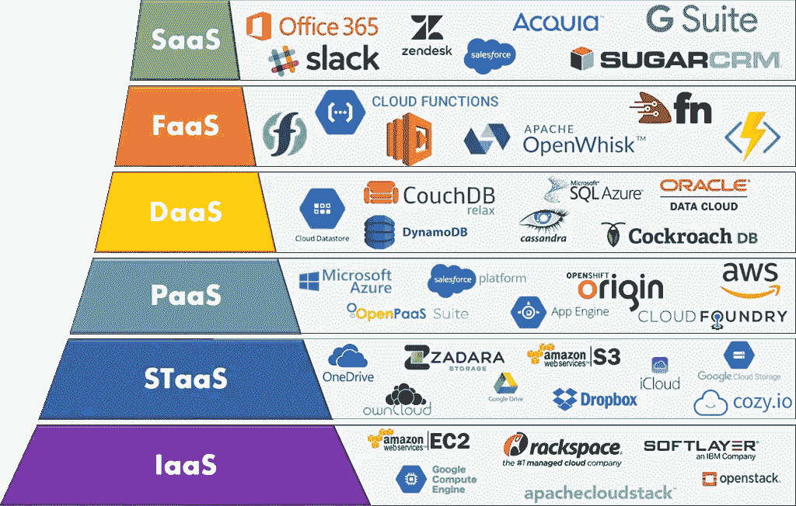

# 系统设计基础:有哪些著名的“即服务”云服务交付模型？

> 原文：<https://medium.com/codex/system-design-basics-what-are-famous-as-a-service-cloud-service-delivery-models-477689942a82?source=collection_archive---------7----------------------->

云服务交付模式

有哪些著名的云服务交付模式，如基础架构即服务(IaaS)、平台即服务(PaaS)或存储即服务(STaaS)？

“即服务”模式代表了由云提供商提供的特定、预打包的 IT 资源组合。

这些模型利用云计算而不是现场本地软件来提供各种服务。

以下是一些著名的“**即服务**”模式:

𝟭. 𝗜𝗮𝗮𝗦 (𝗜𝗻𝗳𝗿𝗮𝘀𝘁𝗿𝘂𝗰𝘁𝘂𝗿𝗲 𝗮𝘀 𝗮 𝗦𝗲𝗿𝘃𝗶𝗰𝗲)

在 IaaS 中，提供商提供对服务器、存储和网络等原始计算资源的访问。客户负责管理操作系统和其他软件。PaaS 的著名例子有 Google Compute Engine、EC2 和 OpenStack。

𝟮. 𝗦𝗧𝗮𝗮𝗦 (𝗦𝘁𝗼𝗿𝗮𝗴𝗲 𝗮𝘀 𝗮 𝗦𝗲𝗿𝘃𝗶𝗰𝗲)

STaaS 是一种云服务模式，在这种模式下，一家公司将其存储基础架构出租给另一家公司或个人，以存储文件或对象。STaaS 的例子有苹果的 iCloud、微软的 OneDrive 和谷歌云存储。

𝟯. 𝗣𝗮𝗮𝗦 (𝗣𝗹𝗮𝘁𝗳𝗼𝗿𝗺 𝗮𝘀 𝗮 𝗦𝗲𝗿𝘃𝗶𝗰𝗲)

在 PaaS 中，提供商提供对开发、部署和运行应用程序的平台的访问。客户无需管理底层基础架构，可以专注于构建和部署他们的应用程序。PaaS 的著名例子有 Google App Engine、Azure 和 Amazon AWS。

𝟰. 𝗗𝗕𝗮𝗮𝗦 (𝗗𝗮𝘁𝗮𝗯𝗮𝘀𝗲 𝗮𝘀 𝗮 𝗦𝗲𝗿𝘃𝗶𝗰𝗲)

在 DBaaS 中，提供者提供对托管数据库服务的访问。这使客户能够创建和使用数据库，而无需管理底层基础架构或软件。DaaS 的著名例子是亚马逊的 DynamoDB、微软的 SQL 数据库和 Apache Cassandra。

𝟱. 𝗙𝗮𝗮𝗦 (𝗙𝘂𝗻𝗰𝘁𝗶𝗼𝗻𝘀 𝗮𝘀 𝗮 𝗦𝗲𝗿𝘃𝗶𝗰𝗲)

FaaS 使云用户能够执行代码来响应事件，而无需开发和运行复杂的微服务。这使客户能够构建和部署由小型模块化组件组成的应用程序，这些组件可以独立扩展和管理。FaaS 的著名例子有 AWS Lambda、谷歌云函数和微软 Azure 函数。

𝟲. 𝗦𝗮𝗮𝗦 (𝗦𝗼𝗳𝘁𝘄𝗮𝗿𝗲 𝗮𝘀 𝗮 𝗦𝗲𝗿𝘃𝗶𝗰𝗲)

在 SaaS，提供商提供完整的软件应用程序，客户可以通过互联网使用。客户不需要安装或管理任何软件，只需根据需要使用应用程序即可。SaaS 的例子有 Office 365、Slack、谷歌的 G 套件等。

𝟳. 𝗔𝗮𝗮𝗦 (𝗔𝗻𝗮𝗹𝘆𝘁𝗶𝗰𝘀 𝗮𝘀 𝗮 𝗦𝗲𝗿𝘃𝗶𝗰𝗲)

AaaS 通过云提供基于订阅的数据分析软件和程序。

𝟴. 𝗡𝗮𝗮𝗦 (𝗡𝗲𝘁𝘄𝗼𝗿𝗸 𝗮𝘀 𝗮 𝘀𝗲𝗿𝘃𝗶𝗰𝗲)

NaaS 是指由第三方提供的托管网络基础设施。

𝟵. 𝗖𝗮𝗮𝗦 (𝗖𝗼𝗻𝘁𝗮𝗶𝗻𝗲𝗿𝘀 𝗮𝘀 𝗮 𝘀𝗲𝗿𝘃𝗶𝗰𝗲)

CaaS 支持使用基于容器的虚拟化来部署和管理容器。

𝟭𝟬. 𝗔𝗮𝗮𝗦 (𝗔𝘂𝘁𝗵𝗲𝗻𝘁𝗶𝗰𝗮𝘁𝗶𝗼𝗻 𝗮𝘀 𝗮 𝗦𝗲𝗿𝘃𝗶𝗰𝗲)

AaaS 使用云服务进行身份和访问管理。著名的例子有 Duo Access，Okta 等。

云服务交付模式的其他示例包括 **BaaS** (备份即服务) **DRaaS** (灾难恢复即服务)，以及( **DOaaS** ) DevOps 即服务。

# 结论

总体而言，云服务交付模式的选择将取决于客户的具体要求和限制，以及他们需要运行的应用程序和工作负载的类型。

云服务有不同的交付模式，客户可以选择最能满足其特定需求和要求的模式。

➡在“ [**探索系统设计面试**](https://www.designgurus.io/course/grokking-the-system-design-interview)**”****[**探索高级系统设计面试**](https://www.designgurus.io/course/grokking-the-advanced-system-design-interview) 中了解更多关于系统设计面试的信息**

**➡在 Linkedin 上关注我，了解系统设计和编码面试的技巧。**

** [## 赢得系统设计面试的完整指南

### 回答任何系统设计面试问题的 7 步流程。系统设计面试问题旨在…

designgurus.org](https://designgurus.org/blog/complete-guide-sys-design)  [## 系统设计面试:是什么让你与众不同？

### 系统设计面试的目的是评估你从头到尾设计完整系统的能力…

designgurus.org](https://designgurus.org/blog/sys-design-distinguishes)  [## 系统设计面试生存指南(2023):准备策略和实用技巧

### 2023 年系统设计面试剧本。

levelup.gitconnected.com](https://levelup.gitconnected.com/system-design-interview-survival-guide-2023-preparation-strategies-and-practical-tips-ba9314e6b9e3)**