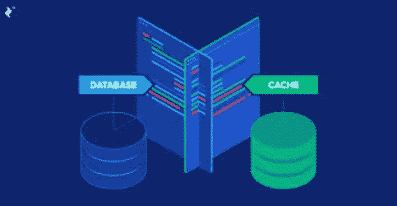

# 系统设计—分布式数据库与缓存

> 原文：<https://medium.com/codex/system-design-distributed-database-vs-cache-eab8e067bd15?source=collection_archive---------2----------------------->

[数据库](https://en.wikipedia.org/wiki/Database)通常被认为是持久的、一致的和可查询的数据存储。[缓存](https://en.wikipedia.org/wiki/Cache_(computing))的行为类似于数据库，除了它们去除了许多特性来提高性能，比如它更喜欢快速访问而不是持久性&一致性。我们不能对这两个系统进行严格的分类，因为两者提供的功能集非常接近，并且在分布式系统的情况下会更加复杂。此外，数据库产品可以作为缓存使用。

本博客讨论了分布式数据库和缓存的各种特征，以帮助确定软件产品如何像数据库一样运行，以及它如何像缓存一样运行，因为很难定义理想的数据库或缓存实际上是什么。

# 坚持

*   除非显式删除，否则数据库通常会持久保存一个条目。持久存储往往实现起来缓慢而复杂。
*   缓存通常会放松持久性特性，也就是说，即使它提供了很强的持久性，也可能偶尔会丢失数据，但这绝不是数据库应该有的。

事实上，缓存是以副本为前提的，必须权衡数据的一致性或活性。缓存还可以实现生存时间来松散地管理一致性。

# 持久性

*   数据库通常支持持久持久性，即支持备份和还原过程。
*   另一方面，缓存几乎从不支持任何形式的持久性或备份。

# 权威

*   数据库包含一个完整的数据集，所以没有结果的查询应该是正确的答案。
*   允许缓存包含数据的子集。如果缓存中缺少某个条目，应用程序应该求助于权威来源。缓存应该被视为非主存储，因为它们通常面向权威数据库，以提高性能。

非权威副本数据库也可以作为另一个类似于缓存的数据库的前端。副本数据库包含来自权威机构的完整数据集，尽管可能受限于一个分区，但是缓存并不要求完整。

# 收回

*   不允许数据库收回条目。
*   缓存回收允许丢弃未被访问的数据，同时工作集随时可用以更好地利用资源。

如果数据访问的分布遵循[幂律](http://en.wikipedia.org/wiki/Power_law)分布，那么缓存回收是最有效的。当所有数据都以相同的概率被访问时，驱逐策略&缓存通常会变得不那么有效。

# 问题

*   数据库通常支持复杂的查询，这是必不可少的，因为它们倾向于存储需要以不同方式检索的权威数据。
*   缓存通常只支持简单的键值访问，因为它提供了对已知存在的数据的快速访问。

通过放弃查询支持，缓存可以获得比数据库更好的性能。这是因为可以使用更简单的数据结构如哈希表来代替树。数据库也可以支持更简单的数据结构，但是这限制了查询能力。

# 可靠性/可用性

*   数据库不容易修复。
*   由于复杂性较低，缓存提供了更好的可靠性和更少的操作负担。如果缓存数据以某种方式损坏，只需删除缓存内容就可以解决问题。

关于可用性，缓存被认为比数据库更重要。影响可用性的错误可以被掩盖为缓存未命中。这可能会给人一种可用性更高的错觉，但是缓存命中率是衡量缓存可用性的一个很好的指标。

# 分配

*   数据库必须能够在不影响一致性或可用性要求的情况下分发数据。主机故障不应导致任何数据丢失，恢复的主机不应引入不一致。
*   当主机出现故障时，缓存可以不那么严格，这也是因为应用程序需要向权威机构求助。如果主机出现故障，10%的缓存被擦除，这只是被视为缓存未命中的突发事件。如果主机恢复，它可能会再次报告旧条目，如果缓存不支持强一致性，这是可以接受的行为。

# 分割

*   数据库支持分区，但是由于查询和事务等数据库特性，分区很难实现。重新分区也是一个需要的特性，通常假设分区数据库支持这一特性。
*   分布式缓存几乎总是支持分区，但是，缓存不需要支持重新分区。相反，当新添加的分区填满时，它们会允许出现缓存未命中。

支持分区的数据库或缓存应该能够读写。

# 一致性

*   数据库通常支持强一致性而不是更高的可用性。
*   缓存很少支持强一致性，而是偏向于可用性和性能。

最终一致性描述了暂时不一致的数据库或缓存自动达到一致性的方式。理想情况下，一致性应该在几秒钟内达到。如果时间太长，不一致可能会永久得不到解决。随着数据存储的增长，达到最终一致性的时间不应变慢。

通过将数据库重新同步到授权机构来达到最终的一致性是一个不同的概念。同样，扫描所有副本并合并差异并不是最终一致系统的特征。相反，这两种情况是数据库修复和恢复的例子，随着数据库大小的增加，修复和恢复会很慢。

# 分身术

*   数据库复制必须确保所有副本接收所有更改。如果最终一致，所有副本都必须收敛到同一组条目。
*   缓存可以容忍未命中，因此复制系统可能是“弱”的，也就是说，它不需要确保所有副本都接收所有更改。如果没有复制，分布式缓存可能会有很高的未命中率。

# 处理

*   数据库支持事务，也就是说，允许一组逻辑操作同时发生或不同时发生。
*   不支持持久性的缓存无法支持事务的实现。

# 扳机

*   数据库支持触发器，以允许运行自定义业务逻辑来响应数据更改。这些触发器本质上是事务性的，即在失败的情况下，完整的事务/数据更改会回滚。
*   缓存通常不支持触发器。

> 感谢您的阅读！如果您觉得这很有帮助，以下是您可以采取的一些后续步骤:

1.  本博客是 ***系统设计选择*** 系列的一部分。查看该系列的[其他博客](https://iamkanikamodi.medium.com/system-design-choosing-between-aws-kinesis-and-aws-sqs-2586c814be8d)。
2.  发送一些掌声给我，并在媒体上关注我以获得更多的技术博客！
3.  在[LinkedIn](https://www.linkedin.com/in/kanika-modi/)&[Twitter](https://twitter.com/iamkanikamodi)上和我联系！