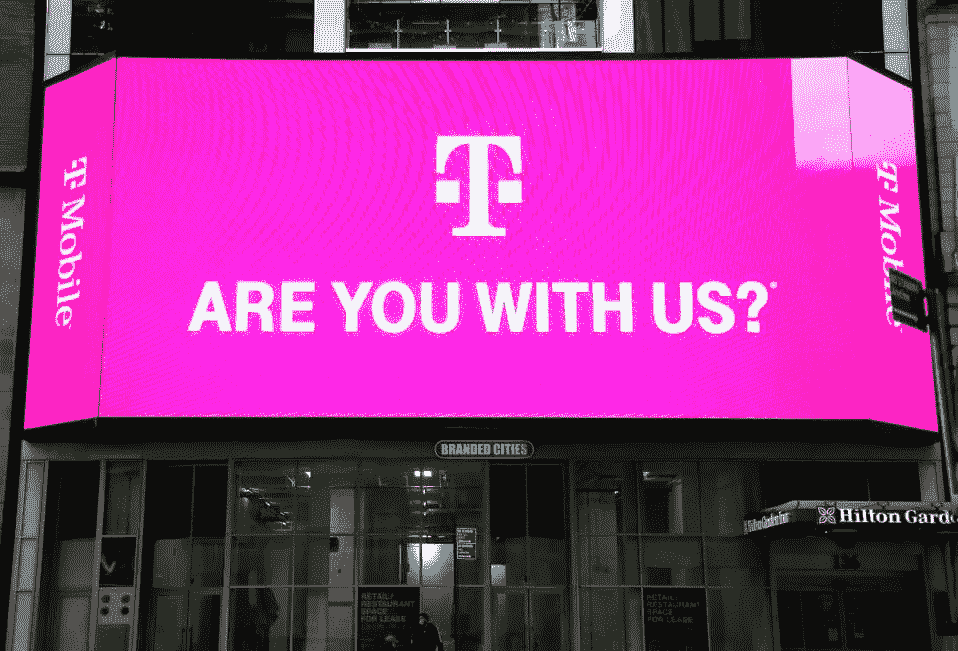

# T-Mobile 家庭互联网:再见，有线！

> 原文：<https://medium.com/codex/t-mobile-home-internet-goodbye-cable-8545d31d219c?source=collection_archive---------0----------------------->

## 削减和弦:不再有 Xfinity，不再有 AT&T。

我一直反对任何形式的有线电视。像 Comcast、Spectrum 和美国电话电报公司这样的公司统治家庭互联网已经太久了。在我使用 Xfinity 互联网服务的第一年，我每月支付 70 美元，外加 13 美元的调制解调器租赁费，以及其他一些随机费用。还有那个…