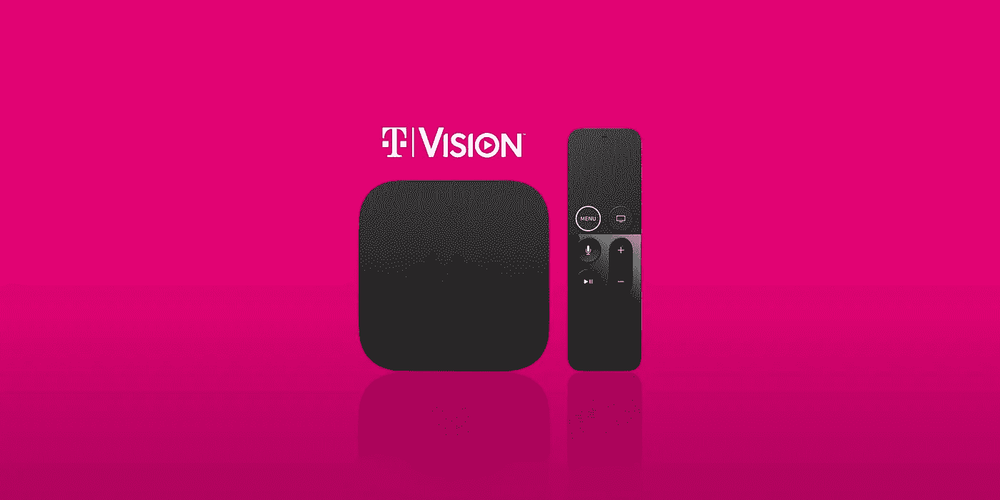

# T-Mobile 的电视很便宜，但不值得

> 原文：<https://medium.com/codex/t-mobiles-tvision-is-cheap-but-not-worth-it-ccfe5a4e8c98?source=collection_archive---------1----------------------->

## [法典](http://medium.com/codex)

## 售价 50 美元，颇具吸引力。但除了价格，它无法与 YouTube 或 Hulu 竞争。

让我们面对现实吧。2021 年的有线电视根本不值得花钱。Xfinity 的有线电视套餐平均每月从 80 美元到 150 美元不等。如果要高清，那就更…